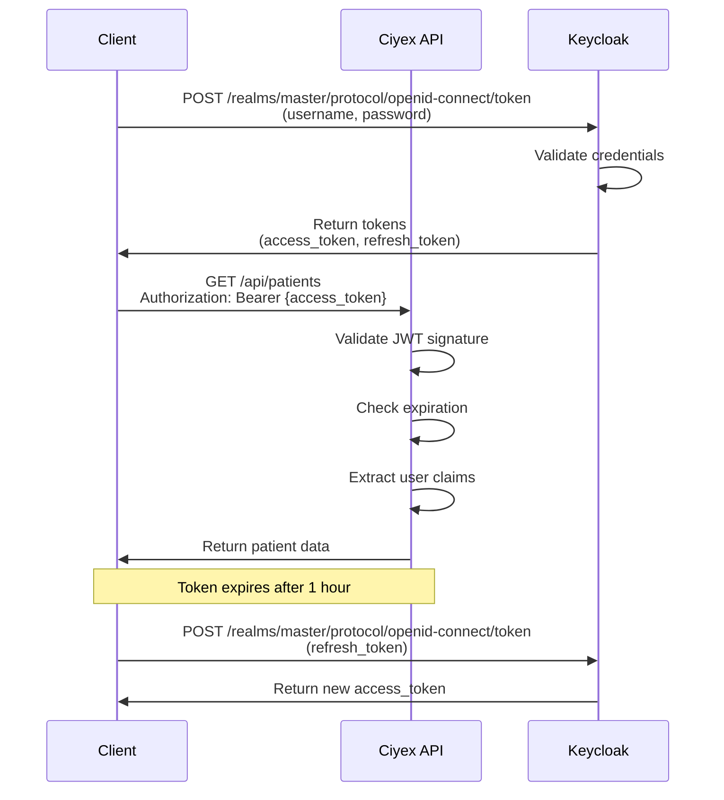

# API Authentication

Complete guide to authentication and authorization in Ciyex EHR APIs.

## Overview

Ciyex EHR uses JWT (JSON Web Tokens) for API authentication, integrated with Keycloak for identity management. This guide covers authentication flows, token management, and security best practices.

## Authentication Flow



## Login

### Username/Password Login

```http
POST https://aran-stg.zpoa.com/realms/master/protocol/openid-connect/token
Content-Type: application/x-www-form-urlencoded

grant_type=password
&client_id=ciyex-app
&username=provider@example.com
&password=SecurePassword123!
```

**Response**:
```json
{
  "access_token": "eyJhbGciOiJSUzI1NiIsInR5cCI6IkpXVCJ9...",
  "expires_in": 3600,
  "refresh_expires_in": 86400,
  "refresh_token": "eyJhbGciOiJIUzI1NiIsInR5cCI6IkpXVCJ9...",
  "token_type": "Bearer",
  "not-before-policy": 0,
  "session_state": "abc123",
  "scope": "profile email"
}
```

### Client Credentials Flow

For server-to-server communication:

```http
POST https://aran-stg.zpoa.com/realms/master/protocol/openid-connect/token
Content-Type: application/x-www-form-urlencoded

grant_type=client_credentials
&client_id=ciyex-service
&client_secret=your-client-secret
```

## Token Structure

### Access Token (JWT)

```json
{
  "header": {
    "alg": "RS256",
    "typ": "JWT",
    "kid": "key-id"
  },
  "payload": {
    "exp": 1697472000,
    "iat": 1697468400,
    "jti": "unique-token-id",
    "iss": "https://aran-stg.zpoa.com/realms/master",
    "aud": "ciyex-app",
    "sub": "user-uuid",
    "typ": "Bearer",
    "azp": "ciyex-app",
    "session_state": "session-id",
    "acr": "1",
    "realm_access": {
      "roles": ["PROVIDER", "USER"]
    },
    "resource_access": {
      "ciyex-app": {
        "roles": ["provider"]
      }
    },
    "scope": "profile email",
    "email_verified": true,
    "name": "Dr. Jane Smith",
    "preferred_username": "jane.smith",
    "given_name": "Jane",
    "family_name": "Smith",
    "email": "jane.smith@example.com",
    "groups": ["/practice_1"]
  }
}
```

## Making Authenticated Requests

### JavaScript/TypeScript

```typescript
// Store tokens
const tokens = {
  accessToken: 'eyJhbGciOiJSUzI1NiIsInR5cCI6IkpXVCJ9...',
  refreshToken: 'eyJhbGciOiJIUzI1NiIsInR5cCI6IkpXVCJ9...',
  expiresAt: Date.now() + 3600000
};

// Make authenticated request
async function fetchPatients() {
  const response = await fetch('http://localhost:8080/api/patients', {
    headers: {
      'Authorization': `Bearer ${tokens.accessToken}`,
      'Content-Type': 'application/json'
    }
  });

  if (response.status === 401) {
    // Token expired, refresh it
    await refreshAccessToken();
    return fetchPatients(); // Retry
  }

  return response.json();
}

// Refresh token
async function refreshAccessToken() {
  const response = await fetch(
    'https://aran-stg.zpoa.com/realms/master/protocol/openid-connect/token',
    {
      method: 'POST',
      headers: {
        'Content-Type': 'application/x-www-form-urlencoded'
      },
      body: new URLSearchParams({
        grant_type: 'refresh_token',
        client_id: 'ciyex-app',
        refresh_token: tokens.refreshToken
      })
    }
  );

  const data = await response.json();
  tokens.accessToken = data.access_token;
  tokens.refreshToken = data.refresh_token;
  tokens.expiresAt = Date.now() + data.expires_in * 1000;
}
```

### Python

```python
import requests
import time

class CiyexClient:
    def __init__(self, username, password):
        self.base_url = "http://localhost:8080"
        self.keycloak_url = "https://aran-stg.zpoa.com"
        self.client_id = "ciyex-app"
        self.tokens = None
        self.login(username, password)
    
    def login(self, username, password):
        response = requests.post(
            f"{self.keycloak_url}/realms/master/protocol/openid-connect/token",
            data={
                "grant_type": "password",
                "client_id": self.client_id,
                "username": username,
                "password": password
            }
        )
        response.raise_for_status()
        self.tokens = response.json()
        self.tokens['expires_at'] = time.time() + self.tokens['expires_in']
    
    def refresh_token(self):
        response = requests.post(
            f"{self.keycloak_url}/realms/master/protocol/openid-connect/token",
            data={
                "grant_type": "refresh_token",
                "client_id": self.client_id,
                "refresh_token": self.tokens['refresh_token']
            }
        )
        response.raise_for_status()
        self.tokens = response.json()
        self.tokens['expires_at'] = time.time() + self.tokens['expires_in']
    
    def get_headers(self):
        if time.time() >= self.tokens['expires_at']:
            self.refresh_token()
        
        return {
            "Authorization": f"Bearer {self.tokens['access_token']}",
            "Content-Type": "application/json"
        }
    
    def get_patients(self):
        response = requests.get(
            f"{self.base_url}/api/patients",
            headers=self.get_headers()
        )
        response.raise_for_status()
        return response.json()

# Usage
client = CiyexClient("provider@example.com", "password")
patients = client.get_patients()
```

### cURL

```bash
# Login
TOKEN_RESPONSE=$(curl -X POST \
  'https://aran-stg.zpoa.com/realms/master/protocol/openid-connect/token' \
  -H 'Content-Type: application/x-www-form-urlencoded' \
  -d 'grant_type=password' \
  -d 'client_id=ciyex-app' \
  -d 'username=provider@example.com' \
  -d 'password=password')

ACCESS_TOKEN=$(echo $TOKEN_RESPONSE | jq -r '.access_token')

# Make authenticated request
curl -X GET 'http://localhost:8080/api/patients' \
  -H "Authorization: Bearer $ACCESS_TOKEN"
```

## Backend Token Validation

### Spring Security Configuration

```java
@Configuration
@EnableWebSecurity
public class SecurityConfig {
    
    @Value("${keycloak.auth-server-url}")
    private String keycloakUrl;
    
    @Value("${keycloak.realm}")
    private String realm;
    
    @Bean
    public SecurityFilterChain filterChain(HttpSecurity http) throws Exception {
        http
            .csrf().disable()
            .authorizeHttpRequests(auth -> auth
                .requestMatchers("/api/auth/**").permitAll()
                .requestMatchers("/actuator/health").permitAll()
                .requestMatchers("/api/**").authenticated()
            )
            .oauth2ResourceServer(oauth2 -> oauth2
                .jwt(jwt -> jwt
                    .jwtAuthenticationConverter(jwtAuthenticationConverter())
                )
            );
        
        return http.build();
    }
    
    @Bean
    public JwtDecoder jwtDecoder() {
        String jwkSetUri = keycloakUrl + "/realms/" + realm + 
                          "/protocol/openid-connect/certs";
        return NimbusJwtDecoder.withJwkSetUri(jwkSetUri).build();
    }
    
    @Bean
    public JwtAuthenticationConverter jwtAuthenticationConverter() {
        JwtGrantedAuthoritiesConverter grantedAuthoritiesConverter = 
            new JwtGrantedAuthoritiesConverter();
        grantedAuthoritiesConverter.setAuthoritiesClaimName("realm_access.roles");
        grantedAuthoritiesConverter.setAuthorityPrefix("ROLE_");
        
        JwtAuthenticationConverter jwtAuthenticationConverter = 
            new JwtAuthenticationConverter();
        jwtAuthenticationConverter.setJwtGrantedAuthoritiesConverter(
            grantedAuthoritiesConverter
        );
        
        return jwtAuthenticationConverter;
    }
}
```

### Extract User Information

```java
@Service
public class UserService {
    
    public UserDetails getCurrentUser() {
        Authentication authentication = SecurityContextHolder
            .getContext()
            .getAuthentication();
        
        if (authentication instanceof JwtAuthenticationToken) {
            JwtAuthenticationToken jwtAuth = (JwtAuthenticationToken) authentication;
            Jwt jwt = jwtAuth.getToken();
            
            return UserDetails.builder()
                .userId(jwt.getSubject())
                .email(jwt.getClaimAsString("email"))
                .name(jwt.getClaimAsString("name"))
                .roles(extractRoles(jwt))
                .groups(extractGroups(jwt))
                .build();
        }
        
        throw new UnauthorizedException("No authentication found");
    }
    
    private List<String> extractRoles(Jwt jwt) {
        Map<String, Object> realmAccess = jwt.getClaim("realm_access");
        if (realmAccess != null && realmAccess.containsKey("roles")) {
            return (List<String>) realmAccess.get("roles");
        }
        return Collections.emptyList();
    }
    
    private List<String> extractGroups(Jwt jwt) {
        return jwt.getClaimAsStringList("groups");
    }
}
```

## Authorization

### Role-Based Access Control

```java
@RestController
@RequestMapping("/api/patients")
public class PatientController {
    
    @GetMapping
    @PreAuthorize("hasRole('PROVIDER') or hasRole('NURSE')")
    public ResponseEntity<?> getAllPatients() {
        // Only providers and nurses can access
    }
    
    @DeleteMapping("/{id}")
    @PreAuthorize("hasRole('ADMIN')")
    public ResponseEntity<?> deletePatient(@PathVariable Long id) {
        // Only admins can delete
    }
}
```

### Custom Authorization

```java
@Service
public class PatientAuthorizationService {
    
    @Autowired
    private UserService userService;
    
    public boolean canAccessPatient(Long patientId) {
        UserDetails user = userService.getCurrentUser();
        Patient patient = patientRepository.findById(patientId)
            .orElseThrow();
        
        // Check if user's organization matches patient's organization
        return user.getOrganizationId().equals(patient.getOrganizationId());
    }
}

@RestController
public class PatientController {
    
    @GetMapping("/api/patients/{id}")
    @PreAuthorize("@patientAuthorizationService.canAccessPatient(#id)")
    public ResponseEntity<?> getPatient(@PathVariable Long id) {
        // User can only access patients in their organization
    }
}
```

## Token Management

### Token Storage (Frontend)

```typescript
// Secure token storage
class TokenManager {
  private static readonly ACCESS_TOKEN_KEY = 'access_token';
  private static readonly REFRESH_TOKEN_KEY = 'refresh_token';
  private static readonly EXPIRES_AT_KEY = 'expires_at';

  static setTokens(accessToken: string, refreshToken: string, expiresIn: number) {
    // Store in httpOnly cookie (preferred) or sessionStorage
    sessionStorage.setItem(this.ACCESS_TOKEN_KEY, accessToken);
    sessionStorage.setItem(this.REFRESH_TOKEN_KEY, refreshToken);
    sessionStorage.setItem(
      this.EXPIRES_AT_KEY,
      String(Date.now() + expiresIn * 1000)
    );
  }

  static getAccessToken(): string | null {
    return sessionStorage.getItem(this.ACCESS_TOKEN_KEY);
  }

  static getRefreshToken(): string | null {
    return sessionStorage.getItem(this.REFRESH_TOKEN_KEY);
  }

  static isTokenExpired(): boolean {
    const expiresAt = sessionStorage.getItem(this.EXPIRES_AT_KEY);
    if (!expiresAt) return true;
    return Date.now() >= parseInt(expiresAt);
  }

  static clearTokens() {
    sessionStorage.removeItem(this.ACCESS_TOKEN_KEY);
    sessionStorage.removeItem(this.REFRESH_TOKEN_KEY);
    sessionStorage.removeItem(this.EXPIRES_AT_KEY);
  }
}
```

### Automatic Token Refresh

```typescript
// Axios interceptor for automatic token refresh
import axios from 'axios';

axios.interceptors.response.use(
  (response) => response,
  async (error) => {
    const originalRequest = error.config;

    if (error.response?.status === 401 && !originalRequest._retry) {
      originalRequest._retry = true;

      try {
        const refreshToken = TokenManager.getRefreshToken();
        const response = await axios.post(
          'https://aran-stg.zpoa.com/realms/master/protocol/openid-connect/token',
          new URLSearchParams({
            grant_type: 'refresh_token',
            client_id: 'ciyex-app',
            refresh_token: refreshToken!
          })
        );

        const { access_token, refresh_token, expires_in } = response.data;
        TokenManager.setTokens(access_token, refresh_token, expires_in);

        originalRequest.headers.Authorization = `Bearer ${access_token}`;
        return axios(originalRequest);
      } catch (refreshError) {
        TokenManager.clearTokens();
        window.location.href = '/login';
        return Promise.reject(refreshError);
      }
    }

    return Promise.reject(error);
  }
);
```

## Logout

### Logout Request

```http
POST https://aran-stg.zpoa.com/realms/master/protocol/openid-connect/logout
Content-Type: application/x-www-form-urlencoded

client_id=ciyex-app
&refresh_token={refresh_token}
```

### Frontend Logout

```typescript
async function logout() {
  const refreshToken = TokenManager.getRefreshToken();

  try {
    await fetch(
      'https://aran-stg.zpoa.com/realms/master/protocol/openid-connect/logout',
      {
        method: 'POST',
        headers: {
          'Content-Type': 'application/x-www-form-urlencoded'
        },
        body: new URLSearchParams({
          client_id: 'ciyex-app',
          refresh_token: refreshToken!
        })
      }
    );
  } finally {
    TokenManager.clearTokens();
    window.location.href = '/login';
  }
}
```

## Security Best Practices

1. **HTTPS Only** - Always use HTTPS in production
2. **Short Expiration** - Keep access token lifetime short (1 hour)
3. **Secure Storage** - Use httpOnly cookies or sessionStorage
4. **Token Rotation** - Rotate refresh tokens
5. **Validate Tokens** - Always validate JWT signature and expiration
6. **Rate Limiting** - Implement rate limiting on auth endpoints
7. **Audit Logging** - Log all authentication events

## Troubleshooting

### Invalid Token

**Error**: `401 Unauthorized - Invalid token`

**Solutions**:
```bash
# Verify token is not expired
jwt decode $ACCESS_TOKEN

# Check token signature
# Ensure Keycloak public key matches

# Verify issuer and audience
```

### Token Refresh Failed

**Error**: `400 Bad Request - Invalid refresh token`

**Solutions**:
- Refresh token may be expired (24 hours)
- User may have logged out
- Refresh token may have been revoked
- Re-authenticate user

## Next Steps

- [Keycloak Integration](keycloak.md) - Keycloak setup
- [Security Best Practices](../security/best-practices.md) - Security guidelines
- [REST API](../api/rest-api.md) - API reference
- [Frontend Development](../development/frontend.md) - Frontend auth
