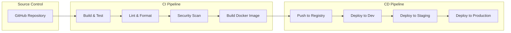

# CI/CD Pipeline

Complete guide to continuous integration and deployment for Ciyex EHR.

## Overview

Automated CI/CD pipelines ensure code quality, run tests, build containers, and deploy to Kubernetes clusters. Ciyex EHR uses GitHub Actions for CI/CD.

## Pipeline Architecture



## GitHub Actions Workflows

### Backend CI/CD

```yaml
# .github/workflows/backend-ci-cd.yml
name: Backend CI/CD

on:
  push:
    branches: [main, develop]
    paths:
      - 'src/**'
      - 'build.gradle'
      - '.github/workflows/backend-ci-cd.yml'
  pull_request:
    branches: [main, develop]

env:
  REGISTRY: ghcr.io
  IMAGE_NAME: ciyex-org/ciyex

jobs:
  test:
    runs-on: ubuntu-latest
    
    services:
      postgres:
        image: postgres:16
        env:
          POSTGRES_DB: ciyexdb_test
          POSTGRES_USER: ciyex
          POSTGRES_PASSWORD: test123
        options: >-
          --health-cmd pg_isready
          --health-interval 10s
          --health-timeout 5s
          --health-retries 5
        ports:
          - 5432:5432
    
    steps:
      - uses: actions/checkout@v4
      
      - name: Set up JDK 21
        uses: actions/setup-java@v4
        with:
          java-version: '21'
          distribution: 'temurin'
          cache: gradle
      
      - name: Grant execute permission for gradlew
        run: chmod +x gradlew
      
      - name: Run tests
        run: ./gradlew test
        env:
          SPRING_DATASOURCE_URL: jdbc:postgresql://localhost:5432/ciyexdb_test
          SPRING_DATASOURCE_USERNAME: ciyex
          SPRING_DATASOURCE_PASSWORD: test123
      
      - name: Generate test report
        if: always()
        uses: dorny/test-reporter@v1
        with:
          name: Test Results
          path: build/test-results/test/*.xml
          reporter: java-junit
      
      - name: Upload coverage to Codecov
        uses: codecov/codecov-action@v3
        with:
          files: build/reports/jacoco/test/jacocoTestReport.xml

  lint:
    runs-on: ubuntu-latest
    
    steps:
      - uses: actions/checkout@v4
      
      - name: Set up JDK 21
        uses: actions/setup-java@v4
        with:
          java-version: '21'
          distribution: 'temurin'
          cache: gradle
      
      - name: Run Checkstyle
        run: ./gradlew checkstyleMain checkstyleTest
      
      - name: Run SpotBugs
        run: ./gradlew spotbugsMain

  security:
    runs-on: ubuntu-latest
    
    steps:
      - uses: actions/checkout@v4
      
      - name: Run dependency check
        run: ./gradlew dependencyCheckAnalyze
      
      - name: Run Trivy vulnerability scanner
        uses: aquasecurity/trivy-action@master
        with:
          scan-type: 'fs'
          scan-ref: '.'
          format: 'sarif'
          output: 'trivy-results.sarif'
      
      - name: Upload Trivy results to GitHub Security
        uses: github/codeql-action/upload-sarif@v2
        with:
          sarif_file: 'trivy-results.sarif'

  build:
    needs: [test, lint, security]
    runs-on: ubuntu-latest
    if: github.event_name == 'push'
    
    permissions:
      contents: read
      packages: write
    
    steps:
      - uses: actions/checkout@v4
      
      - name: Set up JDK 21
        uses: actions/setup-java@v4
        with:
          java-version: '21'
          distribution: 'temurin'
          cache: gradle
      
      - name: Build with Gradle
        run: ./gradlew build -x test
      
      - name: Log in to Container Registry
        uses: docker/login-action@v3
        with:
          registry: ${{ env.REGISTRY }}
          username: ${{ github.actor }}
          password: ${{ secrets.GITHUB_TOKEN }}
      
      - name: Extract metadata
        id: meta
        uses: docker/metadata-action@v5
        with:
          images: ${{ env.REGISTRY }}/${{ env.IMAGE_NAME }}
          tags: |
            type=ref,event=branch
            type=sha,prefix={{branch}}-
            type=semver,pattern={{version}}
      
      - name: Build and push Docker image
        uses: docker/build-push-action@v5
        with:
          context: .
          push: true
          tags: ${{ steps.meta.outputs.tags }}
          labels: ${{ steps.meta.outputs.labels }}
          cache-from: type=gha
          cache-to: type=gha,mode=max

  deploy-dev:
    needs: build
    runs-on: ubuntu-latest
    if: github.ref == 'refs/heads/develop'
    environment: development
    
    steps:
      - uses: actions/checkout@v4
      
      - name: Set up kubectl
        uses: azure/setup-kubectl@v3
      
      - name: Configure kubectl
        run: |
          echo "${{ secrets.KUBECONFIG_DEV }}" | base64 -d > kubeconfig
          export KUBECONFIG=kubeconfig
      
      - name: Deploy to dev
        run: |
          kubectl set image deployment/ciyex-api \
            ciyex-api=${{ env.REGISTRY }}/${{ env.IMAGE_NAME }}:develop-${{ github.sha }} \
            -n ciyex-dev
          
          kubectl rollout status deployment/ciyex-api -n ciyex-dev

  deploy-staging:
    needs: build
    runs-on: ubuntu-latest
    if: github.ref == 'refs/heads/main'
    environment: staging
    
    steps:
      - uses: actions/checkout@v4
      
      - name: Set up kubectl
        uses: azure/setup-kubectl@v3
      
      - name: Configure kubectl
        run: |
          echo "${{ secrets.KUBECONFIG_STAGING }}" | base64 -d > kubeconfig
          export KUBECONFIG=kubeconfig
      
      - name: Deploy to staging
        run: |
          kubectl set image deployment/ciyex-api \
            ciyex-api=${{ env.REGISTRY }}/${{ env.IMAGE_NAME }}:main-${{ github.sha }} \
            -n ciyex-stage
          
          kubectl rollout status deployment/ciyex-api -n ciyex-stage
      
      - name: Run smoke tests
        run: |
          curl -f https://api-stage.example.com/actuator/health || exit 1

  deploy-production:
    needs: deploy-staging
    runs-on: ubuntu-latest
    if: github.ref == 'refs/heads/main'
    environment: production
    
    steps:
      - uses: actions/checkout@v4
      
      - name: Set up kubectl
        uses: azure/setup-kubectl@v3
      
      - name: Configure kubectl
        run: |
          echo "${{ secrets.KUBECONFIG_PROD }}" | base64 -d > kubeconfig
          export KUBECONFIG=kubeconfig
      
      - name: Deploy to production
        run: |
          kubectl set image deployment/ciyex-api \
            ciyex-api=${{ env.REGISTRY }}/${{ env.IMAGE_NAME }}:main-${{ github.sha }} \
            -n ciyex-prod
          
          kubectl rollout status deployment/ciyex-api -n ciyex-prod
      
      - name: Verify deployment
        run: |
          curl -f https://api.example.com/actuator/health || exit 1
```

### Frontend CI/CD

```yaml
# .github/workflows/frontend-ci-cd.yml
name: Frontend CI/CD

on:
  push:
    branches: [main, develop]
    paths:
      - 'src/**'
      - 'package.json'
      - '.github/workflows/frontend-ci-cd.yml'
  pull_request:
    branches: [main, develop]

env:
  REGISTRY: ghcr.io
  IMAGE_NAME: ciyex-org/ciyex-ehr-ui

jobs:
  test:
    runs-on: ubuntu-latest
    
    steps:
      - uses: actions/checkout@v4
      
      - name: Setup Node.js
        uses: actions/setup-node@v4
        with:
          node-version: '22'
          cache: 'pnpm'
      
      - name: Install pnpm
        run: npm install -g pnpm
      
      - name: Install dependencies
        run: pnpm install
      
      - name: Run linter
        run: pnpm lint
      
      - name: Run type check
        run: pnpm type-check
      
      - name: Run tests
        run: pnpm test --coverage
      
      - name: Upload coverage
        uses: codecov/codecov-action@v3
        with:
          files: coverage/lcov.info

  build:
    needs: test
    runs-on: ubuntu-latest
    if: github.event_name == 'push'
    
    permissions:
      contents: read
      packages: write
    
    steps:
      - uses: actions/checkout@v4
      
      - name: Setup Node.js
        uses: actions/setup-node@v4
        with:
          node-version: '22'
          cache: 'pnpm'
      
      - name: Install pnpm
        run: npm install -g pnpm
      
      - name: Install dependencies
        run: pnpm install
      
      - name: Build application
        run: pnpm build
        env:
          NEXT_PUBLIC_API_URL: ${{ secrets.API_URL }}
      
      - name: Log in to Container Registry
        uses: docker/login-action@v3
        with:
          registry: ${{ env.REGISTRY }}
          username: ${{ github.actor }}
          password: ${{ secrets.GITHUB_TOKEN }}
      
      - name: Build and push Docker image
        uses: docker/build-push-action@v5
        with:
          context: .
          push: true
          tags: ${{ env.REGISTRY }}/${{ env.IMAGE_NAME }}:${{ github.sha }}
          cache-from: type=gha
          cache-to: type=gha,mode=max

  deploy:
    needs: build
    runs-on: ubuntu-latest
    if: github.ref == 'refs/heads/main'
    
    steps:
      - name: Deploy to Kubernetes
        run: |
          kubectl set image deployment/ciyex-ui \
            ciyex-ui=${{ env.REGISTRY }}/${{ env.IMAGE_NAME }}:${{ github.sha }} \
            -n ciyex-prod
```

## Docker Images

### Backend Dockerfile

```dockerfile
# Dockerfile
FROM eclipse-temurin:21-jdk-alpine AS builder

WORKDIR /app

COPY gradle gradle
COPY gradlew .
COPY build.gradle .
COPY settings.gradle .
COPY src src

RUN ./gradlew build -x test

FROM eclipse-temurin:21-jre-alpine

WORKDIR /app

COPY --from=builder /app/build/libs/*.jar app.jar

EXPOSE 8080

ENTRYPOINT ["java", "-jar", "app.jar"]
```

### Frontend Dockerfile

```dockerfile
# Dockerfile
FROM node:22-alpine AS builder

WORKDIR /app

RUN npm install -g pnpm

COPY package.json pnpm-lock.yaml ./
RUN pnpm install --frozen-lockfile

COPY . .
RUN pnpm build

FROM node:22-alpine

WORKDIR /app

RUN npm install -g pnpm

COPY --from=builder /app/.next ./.next
COPY --from=builder /app/public ./public
COPY --from=builder /app/package.json ./
COPY --from=builder /app/pnpm-lock.yaml ./

RUN pnpm install --prod --frozen-lockfile

EXPOSE 3000

CMD ["pnpm", "start"]
```

## Deployment Strategies

### Blue-Green Deployment

```yaml
# blue-green-deployment.yaml
apiVersion: apps/v1
kind: Deployment
metadata:
  name: ciyex-api-blue
spec:
  replicas: 2
  selector:
    matchLabels:
      app: ciyex-api
      version: blue
  template:
    metadata:
      labels:
        app: ciyex-api
        version: blue
    spec:
      containers:
      - name: ciyex-api
        image: ghcr.io/ciyex-org/ciyex:v1.0.0
---
apiVersion: apps/v1
kind: Deployment
metadata:
  name: ciyex-api-green
spec:
  replicas: 2
  selector:
    matchLabels:
      app: ciyex-api
      version: green
  template:
    metadata:
      labels:
        app: ciyex-api
        version: green
    spec:
      containers:
      - name: ciyex-api
        image: ghcr.io/ciyex-org/ciyex:v1.1.0
---
apiVersion: v1
kind: Service
metadata:
  name: ciyex-api
spec:
  selector:
    app: ciyex-api
    version: blue  # Switch to green after verification
  ports:
  - port: 8080
```

### Canary Deployment

```yaml
# canary-deployment.yaml
apiVersion: apps/v1
kind: Deployment
metadata:
  name: ciyex-api-stable
spec:
  replicas: 9
  selector:
    matchLabels:
      app: ciyex-api
      track: stable
---
apiVersion: apps/v1
kind: Deployment
metadata:
  name: ciyex-api-canary
spec:
  replicas: 1  # 10% traffic
  selector:
    matchLabels:
      app: ciyex-api
      track: canary
  template:
    spec:
      containers:
      - name: ciyex-api
        image: ghcr.io/ciyex-org/ciyex:v1.1.0-canary
```

## Environment Management

### GitHub Environments

Configure in GitHub Settings → Environments:

**Development**:
- Auto-deploy on push to `develop`
- No approval required

**Staging**:
- Auto-deploy on push to `main`
- No approval required
- Run smoke tests

**Production**:
- Manual approval required
- Requires staging success
- Protected environment

### Secrets Management

```bash
# Add secrets to GitHub
gh secret set KUBECONFIG_DEV < kubeconfig-dev.yaml
gh secret set KUBECONFIG_STAGING < kubeconfig-staging.yaml
gh secret set KUBECONFIG_PROD < kubeconfig-prod.yaml

gh secret set DB_PASSWORD
gh secret set JWT_SECRET
gh secret set STRIPE_SECRET_KEY
```

## Rollback Procedures

### Automatic Rollback

```yaml
# Add to deployment job
- name: Deploy with rollback
  run: |
    kubectl set image deployment/ciyex-api \
      ciyex-api=${{ env.IMAGE }}:${{ github.sha }} \
      -n ciyex-prod
    
    # Wait for rollout
    if ! kubectl rollout status deployment/ciyex-api -n ciyex-prod --timeout=5m; then
      echo "Deployment failed, rolling back"
      kubectl rollout undo deployment/ciyex-api -n ciyex-prod
      exit 1
    fi
```

### Manual Rollback

```bash
# Rollback to previous version
kubectl rollout undo deployment/ciyex-api -n ciyex-prod

# Rollback to specific revision
kubectl rollout undo deployment/ciyex-api --to-revision=3 -n ciyex-prod

# Check rollout history
kubectl rollout history deployment/ciyex-api -n ciyex-prod
```

## Quality Gates

### Code Coverage

```yaml
- name: Check coverage
  run: |
    COVERAGE=$(./gradlew jacocoTestCoverageVerification | grep -oP '\d+\.\d+')
    if (( $(echo "$COVERAGE < 80" | bc -l) )); then
      echo "Coverage $COVERAGE% is below 80%"
      exit 1
    fi
```

### Performance Testing

```yaml
- name: Run performance tests
  run: |
    # Run k6 load test
    k6 run --vus 100 --duration 30s performance-test.js
```

## Notifications

### Slack Notifications

```yaml
- name: Notify Slack
  if: always()
  uses: 8398a7/action-slack@v3
  with:
    status: ${{ job.status }}
    text: 'Deployment to production ${{ job.status }}'
    webhook_url: ${{ secrets.SLACK_WEBHOOK }}
```

## Best Practices

1. **Automated Testing** - Run all tests in CI
2. **Security Scanning** - Scan dependencies and images
3. **Immutable Tags** - Use SHA-based tags
4. **Environment Parity** - Keep environments similar
5. **Gradual Rollouts** - Use canary deployments
6. **Quick Rollbacks** - Automate rollback procedures
7. **Monitor Deployments** - Track deployment metrics

## Next Steps

- [Kubernetes Deployment](../deployment/kubernetes.md) - K8s setup
- [Monitoring](../operations/monitoring.md) - Deployment monitoring
- [Security](../security/best-practices.md) - CI/CD security
- [Testing](../development/testing.md) - Test strategies
