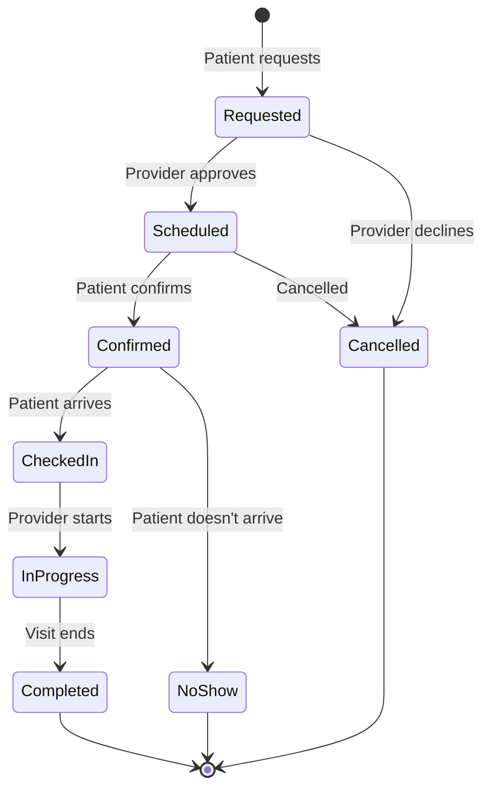
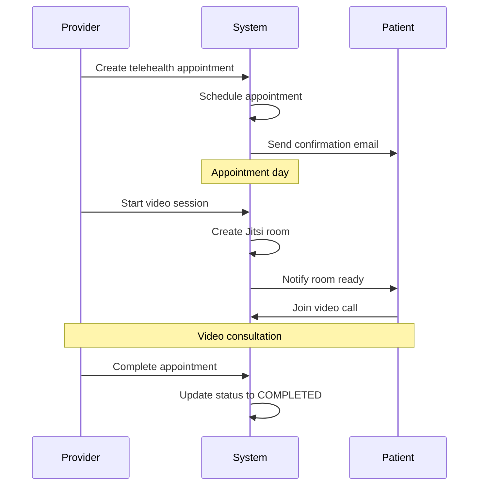

# Appointments

Complete guide to appointment scheduling and management in Ciyex EHR.

## Overview

The Appointments module provides comprehensive scheduling capabilities for healthcare providers and patients, including online booking, calendar management, and automated reminders.

## Features

- 📅 **Calendar Management** - Visual calendar interface for providers
- 🔍 **Availability Management** - Configure provider schedules and time slots
- 📱 **Online Booking** - Patients can request appointments via portal
- 🔔 **Automated Reminders** - Email and SMS appointment reminders
- 📊 **Appointment Types** - In-person, telehealth, follow-up
- ⏰ **Waitlist Management** - Manage cancellations and waitlists
- 📈 **Analytics** - Appointment statistics and no-show tracking
- 🔄 **Recurring Appointments** - Schedule recurring visits

## Appointment Lifecycle



## Appointment Types

### In-Person Visit

Standard office visit at a physical location.

**Configuration**:
- Duration: 15, 30, 45, or 60 minutes
- Location: Required
- Room: Optional

### Telehealth Visit

Virtual video consultation via Jitsi.

**Configuration**:
- Duration: 15, 30, or 45 minutes
- Location: Not required
- Video room: Auto-created

### Follow-Up Visit

Post-procedure or post-treatment follow-up.

**Configuration**:
- Duration: 15 or 30 minutes
- Linked to: Original appointment
- Auto-scheduled: Optional

### New Patient Visit

First visit for new patients.

**Configuration**:
- Duration: 60 minutes
- Intake forms: Required
- Insurance verification: Required

## Creating Appointments

### Via Provider UI

1. **Open Calendar**
   - Navigate to Calendar view
   - Select date and time slot

2. **Select Patient**
   - Search for existing patient
   - Or create new patient

3. **Configure Appointment**
   - Select appointment type
   - Choose duration
   - Select location (if in-person)
   - Add reason for visit
   - Set priority

4. **Save Appointment**
   - Appointment created with status "SCHEDULED"
   - Patient receives confirmation email

### Via Patient Portal

1. **Request Appointment**
   - Patient logs into portal
   - Clicks "Request Appointment"

2. **Select Provider**
   - Choose from available providers
   - View provider specialty and availability

3. **Choose Date/Time**
   - View available time slots
   - Select preferred date and time

4. **Provide Details**
   - Enter reason for visit
   - Select appointment type
   - Add any notes

5. **Submit Request**
   - Appointment created with status "REQUESTED"
   - Provider receives notification
   - Patient receives confirmation

### Via API

```http
POST /api/appointments
Authorization: Bearer {token}
Content-Type: application/json

{
  "patientId": 123,
  "providerId": 45,
  "locationId": 10,
  "appointmentType": "IN_PERSON",
  "appointmentDate": "2024-10-20",
  "appointmentTime": "10:00:00",
  "duration": 30,
  "reason": "Annual physical examination",
  "priority": "ROUTINE",
  "status": "SCHEDULED"
}
```

**Response**:
```json
{
  "success": true,
  "message": "Appointment created successfully",
  "data": {
    "id": 456,
    "patientId": 123,
    "providerId": 45,
    "appointmentDate": "2024-10-20",
    "appointmentTime": "10:00:00",
    "status": "SCHEDULED",
    "confirmationCode": "APT-456-2024"
  }
}
```

## Provider Availability

### Configuring Schedule

Providers can configure their availability:

```http
POST /api/providers/{providerId}/availability
Authorization: Bearer {token}
Content-Type: application/json

{
  "dayOfWeek": "MONDAY",
  "startTime": "09:00:00",
  "endTime": "17:00:00",
  "slotDuration": 30,
  "breakTimes": [
    {
      "startTime": "12:00:00",
      "endTime": "13:00:00"
    }
  ]
}
```

### Time Slots

Time slots are automatically generated based on provider availability:

```http
GET /api/appointments/available-slots?providerId=45&date=2024-10-20
Authorization: Bearer {token}
```

**Response**:
```json
{
  "success": true,
  "data": [
    {
      "startTime": "09:00:00",
      "endTime": "09:30:00",
      "available": true
    },
    {
      "startTime": "09:30:00",
      "endTime": "10:00:00",
      "available": true
    },
    {
      "startTime": "10:00:00",
      "endTime": "10:30:00",
      "available": false
    }
  ]
}
```

### Blocking Time

Block time for meetings, lunch, or other activities:

```http
POST /api/providers/{providerId}/blocked-time
Authorization: Bearer {token}
Content-Type: application/json

{
  "startDate": "2024-10-20",
  "endDate": "2024-10-20",
  "startTime": "12:00:00",
  "endTime": "13:00:00",
  "reason": "Lunch break",
  "recurring": false
}
```

## Appointment Management

### Updating Appointments

```http
PUT /api/appointments/{id}
Authorization: Bearer {token}
Content-Type: application/json

{
  "appointmentDate": "2024-10-21",
  "appointmentTime": "14:00:00",
  "reason": "Updated reason"
}
```

### Cancelling Appointments

```http
POST /api/appointments/{id}/cancel
Authorization: Bearer {token}
Content-Type: application/json

{
  "reason": "Patient requested cancellation",
  "notifyPatient": true
}
```

### Rescheduling

```http
POST /api/appointments/{id}/reschedule
Authorization: Bearer {token}
Content-Type: application/json

{
  "newDate": "2024-10-25",
  "newTime": "10:00:00",
  "reason": "Provider unavailable"
}
```

### Check-In

```http
POST /api/appointments/{id}/check-in
Authorization: Bearer {token}
Content-Type: application/json

{
  "checkInTime": "2024-10-20T09:55:00Z",
  "notes": "Patient arrived early"
}
```

## Reminders

### Email Reminders

Automatically sent 24 hours before appointment:

**Subject**: Appointment Reminder - Tomorrow at 10:00 AM

**Body**:
```
Dear John Doe,

This is a reminder of your upcoming appointment:

Date: October 20, 2024
Time: 10:00 AM
Provider: Dr. Jane Smith
Location: Main Clinic, 123 Healthcare Ave

If you need to cancel or reschedule, please call (555) 123-4567 
or visit our patient portal.

Thank you,
Ciyex EHR Team
```

### SMS Reminders

Sent 2 hours before appointment:

```
Reminder: Appointment today at 10:00 AM with Dr. Smith at Main Clinic. 
Reply CONFIRM to confirm or call (555) 123-4567 to reschedule.
```

### Configuring Reminders

```http
POST /api/appointments/{id}/reminders
Authorization: Bearer {token}
Content-Type: application/json

{
  "emailReminder": true,
  "emailReminderHours": 24,
  "smsReminder": true,
  "smsReminderHours": 2
}
```

## Waitlist Management

### Adding to Waitlist

```http
POST /api/appointments/waitlist
Authorization: Bearer {token}
Content-Type: application/json

{
  "patientId": 123,
  "providerId": 45,
  "preferredDates": ["2024-10-20", "2024-10-21"],
  "preferredTimes": ["morning", "afternoon"],
  "reason": "Follow-up consultation"
}
```

### Notifying Waitlist

When an appointment is cancelled, notify waitlist:

```http
POST /api/appointments/waitlist/notify
Authorization: Bearer {token}
Content-Type: application/json

{
  "providerId": 45,
  "date": "2024-10-20",
  "time": "10:00:00"
}
```

## Calendar Views

### Day View

```http
GET /api/appointments/calendar/day?providerId=45&date=2024-10-20
Authorization: Bearer {token}
```

### Week View

```http
GET /api/appointments/calendar/week?providerId=45&startDate=2024-10-14
Authorization: Bearer {token}
```

### Month View

```http
GET /api/appointments/calendar/month?providerId=45&month=10&year=2024
Authorization: Bearer {token}
```

## Analytics

### Appointment Statistics

```http
GET /api/appointments/analytics?startDate=2024-10-01&endDate=2024-10-31
Authorization: Bearer {token}
```

**Response**:
```json
{
  "success": true,
  "data": {
    "totalAppointments": 150,
    "completed": 120,
    "cancelled": 20,
    "noShows": 10,
    "completionRate": 0.80,
    "noShowRate": 0.067,
    "averageDuration": 28,
    "byType": {
      "IN_PERSON": 100,
      "TELEHEALTH": 50
    },
    "byProvider": {
      "45": 80,
      "46": 70
    }
  }
}
```

### No-Show Tracking

```http
GET /api/appointments/no-shows?patientId=123
Authorization: Bearer {token}
```

## Integration with Telehealth

For telehealth appointments, video rooms are automatically created:



## Best Practices

### For Providers

1. **Set Realistic Schedules** - Don't overbook
2. **Buffer Time** - Add 5-10 minutes between appointments
3. **Block Personal Time** - Lunch, meetings, admin time
4. **Review Requests Daily** - Approve/decline within 24 hours
5. **Document No-Shows** - Track patterns

### For Staff

1. **Confirm Appointments** - Call patients 24 hours before
2. **Update Cancellations Promptly** - Free up slots quickly
3. **Manage Waitlist** - Fill cancellations from waitlist
4. **Check Insurance** - Verify before appointment
5. **Prepare Charts** - Have patient charts ready

### For Patients

1. **Book Early** - Schedule 1-2 weeks in advance
2. **Confirm Attendance** - Respond to reminders
3. **Cancel Early** - Give 24 hours notice if possible
4. **Arrive Early** - Arrive 10-15 minutes before
5. **Update Information** - Keep contact info current

## Troubleshooting

### No Available Slots

**Issue**: No time slots showing for provider

**Solutions**:
- Check provider availability is configured
- Verify date is not in the past
- Check if provider has blocked time
- Ensure slot duration matches appointment type

### Appointment Not Appearing

**Issue**: Created appointment doesn't show in calendar

**Solutions**:
- Refresh calendar view
- Check correct date/provider selected
- Verify appointment status (might be REQUESTED)
- Check database for appointment record

### Reminder Not Sent

**Issue**: Patient didn't receive reminder

**Solutions**:
- Verify patient email/phone is correct
- Check SMTP/SMS configuration
- Review reminder settings for appointment
- Check email spam folder

### Double Booking

**Issue**: Two appointments in same time slot

**Solutions**:
- Check for race condition in booking
- Verify slot locking mechanism
- Review appointment creation logs
- Implement optimistic locking

## Configuration

### Appointment Settings

```yaml
# application.yml
ciyex:
  appointments:
    default-duration: 30
    min-duration: 15
    max-duration: 120
    buffer-time: 5
    advance-booking-days: 90
    cancellation-hours: 24
    reminder-email-hours: 24
    reminder-sms-hours: 2
    auto-confirm: false
    waitlist-enabled: true
```

### Notification Templates

Customize email and SMS templates in the database:

```sql
-- Email template
INSERT INTO notification_templates (type, subject, body)
VALUES (
  'APPOINTMENT_REMINDER',
  'Appointment Reminder - {{date}} at {{time}}',
  'Dear {{patientName}}, ...'
);

-- SMS template
INSERT INTO notification_templates (type, body)
VALUES (
  'APPOINTMENT_REMINDER_SMS',
  'Reminder: Appointment {{date}} at {{time}} with {{providerName}}'
);
```

## Next Steps

- [Telehealth](telehealth.md) - Video consultation integration
- [Patient Management](patient-management.md) - Patient records
- [Clinical Documentation](clinical-docs.md) - Document encounters
- [Billing](billing.md) - Invoice appointments
