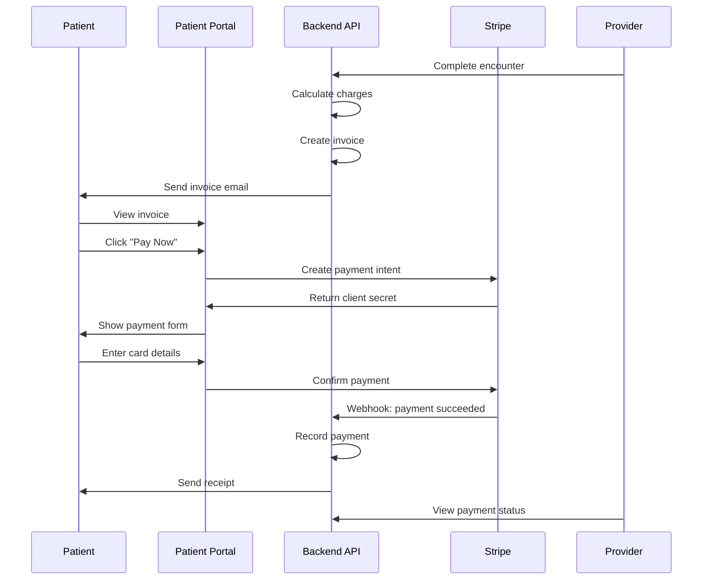
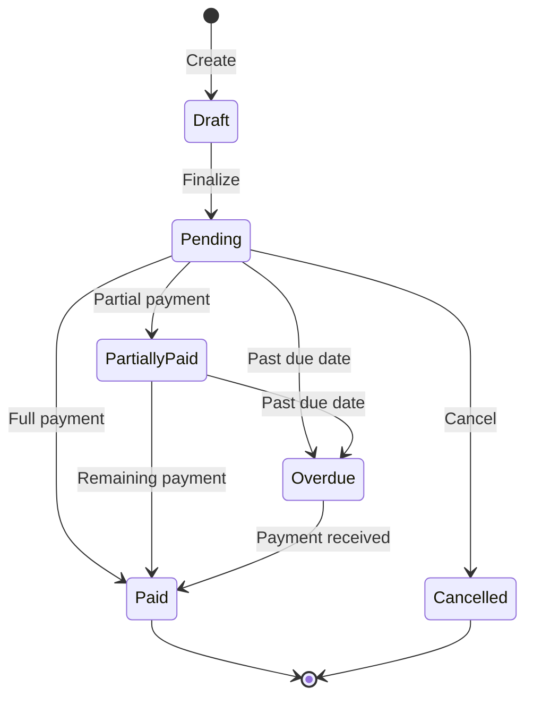

# Billing & Payments

Complete guide to billing, invoicing, and payment processing in Ciyex EHR.

## Overview

Ciyex EHR includes integrated billing and payment processing capabilities, supporting insurance claims, patient billing, and online payments via Stripe.

## Features

- 💳 **Online Payments** - Stripe integration for credit card processing
- 📄 **Invoice Generation** - Automated invoice creation
- 🏥 **Insurance Claims** - Submit claims electronically
- 📊 **Payment Tracking** - Track payments and outstanding balances
- 🔔 **Payment Reminders** - Automated reminder emails
- 📈 **Financial Reports** - Revenue and payment analytics
- 💰 **Payment Plans** - Set up installment plans
- 🧾 **Receipts** - Automatic receipt generation

## Billing Workflow



## Invoice Management

### Creating Invoices

**Automatic Invoice Creation**:
```java
@Service
public class BillingService {
    public Invoice createInvoiceFromEncounter(Encounter encounter) {
        Invoice invoice = new Invoice();
        invoice.setPatientId(encounter.getPatientId());
        invoice.setEncounterId(encounter.getId());
        invoice.setInvoiceDate(LocalDate.now());
        invoice.setDueDate(LocalDate.now().plusDays(30));
        
        // Add line items from encounter
        for (Procedure procedure : encounter.getProcedures()) {
            InvoiceLineItem item = new InvoiceLineItem();
            item.setDescription(procedure.getDescription());
            item.setCptCode(procedure.getCptCode());
            item.setQuantity(1);
            item.setUnitPrice(procedure.getCharge());
            invoice.addLineItem(item);
        }
        
        invoice.calculateTotal();
        return invoiceRepository.save(invoice);
    }
}
```

**Manual Invoice Creation**:
```http
POST /api/billing/invoices
Authorization: Bearer {token}
Content-Type: application/json

{
  "patientId": 123,
  "encounterId": 456,
  "invoiceDate": "2024-10-15",
  "dueDate": "2024-11-15",
  "lineItems": [
    {
      "description": "Office Visit - Established Patient",
      "cptCode": "99213",
      "quantity": 1,
      "unitPrice": 150.00
    },
    {
      "description": "Blood Pressure Check",
      "cptCode": "93000",
      "quantity": 1,
      "unitPrice": 25.00
    }
  ],
  "notes": "Annual checkup"
}
```

**Response**:
```json
{
  "success": true,
  "data": {
    "id": 789,
    "invoiceNumber": "INV-2024-00789",
    "patientId": 123,
    "subtotal": 175.00,
    "tax": 0.00,
    "total": 175.00,
    "amountPaid": 0.00,
    "balance": 175.00,
    "status": "PENDING"
  }
}
```

### Invoice Line Items

Common CPT codes and charges:

| CPT Code | Description | Typical Charge |
|----------|-------------|----------------|
| 99213 | Office Visit - Established | $150 |
| 99214 | Office Visit - Detailed | $200 |
| 99215 | Office Visit - Comprehensive | $250 |
| 99203 | New Patient - Detailed | $200 |
| 99204 | New Patient - Comprehensive | $300 |
| 93000 | ECG | $50 |
| 80053 | Comprehensive Metabolic Panel | $75 |
| 85025 | Complete Blood Count | $30 |

### Invoice Status



## Payment Processing

### Stripe Integration

**Configuration**:
```yaml
# application.yml
stripe:
  api-key: ${STRIPE_SECRET_KEY}
  publishable-key: ${STRIPE_PUBLISHABLE_KEY}
  webhook-secret: ${STRIPE_WEBHOOK_SECRET}
```

**Create Payment Intent**:
```http
POST /api/billing/payment-intent
Authorization: Bearer {token}
Content-Type: application/json

{
  "invoiceId": 789,
  "amount": 175.00,
  "currency": "usd",
  "paymentMethod": "card"
}
```

**Response**:
```json
{
  "success": true,
  "data": {
    "clientSecret": "pi_xxx_secret_yyy",
    "paymentIntentId": "pi_xxx",
    "amount": 17500,
    "currency": "usd"
  }
}
```

### Frontend Payment Form

```typescript
import { loadStripe } from '@stripe/stripe-js';
import { Elements, CardElement, useStripe, useElements } from '@stripe/react-stripe-js';

const stripePromise = loadStripe('pk_test_...');

function PaymentForm({ invoice }) {
  const stripe = useStripe();
  const elements = useElements();
  const [loading, setLoading] = useState(false);

  const handleSubmit = async (e) => {
    e.preventDefault();
    setLoading(true);

    // Create payment intent
    const response = await fetch('/api/billing/payment-intent', {
      method: 'POST',
      headers: {
        'Authorization': `Bearer ${token}`,
        'Content-Type': 'application/json'
      },
      body: JSON.stringify({
        invoiceId: invoice.id,
        amount: invoice.balance,
        currency: 'usd'
      })
    });

    const { clientSecret } = await response.json();

    // Confirm payment
    const result = await stripe.confirmCardPayment(clientSecret, {
      payment_method: {
        card: elements.getElement(CardElement),
        billing_details: {
          name: invoice.patientName,
          email: invoice.patientEmail
        }
      }
    });

    if (result.error) {
      alert(result.error.message);
    } else {
      alert('Payment successful!');
      window.location.href = '/invoices';
    }

    setLoading(false);
  };

  return (
    <form onSubmit={handleSubmit}>
      <CardElement />
      <button type="submit" disabled={!stripe || loading}>
        Pay ${invoice.balance}
      </button>
    </form>
  );
}

export default function PaymentPage({ invoice }) {
  return (
    <Elements stripe={stripePromise}>
      <PaymentForm invoice={invoice} />
    </Elements>
  );
}
```

### Stripe Webhooks

```java
@RestController
@RequestMapping("/api/webhooks/stripe")
public class StripeWebhookController {
    
    @PostMapping
    public ResponseEntity<?> handleWebhook(
        @RequestBody String payload,
        @RequestHeader("Stripe-Signature") String signature) {
        
        Event event = Webhook.constructEvent(
            payload, signature, webhookSecret
        );
        
        switch (event.getType()) {
            case "payment_intent.succeeded":
                handlePaymentSuccess(event);
                break;
            case "payment_intent.payment_failed":
                handlePaymentFailure(event);
                break;
        }
        
        return ResponseEntity.ok().build();
    }
    
    private void handlePaymentSuccess(Event event) {
        PaymentIntent paymentIntent = (PaymentIntent) event.getData().getObject();
        
        // Record payment
        Payment payment = new Payment();
        payment.setInvoiceId(getInvoiceIdFromMetadata(paymentIntent));
        payment.setAmount(paymentIntent.getAmount() / 100.0);
        payment.setPaymentMethod("CARD");
        payment.setStripePaymentIntentId(paymentIntent.getId());
        payment.setStatus("COMPLETED");
        paymentRepository.save(payment);
        
        // Update invoice
        updateInvoiceStatus(payment.getInvoiceId());
        
        // Send receipt
        emailService.sendReceipt(payment);
    }
}
```

## Insurance Claims

### Creating Claims

```http
POST /api/billing/claims
Authorization: Bearer {token}
Content-Type: application/json

{
  "patientId": 123,
  "encounterId": 456,
  "insuranceId": 10,
  "claimType": "PROFESSIONAL",
  "serviceDate": "2024-10-15",
  "diagnosisCodes": ["E11.9", "I10"],
  "procedureCodes": [
    {
      "cptCode": "99213",
      "charge": 150.00,
      "units": 1
    }
  ],
  "providerId": 45,
  "facilityId": 5
}
```

### Claim Status

```http
GET /api/billing/claims/{id}/status
Authorization: Bearer {token}
```

**Response**:
```json
{
  "success": true,
  "data": {
    "claimId": "CLM-2024-00123",
    "status": "SUBMITTED",
    "submittedDate": "2024-10-16",
    "payerName": "Blue Cross Blue Shield",
    "claimAmount": 150.00,
    "paidAmount": 0.00,
    "adjustments": [],
    "denialReason": null
  }
}
```

### Electronic Claims Submission

```java
@Service
public class ClaimsService {
    
    public void submitClaim(Claim claim) {
        // Generate HIPAA 837 file
        String edi837 = generateEDI837(claim);
        
        // Submit to clearinghouse
        clearinghouseClient.submitClaim(edi837);
        
        // Update claim status
        claim.setStatus(ClaimStatus.SUBMITTED);
        claim.setSubmittedDate(LocalDate.now());
        claimRepository.save(claim);
    }
    
    private String generateEDI837(Claim claim) {
        // EDI 837 format
        StringBuilder edi = new StringBuilder();
        edi.append("ISA*00*          *00*          *ZZ*SENDER         *ZZ*RECEIVER       *");
        edi.append(LocalDate.now().format(DateTimeFormatter.ofPattern("yyMMdd")));
        edi.append("*");
        edi.append(LocalTime.now().format(DateTimeFormatter.ofPattern("HHmm")));
        edi.append("*^*00501*000000001*0*P*:~\n");
        // ... more EDI segments
        return edi.toString();
    }
}
```

## Payment Plans

### Creating Payment Plans

```http
POST /api/billing/payment-plans
Authorization: Bearer {token}
Content-Type: application/json

{
  "invoiceId": 789,
  "totalAmount": 1000.00,
  "numberOfPayments": 4,
  "frequency": "MONTHLY",
  "firstPaymentDate": "2024-11-01",
  "autoCharge": true
}
```

**Response**:
```json
{
  "success": true,
  "data": {
    "id": 50,
    "invoiceId": 789,
    "totalAmount": 1000.00,
    "paymentAmount": 250.00,
    "numberOfPayments": 4,
    "paymentsRemaining": 4,
    "schedule": [
      {
        "paymentNumber": 1,
        "dueDate": "2024-11-01",
        "amount": 250.00,
        "status": "PENDING"
      },
      {
        "paymentNumber": 2,
        "dueDate": "2024-12-01",
        "amount": 250.00,
        "status": "PENDING"
      },
      {
        "paymentNumber": 3,
        "dueDate": "2025-01-01",
        "amount": 250.00,
        "status": "PENDING"
      },
      {
        "paymentNumber": 4,
        "dueDate": "2025-02-01",
        "amount": 250.00,
        "status": "PENDING"
      }
    ]
  }
}
```

### Auto-Charge Payment Plans

```java
@Scheduled(cron = "0 0 9 * * *")  // Run daily at 9 AM
public void processScheduledPayments() {
    List<PaymentPlanSchedule> duePayments = 
        paymentPlanRepository.findDuePayments(LocalDate.now());
    
    for (PaymentPlanSchedule schedule : duePayments) {
        try {
            // Charge saved payment method
            PaymentIntent paymentIntent = stripeService.createPaymentIntent(
                schedule.getAmount(),
                schedule.getPaymentPlan().getPaymentMethodId()
            );
            
            // Record payment
            recordPayment(schedule, paymentIntent);
            
            // Update schedule
            schedule.setStatus(PaymentStatus.PAID);
            schedule.setPaidDate(LocalDate.now());
            
        } catch (Exception e) {
            // Send failed payment notification
            emailService.sendPaymentFailedNotification(schedule);
        }
    }
}
```

## Payment Reminders

### Automated Reminders

```java
@Scheduled(cron = "0 0 10 * * *")  // Run daily at 10 AM
public void sendPaymentReminders() {
    // Find overdue invoices
    List<Invoice> overdueInvoices = 
        invoiceRepository.findOverdueInvoices(LocalDate.now());
    
    for (Invoice invoice : overdueInvoices) {
        // Check when last reminder was sent
        if (shouldSendReminder(invoice)) {
            emailService.sendPaymentReminder(invoice);
            
            // Record reminder sent
            invoice.setLastReminderDate(LocalDate.now());
            invoiceRepository.save(invoice);
        }
    }
}

private boolean shouldSendReminder(Invoice invoice) {
    if (invoice.getLastReminderDate() == null) {
        return true;  // Never sent
    }
    
    long daysSinceReminder = ChronoUnit.DAYS.between(
        invoice.getLastReminderDate(),
        LocalDate.now()
    );
    
    return daysSinceReminder >= 7;  // Send every 7 days
}
```

### Reminder Email Template

**Subject**: Payment Reminder - Invoice #{invoiceNumber}

**Body**:
```html
<p>Dear {{patientName}},</p>

<p>This is a friendly reminder that payment for invoice #{{invoiceNumber}} 
is now {{daysOverdue}} days overdue.</p>

<p><strong>Invoice Details:</strong></p>
<ul>
  <li>Invoice Date: {{invoiceDate}}</li>
  <li>Due Date: {{dueDate}}</li>
  <li>Amount Due: ${{balance}}</li>
</ul>

<p>You can pay online by clicking the button below:</p>

<a href="{{paymentLink}}" style="background-color: #4CAF50; color: white; 
   padding: 10px 20px; text-decoration: none; border-radius: 5px;">
  Pay Now
</a>

<p>If you have questions or need to set up a payment plan, 
please contact our billing department at (555) 123-4567.</p>

<p>Thank you,<br>{{practiceName}}</p>
```

## Financial Reports

### Revenue Report

```http
GET /api/billing/reports/revenue?startDate=2024-10-01&endDate=2024-10-31
Authorization: Bearer {token}
```

**Response**:
```json
{
  "success": true,
  "data": {
    "period": {
      "startDate": "2024-10-01",
      "endDate": "2024-10-31"
    },
    "totalBilled": 50000.00,
    "totalCollected": 42000.00,
    "totalOutstanding": 8000.00,
    "collectionRate": 0.84,
    "byPaymentMethod": {
      "CARD": 30000.00,
      "INSURANCE": 10000.00,
      "CASH": 2000.00
    },
    "byProvider": {
      "Dr. Smith": 25000.00,
      "Dr. Jones": 17000.00
    }
  }
}
```

### Outstanding Balances

```http
GET /api/billing/reports/outstanding
Authorization: Bearer {token}
```

**Response**:
```json
{
  "success": true,
  "data": {
    "totalOutstanding": 25000.00,
    "aging": {
      "current": 10000.00,
      "30days": 8000.00,
      "60days": 5000.00,
      "90days": 2000.00
    },
    "topDebtors": [
      {
        "patientId": 123,
        "patientName": "John Doe",
        "balance": 5000.00,
        "oldestInvoiceDate": "2024-07-15"
      }
    ]
  }
}
```

## Best Practices

### For Billing Staff

1. **Verify Insurance** - Always verify before appointment
2. **Timely Billing** - Submit claims within 24-48 hours
3. **Follow Up** - Check claim status weekly
4. **Payment Plans** - Offer for balances >$500
5. **Document Everything** - Keep detailed notes

### For Patients

1. **Review Invoices** - Check for accuracy
2. **Pay Promptly** - Avoid late fees
3. **Use Payment Plans** - If needed
4. **Keep Records** - Save receipts
5. **Ask Questions** - Contact billing with concerns

## Troubleshooting

### Payment Failed

**Issue**: Stripe payment declined

**Solutions**:
- Check card details are correct
- Verify sufficient funds
- Try different card
- Contact card issuer

### Invoice Not Generated

**Issue**: Invoice not created after encounter

**Solutions**:
```bash
# Check encounter has procedures
kubectl exec -it postgres-0 -- psql -U ciyex -d ciyexdb -c "
  SELECT * FROM procedures WHERE encounter_id = 456;
"

# Manually trigger invoice creation
curl -X POST http://localhost:8080/api/billing/invoices/generate \
  -H "Authorization: Bearer $TOKEN" \
  -d '{"encounterId": 456}'
```

### Claim Rejected

**Issue**: Insurance claim rejected

**Solutions**:
- Review rejection reason
- Verify patient eligibility
- Check diagnosis codes
- Correct and resubmit

## Next Steps

- [Patient Management](../features/patient-management.md) - Patient records
- [Appointments](../features/appointments.md) - Scheduling
- [Stripe Integration](../integrations/stripe.md) - Payment setup
- [Financial Reports](reports.md) - Detailed reporting
