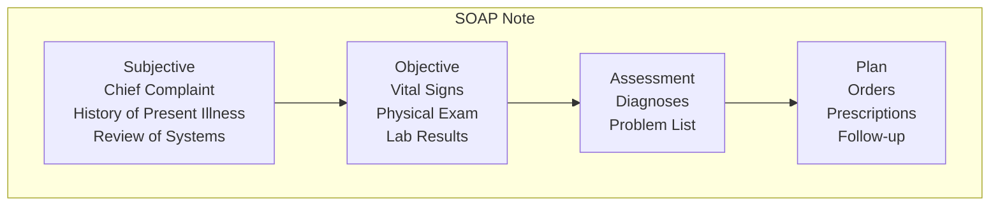

# Clinical Documentation

Complete guide to documenting patient encounters and clinical notes in Ciyex EHR.

## Overview

Clinical documentation is the core of any EHR system. Ciyex EHR provides comprehensive tools for documenting patient encounters using SOAP notes, templates, and structured data entry.

## Features

- 📝 **SOAP Notes** - Subjective, Objective, Assessment, Plan format
- 📋 **Templates** - Pre-built templates for common visit types
- 🎤 **Voice Dictation** - Speech-to-text for faster documentation
- 📊 **Structured Data** - Coded diagnoses, procedures, medications
- 🔍 **Smart Search** - Quick access to patient history
- 📱 **Mobile Documentation** - Document on tablets/phones
- ✅ **E-Signatures** - Electronic signature capture
- 📄 **PDF Export** - Export notes as PDF

## SOAP Note Structure



## Creating Encounter Notes

### Via Provider UI

1. **Start Encounter**
   - Open patient chart
   - Click "New Encounter"
   - Select encounter type (Office Visit, Telehealth, etc.)

2. **Document Subjective**
   - Enter chief complaint
   - Document history of present illness
   - Complete review of systems

3. **Record Objective**
   - Enter vital signs
   - Document physical exam findings
   - Review lab results

4. **Add Assessment**
   - Select diagnoses (ICD-10 codes)
   - Update problem list
   - Document clinical impression

5. **Create Plan**
   - Order labs/imaging
   - Prescribe medications
   - Schedule follow-up
   - Patient instructions

6. **Sign Note**
   - Review complete note
   - Add signature
   - Lock note

### Via API

```http
POST /api/encounters
Authorization: Bearer {token}
Content-Type: application/json

{
  "patientId": 123,
  "providerId": 45,
  "encounterDate": "2024-10-15",
  "encounterType": "OFFICE_VISIT",
  "chiefComplaint": "Annual physical examination",
  "subjective": {
    "historyOfPresentIllness": "Patient presents for annual physical. No acute complaints. Reports feeling well overall.",
    "reviewOfSystems": {
      "constitutional": "No fever, chills, or weight changes",
      "cardiovascular": "No chest pain or palpitations",
      "respiratory": "No shortness of breath or cough",
      "gastrointestinal": "No abdominal pain, nausea, or vomiting"
    }
  },
  "objective": {
    "vitals": {
      "bloodPressure": "120/80",
      "heartRate": 72,
      "temperature": 98.6,
      "weight": 180,
      "height": 70,
      "bmi": 25.8
    },
    "physicalExam": {
      "general": "Well-appearing, no acute distress",
      "cardiovascular": "Regular rate and rhythm, no murmurs",
      "respiratory": "Clear to auscultation bilaterally",
      "abdomen": "Soft, non-tender, no masses"
    }
  },
  "assessment": {
    "diagnoses": [
      {
        "icd10Code": "Z00.00",
        "description": "Encounter for general adult medical examination without abnormal findings",
        "status": "active"
      }
    ]
  },
  "plan": {
    "orders": [
      {
        "type": "LAB",
        "description": "Complete Blood Count",
        "code": "85025"
      },
      {
        "type": "LAB",
        "description": "Comprehensive Metabolic Panel",
        "code": "80053"
      }
    ],
    "medications": [],
    "instructions": "Continue current medications. Return in 1 year for next annual physical.",
    "followUp": {
      "timeframe": "1 year",
      "reason": "Annual physical"
    }
  }
}
```

**Response**:
```json
{
  "success": true,
  "message": "Encounter created successfully",
  "data": {
    "id": 789,
    "patientId": 123,
    "providerId": 45,
    "encounterDate": "2024-10-15",
    "status": "DRAFT",
    "createdAt": "2024-10-15T10:30:00Z"
  }
}
```

## Note Templates

### Common Templates

#### Annual Physical Template

```markdown
**Chief Complaint**: Annual physical examination

**Subjective**:
- HPI: Patient presents for annual physical. [No acute complaints / Specific concerns: ___]
- ROS:
  - Constitutional: [✓] No fever, chills, weight changes
  - Cardiovascular: [✓] No chest pain, palpitations
  - Respiratory: [✓] No SOB, cough
  - GI: [✓] No abdominal pain, N/V/D
  - [Additional systems as needed]

**Objective**:
- Vitals: BP ___, HR ___, Temp ___, Wt ___, Ht ___, BMI ___
- General: Well-appearing, NAD
- CV: RRR, no murmurs
- Resp: CTAB
- Abd: Soft, NT, ND, no masses
- [Additional exam findings]

**Assessment**:
1. Z00.00 - Encounter for general adult medical examination

**Plan**:
- Labs: CBC, CMP, Lipid panel, HbA1c
- Immunizations: [As needed]
- Screenings: [Age-appropriate]
- Follow-up: 1 year for next annual physical
```

#### Diabetes Follow-up Template

```markdown
**Chief Complaint**: Diabetes follow-up

**Subjective**:
- Blood sugar control: [Well controlled / Poorly controlled]
- Home glucose readings: Fasting ___, Post-prandial ___
- Hypoglycemic episodes: [Yes / No]
- Medication compliance: [Good / Fair / Poor]
- Diet and exercise: [Describe]

**Objective**:
- Vitals: BP ___, HR ___, Wt ___, BMI ___
- Foot exam: [Normal / Abnormal - describe]
- Monofilament test: [Intact / Diminished]

**Assessment**:
1. E11.9 - Type 2 diabetes mellitus without complications
2. [Additional diagnoses]

**Plan**:
- Continue metformin 1000mg BID
- HbA1c today (goal <7%)
- Diabetic foot care education
- Follow-up: 3 months
```

### Creating Custom Templates

```http
POST /api/templates
Authorization: Bearer {token}
Content-Type: application/json

{
  "name": "Hypertension Follow-up",
  "category": "CHRONIC_DISEASE",
  "encounterType": "OFFICE_VISIT",
  "template": {
    "chiefComplaint": "Hypertension follow-up",
    "subjective": {
      "hpi": "Patient returns for blood pressure check...",
      "ros": {
        "cardiovascular": "No chest pain, palpitations, or edema",
        "neurological": "No headaches, dizziness, or vision changes"
      }
    },
    "objective": {
      "vitals": ["bloodPressure", "heartRate", "weight"],
      "physicalExam": {
        "cardiovascular": "Regular rate and rhythm",
        "neurological": "Alert and oriented x3"
      }
    },
    "assessment": {
      "diagnoses": [
        {
          "icd10Code": "I10",
          "description": "Essential (primary) hypertension"
        }
      ]
    },
    "plan": {
      "medications": ["Continue current antihypertensive"],
      "followUp": "3 months"
    }
  }
}
```

## Voice Dictation

### Browser-Based Speech Recognition

```typescript
// Frontend implementation
import { useState, useEffect } from 'react';

export function useSpeechRecognition() {
  const [isListening, setIsListening] = useState(false);
  const [transcript, setTranscript] = useState('');

  useEffect(() => {
    if (!('webkitSpeechRecognition' in window)) {
      console.error('Speech recognition not supported');
      return;
    }

    const recognition = new webkitSpeechRecognition();
    recognition.continuous = true;
    recognition.interimResults = true;

    recognition.onresult = (event) => {
      let interimTranscript = '';
      let finalTranscript = '';

      for (let i = event.resultIndex; i < event.results.length; i++) {
        const transcript = event.results[i][0].transcript;
        if (event.results[i].isFinal) {
          finalTranscript += transcript + ' ';
        } else {
          interimTranscript += transcript;
        }
      }

      setTranscript(finalTranscript + interimTranscript);
    };

    if (isListening) {
      recognition.start();
    } else {
      recognition.stop();
    }

    return () => recognition.stop();
  }, [isListening]);

  return { isListening, setIsListening, transcript };
}

// Usage in component
export function SOAPNoteEditor() {
  const { isListening, setIsListening, transcript } = useSpeechRecognition();
  const [note, setNote] = useState('');

  useEffect(() => {
    if (transcript) {
      setNote(prev => prev + transcript);
    }
  }, [transcript]);

  return (
    <div>
      <textarea value={note} onChange={(e) => setNote(e.target.value)} />
      <button onClick={() => setIsListening(!isListening)}>
        {isListening ? '🎤 Stop' : '🎤 Start'} Dictation
      </button>
    </div>
  );
}
```

## Structured Data Entry

### ICD-10 Code Search

```http
GET /api/codes/icd10/search?q=diabetes
Authorization: Bearer {token}
```

**Response**:
```json
{
  "success": true,
  "data": [
    {
      "code": "E11.9",
      "description": "Type 2 diabetes mellitus without complications",
      "category": "Endocrine, nutritional and metabolic diseases"
    },
    {
      "code": "E11.65",
      "description": "Type 2 diabetes mellitus with hyperglycemia",
      "category": "Endocrine, nutritional and metabolic diseases"
    }
  ]
}
```

### CPT Code Search

```http
GET /api/codes/cpt/search?q=office+visit
Authorization: Bearer {token}
```

**Response**:
```json
{
  "success": true,
  "data": [
    {
      "code": "99213",
      "description": "Office or other outpatient visit, established patient, 20-29 minutes",
      "category": "Evaluation and Management"
    },
    {
      "code": "99214",
      "description": "Office or other outpatient visit, established patient, 30-39 minutes",
      "category": "Evaluation and Management"
    }
  ]
}
```

## Problem List Management

### Adding to Problem List

```http
POST /api/patients/{patientId}/problems
Authorization: Bearer {token}
Content-Type: application/json

{
  "icd10Code": "E11.9",
  "description": "Type 2 diabetes mellitus without complications",
  "status": "ACTIVE",
  "onsetDate": "2020-03-15",
  "notes": "Diagnosed during annual physical"
}
```

### Updating Problem Status

```http
PUT /api/patients/{patientId}/problems/{problemId}
Authorization: Bearer {token}
Content-Type: application/json

{
  "status": "RESOLVED",
  "resolvedDate": "2024-10-15",
  "notes": "Blood sugar well controlled, no longer requires medication"
}
```

## Medication Orders

### Prescribing Medications

```http
POST /api/patients/{patientId}/medications
Authorization: Bearer {token}
Content-Type: application/json

{
  "medicationName": "Metformin",
  "dosage": "1000mg",
  "route": "oral",
  "frequency": "twice daily",
  "duration": "90 days",
  "quantity": 180,
  "refills": 3,
  "instructions": "Take with meals to reduce GI upset",
  "prescribedDate": "2024-10-15"
}
```

### E-Prescribing Integration

```java
@Service
public class EPrescribeService {
    
    public void sendPrescription(Medication medication) {
        // Generate NCPDP SCRIPT message
        String scriptMessage = generateNCPDPScript(medication);
        
        // Send to pharmacy via Surescripts
        surescriptsClient.sendPrescription(scriptMessage);
        
        // Update medication status
        medication.setStatus(MedicationStatus.SENT);
        medication.setSentDate(LocalDateTime.now());
        medicationRepository.save(medication);
    }
}
```

## Lab Orders

### Ordering Labs

```http
POST /api/orders/lab
Authorization: Bearer {token}
Content-Type: application/json

{
  "patientId": 123,
  "encounterId": 789,
  "providerId": 45,
  "orderDate": "2024-10-15",
  "tests": [
    {
      "loincCode": "2093-3",
      "description": "Total Cholesterol",
      "priority": "ROUTINE"
    },
    {
      "loincCode": "2085-9",
      "description": "HDL Cholesterol",
      "priority": "ROUTINE"
    }
  ],
  "instructions": "Fasting required",
  "labFacility": "Quest Diagnostics"
}
```

## Note Signing & Locking

### Electronic Signature

```http
POST /api/encounters/{id}/sign
Authorization: Bearer {token}
Content-Type: application/json

{
  "signature": "Dr. Jane Smith, MD",
  "signatureDate": "2024-10-15T14:30:00Z",
  "attestation": "I attest that this note accurately reflects the patient encounter"
}
```

**Response**:
```json
{
  "success": true,
  "message": "Note signed successfully",
  "data": {
    "encounterId": 789,
    "status": "SIGNED",
    "signedBy": "Dr. Jane Smith",
    "signedAt": "2024-10-15T14:30:00Z",
    "locked": true
  }
}
```

### Addendum to Signed Note

```http
POST /api/encounters/{id}/addendum
Authorization: Bearer {token}
Content-Type: application/json

{
  "addendumText": "Addendum: Patient called to report improvement in symptoms. No further action needed at this time.",
  "addendumDate": "2024-10-16T09:00:00Z"
}
```

## PDF Export

### Generate PDF

```http
GET /api/encounters/{id}/pdf
Authorization: Bearer {token}
Accept: application/pdf
```

### PDF Template

```java
@Service
public class PDFService {
    
    public byte[] generateEncounterPDF(Encounter encounter) {
        Document document = new Document();
        ByteArrayOutputStream baos = new ByteArrayOutputStream();
        PdfWriter.getInstance(document, baos);
        
        document.open();
        
        // Header
        addHeader(document, encounter);
        
        // Patient demographics
        addPatientInfo(document, encounter.getPatient());
        
        // SOAP note
        addSOAPNote(document, encounter);
        
        // Signature
        addSignature(document, encounter);
        
        document.close();
        
        return baos.toByteArray();
    }
}
```

## Best Practices

### Documentation Guidelines

1. **Be Timely** - Document within 24 hours of encounter
2. **Be Accurate** - Use precise medical terminology
3. **Be Complete** - Include all relevant information
4. **Be Concise** - Avoid unnecessary details
5. **Use Templates** - For consistency and efficiency

### Medical-Legal Considerations

1. **Never Alter Signed Notes** - Use addendums instead
2. **Document Informed Consent** - For procedures and treatments
3. **Document Patient Education** - What was taught and understood
4. **Document Non-Compliance** - If patient refuses treatment
5. **Avoid Speculation** - Document facts, not assumptions

### Coding Best Practices

1. **Code to Highest Specificity** - Use most specific ICD-10 code
2. **Support with Documentation** - Ensure diagnosis is documented
3. **Link Diagnoses to Procedures** - Show medical necessity
4. **Update Problem List** - Keep current and accurate
5. **Review Before Signing** - Verify all codes are correct

## Troubleshooting

### Cannot Save Note

**Issue**: Save button disabled or error on save

**Solutions**:
- Check all required fields are filled
- Verify internet connection
- Check browser console for errors
- Try refreshing page

### Template Not Loading

**Issue**: Template doesn't populate fields

**Solutions**:
```bash
# Check template exists
curl -H "Authorization: Bearer $TOKEN" \
  http://localhost:8080/api/templates/{id}

# Verify template format
# Re-create template if corrupted
```

### Voice Dictation Not Working

**Issue**: Microphone not capturing speech

**Solutions**:
- Check browser permissions for microphone
- Verify microphone is working
- Try different browser (Chrome recommended)
- Check for HTTPS (required for speech API)

## Next Steps

- [Patient Management](patient-management.md) - Patient records
- [Appointments](appointments.md) - Scheduling encounters
- [Billing](billing.md) - Billing for encounters
- [E-Prescribing](../integrations/eprescribe.md) - Electronic prescriptions
