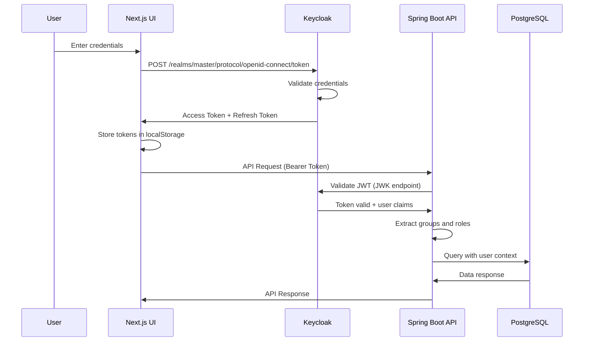

# Keycloak Integration Guide

Complete guide for integrating Keycloak (Aran ID) authentication with Ciyex EHR.

## Overview

Ciyex EHR uses Keycloak as its authentication and authorization provider, offering:

- **Single Sign-On (SSO)** - One login for all Ciyex services
- **OAuth2/OIDC** - Industry-standard authentication protocols
- **Group-Based Access** - Organize users by practice, role, and permissions
- **Multi-Factor Authentication** - Enhanced security
- **User Federation** - Connect to existing identity providers

## Architecture



## Keycloak Server Setup

### Server Details

| Property | Value |
|----------|-------|
| **URL** | https://aran-stg.zpoa.com/ |
| **Realm** | master |
| **Admin Console** | https://aran-stg.zpoa.com/admin |

### Access Admin Console

1. Navigate to https://aran-stg.zpoa.com/admin
2. Select realm: **master**
3. Login with admin credentials

## Client Configuration

### Create Ciyex Client

1. **Navigate to Clients**
   - Click "Clients" in left sidebar
   - Click "Create client"

2. **Client Settings**
   ```
   Client ID: ciyex-app
   Client Protocol: openid-connect
   Access Type: confidential
   ```

3. **Capability Config**
   - ✅ Client authentication: ON
   - ✅ Authorization: ON
   - ✅ Standard flow: ON
   - ✅ Direct access grants: ON
   - ❌ Implicit flow: OFF
   - ❌ Service accounts: OFF

4. **Valid Redirect URIs**
   ```
   http://localhost:3000/*
   https://practice1.example.com/*
   https://practice2.example.com/*
   ```

5. **Web Origins**
   ```
   http://localhost:3000
   https://practice1.example.com
   https://practice2.example.com
   +
   ```

6. **Get Client Secret**
   - Go to "Credentials" tab
   - Copy the "Client secret"
   - Store securely (needed for backend configuration)

### Client Mappers

Add custom mappers to include additional claims in JWT tokens:

#### 1. Tenant ID Mapper

```
Name: tenant-id
Mapper Type: User Attribute
User Attribute: tenant_id
Token Claim Name: tenant_id
Claim JSON Type: long
Add to ID token: ON
Add to access token: ON
Add to userinfo: ON
```

#### 2. Tenant Name Mapper

```
Name: tenant-name
Mapper Type: User Attribute
User Attribute: tenant_name
Token Claim Name: tenant_name
Claim JSON Type: String
Add to ID token: ON
Add to access token: ON
```

#### 3. Groups Mapper

```
Name: groups
Mapper Type: Group Membership
Token Claim Name: groups
Full group path: OFF
Add to ID token: ON
Add to access token: ON
```

## Group Configuration

### Group Hierarchy

Create groups to organize users by practice and role:

```
/practices
  /practice-1
    /providers
    /staff
    /admin
  /practice-2
    /providers
    /staff
    /admin
```

### Create Groups

1. Click "Groups" in left sidebar
2. Click "Create group"
3. Create hierarchy as shown above

### Assign Group Attributes

For each practice group, add attributes:

1. Select group (e.g., `/practices/practice-1`)
2. Go to "Attributes" tab
3. Add attributes:
   ```
   tenant_id: 1
   tenant_name: practice_1
   schema_name: practice_1
   ```

## User Management

### Create Users

1. **Navigate to Users**
   - Click "Users" in left sidebar
   - Click "Create new user"

2. **User Details**
   ```
   Username: john.provider@example.com
   Email: john.provider@example.com
   First name: John
   Last name: Provider
   Email verified: ON
   Enabled: ON
   ```

3. **Set Password**
   - Go to "Credentials" tab
   - Click "Set password"
   - Enter password
   - Temporary: OFF (for permanent password)

4. **Assign Groups**
   - Go to "Groups" tab
   - Click "Join Group"
   - Select `/practices/practice-1/providers`
   - Click "Join"

### User Attributes

Add custom attributes to users:

```
patient_id: 123 (for patient users)
provider_id: 45 (for provider users)
role: PROVIDER | PATIENT | ADMIN
```

## Backend Configuration

### 1. Add Dependencies

In `build.gradle`:

```gradle
dependencies {
    implementation 'org.springframework.boot:spring-boot-starter-oauth2-resource-server'
    implementation 'org.springframework.boot:spring-boot-starter-oauth2-client'
}
```

### 2. Application Configuration

In `application.yml`:

```yaml
keycloak:
  enabled: true
  auth-server-url: https://aran-stg.zpoa.com/
  realm: master
  resource: ciyex-app
  credentials:
    secret: ${KEYCLOAK_CLIENT_SECRET}
  use-resource-role-mappings: true
  bearer-only: false

spring:
  security:
    oauth2:
      resourceserver:
        jwt:
          issuer-uri: https://aran-stg.zpoa.com/realms/master
          jwk-set-uri: https://aran-stg.zpoa.com/realms/master/protocol/openid-connect/certs
```

### 3. Environment Variables

```bash
export KEYCLOAK_CLIENT_SECRET=your-client-secret-here
```

### 4. Security Configuration

The backend includes:

- **KeycloakConfig.java** - Keycloak configuration
- **KeycloakAuthService.java** - Authentication service
- **KeycloakJwtAuthenticationConverter.java** - JWT to Spring Security converter
- **SecurityConfig.java** - Security configuration

## Frontend Configuration

### 1. Environment Variables

In `.env.local`:

```bash
# Keycloak Configuration
NEXT_PUBLIC_KEYCLOAK_ENABLED=true
NEXT_PUBLIC_KEYCLOAK_URL=https://aran-stg.zpoa.com
NEXT_PUBLIC_KEYCLOAK_REALM=master
NEXT_PUBLIC_KEYCLOAK_CLIENT_ID=ciyex-app
```

### 2. Login Flow

The frontend supports both Keycloak and local authentication:

```typescript
// Keycloak login
const response = await fetch(`${API_URL}/api/auth/keycloak-login`, {
  method: 'POST',
  headers: { 'Content-Type': 'application/json' },
  body: JSON.stringify({ username, password })
});

const data = await response.json();

// Store tokens
localStorage.setItem('token', data.data.token);
localStorage.setItem('refreshToken', data.data.refresh_token);
localStorage.setItem('groups', JSON.stringify(data.data.groups));
localStorage.setItem('authMethod', 'keycloak');
```

## API Endpoints

### Keycloak Login

```http
POST /api/auth/keycloak-login
Content-Type: application/json

{
  "username": "john.provider@example.com",
  "password": "password123"
}
```

**Response:**
```json
{
  "success": true,
  "message": "Keycloak login successful",
  "data": {
    "token": "eyJhbGciOiJSUzI1NiIsInR5cCI6IkpXVCJ9...",
    "refresh_token": "eyJhbGciOiJIUzI1NiIsInR5cCI6IkpXVCJ9...",
    "expires_in": 300,
    "email": "john.provider@example.com",
    "username": "john.provider",
    "firstName": "John",
    "lastName": "Provider",
    "groups": ["/practices/practice-1/providers"],
    "userId": "f47ac10b-58cc-4372-a567-0e02b2c3d479"
  }
}
```

### Token Refresh

```http
POST /api/auth/refresh
Content-Type: application/json

{
  "refreshToken": "eyJhbGciOiJIUzI1NiIsInR5cCI6IkpXVCJ9..."
}
```

## JWT Token Structure

### Access Token Claims

```json
{
  "exp": 1730000000,
  "iat": 1729999700,
  "jti": "unique-token-id",
  "iss": "https://aran-stg.zpoa.com/realms/master",
  "sub": "f47ac10b-58cc-4372-a567-0e02b2c3d479",
  "typ": "Bearer",
  "azp": "ciyex-app",
  "email": "john.provider@example.com",
  "email_verified": true,
  "name": "John Provider",
  "preferred_username": "john.provider",
  "given_name": "John",
  "family_name": "Provider",
  "tenant_id": 1,
  "tenant_name": "practice_1",
  "groups": ["/practices/practice-1/providers"],
  "realm_access": {
    "roles": ["provider", "user"]
  }
}
```

## Authorization

### Group-Based Access Control

Backend extracts groups from JWT and maps to Spring Security authorities:

```java
// Groups mapped with GROUP_ prefix
/practices/practice-1/providers → GROUP_practices_practice-1_providers

// Roles mapped with ROLE_ prefix
provider → ROLE_provider
```

### Securing Endpoints

```java
@PreAuthorize("hasAuthority('GROUP_practices_practice-1_providers')")
@GetMapping("/api/providers/schedule")
public ResponseEntity<?> getSchedule() {
    // Only accessible to practice-1 providers
}

@PreAuthorize("hasRole('ADMIN')")
@PostMapping("/api/admin/settings")
public ResponseEntity<?> updateSettings() {
    // Only accessible to admins
}
```

## Testing

### Test Keycloak Authentication

```bash
# Get access token
curl -X POST https://aran-stg.zpoa.com/realms/master/protocol/openid-connect/token \
  -H "Content-Type: application/x-www-form-urlencoded" \
  -d "client_id=ciyex-app" \
  -d "client_secret=YOUR_CLIENT_SECRET" \
  -d "username=john.provider@example.com" \
  -d "password=password123" \
  -d "grant_type=password"

# Use token in API request
curl -X GET http://localhost:8080/api/patients \
  -H "Authorization: Bearer YOUR_ACCESS_TOKEN"
```

### Decode JWT Token

Use [jwt.io](https://jwt.io) to decode and inspect JWT tokens.

## Troubleshooting

### Issue: "Invalid client credentials"

**Solution:**
- Verify client secret in backend configuration
- Check client ID matches Keycloak configuration
- Ensure client is enabled in Keycloak

### Issue: "Token validation failed"

**Solution:**
- Check `issuer-uri` matches Keycloak realm URL
- Verify `jwk-set-uri` is accessible
- Ensure system time is synchronized (JWT exp validation)

### Issue: "Groups not appearing in token"

**Solution:**
- Verify group mapper is configured in client
- Check user is assigned to groups
- Ensure "Add to access token" is enabled in mapper

### Issue: "Unauthorized" even with valid token

**Solution:**
- Check group/role mappings in backend
- Verify `@PreAuthorize` annotations use correct authority names
- Enable debug logging: `logging.level.org.springframework.security=DEBUG`

## Migration from Local Auth

### Step 1: Create Keycloak Users

For each existing user:
1. Create user in Keycloak
2. Set same email address
3. Assign to appropriate groups
4. Set initial password

### Step 2: Enable Dual Authentication

Keep both local and Keycloak auth enabled during transition:

```yaml
keycloak:
  enabled: true  # Enable Keycloak
  
# Local auth still works via /api/auth/login
```

### Step 3: Migrate Users Gradually

- Inform users of new login method
- Provide password reset instructions
- Monitor both auth methods

### Step 4: Disable Local Auth

Once all users migrated:

```yaml
keycloak:
  enabled: true
  
# Remove local auth endpoints
```

## Security Best Practices

1. **Client Secret** - Store in environment variables, never commit to git
2. **Token Storage** - Use httpOnly cookies in production (not localStorage)
3. **HTTPS** - Always use HTTPS for Keycloak communication
4. **Token Expiration** - Implement token refresh logic
5. **Group Validation** - Always validate group membership on backend
6. **Audit Logging** - Log all authentication attempts

## Next Steps

- [Authentication Security](../security/authentication-security.md)
- [Authorization](../security/authorization.md)
- [User Management](../operations/user-management.md)
- [Troubleshooting](../operations/troubleshooting.md)
