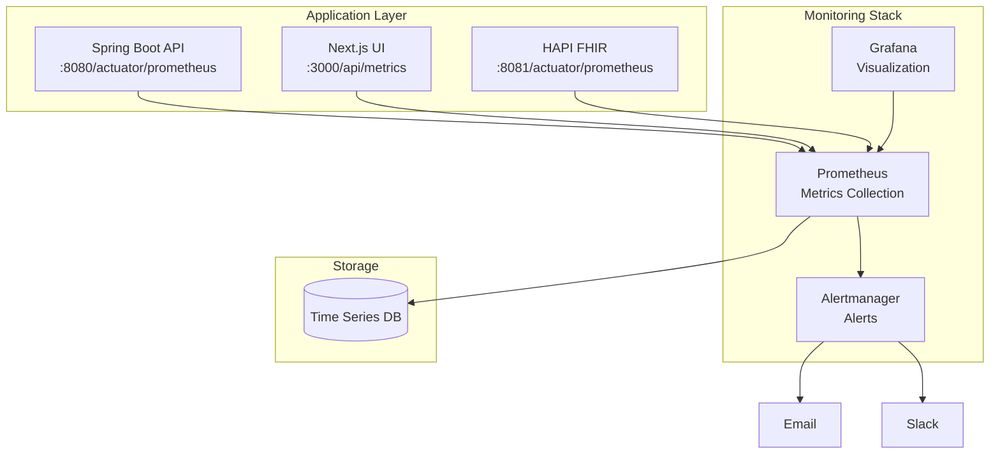

# Monitoring & Observability

Complete guide to monitoring Ciyex EHR with Prometheus and Grafana.

## Overview

Comprehensive monitoring is essential for maintaining system health, identifying issues early, and ensuring optimal performance. Ciyex EHR uses Prometheus for metrics collection and Grafana for visualization.

## Architecture



## Prometheus Setup

### Installation (Kubernetes)

```yaml
# prometheus-deployment.yaml
apiVersion: v1
kind: ConfigMap
metadata:
  name: prometheus-config
  namespace: monitoring
data:
  prometheus.yml: |
    global:
      scrape_interval: 15s
      evaluation_interval: 15s
    
    scrape_configs:
      - job_name: 'ciyex-api'
        kubernetes_sd_configs:
          - role: pod
            namespaces:
              names:
                - ciyex-prod
        relabel_configs:
          - source_labels: [__meta_kubernetes_pod_annotation_prometheus_io_scrape]
            action: keep
            regex: true
          - source_labels: [__meta_kubernetes_pod_annotation_prometheus_io_path]
            action: replace
            target_label: __metrics_path__
            regex: (.+)
          - source_labels: [__address__, __meta_kubernetes_pod_annotation_prometheus_io_port]
            action: replace
            regex: ([^:]+)(?::\d+)?;(\d+)
            replacement: $1:$2
            target_label: __address__
---
apiVersion: apps/v1
kind: Deployment
metadata:
  name: prometheus
  namespace: monitoring
spec:
  replicas: 1
  selector:
    matchLabels:
      app: prometheus
  template:
    metadata:
      labels:
        app: prometheus
    spec:
      containers:
      - name: prometheus
        image: prom/prometheus:latest
        args:
          - '--config.file=/etc/prometheus/prometheus.yml'
          - '--storage.tsdb.path=/prometheus'
          - '--storage.tsdb.retention.time=30d'
        ports:
        - containerPort: 9090
        volumeMounts:
        - name: config
          mountPath: /etc/prometheus
        - name: storage
          mountPath: /prometheus
      volumes:
      - name: config
        configMap:
          name: prometheus-config
      - name: storage
        persistentVolumeClaim:
          claimName: prometheus-storage
---
apiVersion: v1
kind: Service
metadata:
  name: prometheus
  namespace: monitoring
spec:
  selector:
    app: prometheus
  ports:
  - port: 9090
    targetPort: 9090
```

### Deploy Prometheus

```bash
# Create namespace
kubectl create namespace monitoring

# Create PVC for storage
kubectl apply -f - <<EOF
apiVersion: v1
kind: PersistentVolumeClaim
metadata:
  name: prometheus-storage
  namespace: monitoring
spec:
  accessModes:
    - ReadWriteOnce
  resources:
    requests:
      storage: 50Gi
EOF

# Deploy Prometheus
kubectl apply -f prometheus-deployment.yaml
```

## Application Metrics

### Backend Metrics (Spring Boot)

**Enable Actuator**:
```yaml
# application.yml
management:
  endpoints:
    web:
      exposure:
        include: health,info,metrics,prometheus
  metrics:
    export:
      prometheus:
        enabled: true
    tags:
      application: ciyex-api
      environment: production
```

**Add Prometheus Annotations**:
```yaml
# deployment.yaml
apiVersion: apps/v1
kind: Deployment
metadata:
  name: ciyex-api
spec:
  template:
    metadata:
      annotations:
        prometheus.io/scrape: "true"
        prometheus.io/port: "8080"
        prometheus.io/path: "/actuator/prometheus"
```

**Custom Metrics**:
```java
@Service
public class PatientService {
    private final Counter patientCreatedCounter;
    private final Timer patientSearchTimer;
    
    public PatientService(MeterRegistry registry) {
        this.patientCreatedCounter = Counter.builder("patients.created")
            .description("Number of patients created")
            .tag("type", "patient")
            .register(registry);
            
        this.patientSearchTimer = Timer.builder("patients.search.duration")
            .description("Patient search duration")
            .register(registry);
    }
    
    public Patient createPatient(PatientDTO dto) {
        Patient patient = // create patient
        patientCreatedCounter.increment();
        return patient;
    }
    
    public List<Patient> searchPatients(String query) {
        return patientSearchTimer.record(() -> {
            return patientRepository.search(query);
        });
    }
}
```

### Frontend Metrics (Next.js)

**API Route for Metrics**:
```typescript
// src/app/api/metrics/route.ts
import { NextResponse } from 'next/server';

let requestCount = 0;
let errorCount = 0;

export async function GET() {
  const metrics = `
# HELP http_requests_total Total HTTP requests
# TYPE http_requests_total counter
http_requests_total{app="ciyex-ui"} ${requestCount}

# HELP http_errors_total Total HTTP errors
# TYPE http_errors_total counter
http_errors_total{app="ciyex-ui"} ${errorCount}
  `.trim();

  return new NextResponse(metrics, {
    headers: { 'Content-Type': 'text/plain' }
  });
}

export function incrementRequests() {
  requestCount++;
}

export function incrementErrors() {
  errorCount++;
}
```

## Grafana Setup

### Installation

```yaml
# grafana-deployment.yaml
apiVersion: apps/v1
kind: Deployment
metadata:
  name: grafana
  namespace: monitoring
spec:
  replicas: 1
  selector:
    matchLabels:
      app: grafana
  template:
    metadata:
      labels:
        app: grafana
    spec:
      containers:
      - name: grafana
        image: grafana/grafana:latest
        ports:
        - containerPort: 3000
        env:
        - name: GF_SECURITY_ADMIN_PASSWORD
          valueFrom:
            secretKeyRef:
              name: grafana-admin
              key: password
        volumeMounts:
        - name: storage
          mountPath: /var/lib/grafana
      volumes:
      - name: storage
        persistentVolumeClaim:
          claimName: grafana-storage
---
apiVersion: v1
kind: Service
metadata:
  name: grafana
  namespace: monitoring
spec:
  selector:
    app: grafana
  ports:
  - port: 80
    targetPort: 3000
```

### Deploy Grafana

```bash
# Create admin password secret
kubectl create secret generic grafana-admin \
  --from-literal=password=admin-password \
  --namespace=monitoring

# Create PVC
kubectl apply -f - <<EOF
apiVersion: v1
kind: PersistentVolumeClaim
metadata:
  name: grafana-storage
  namespace: monitoring
spec:
  accessModes:
    - ReadWriteOnce
  resources:
    requests:
      storage: 10Gi
EOF

# Deploy Grafana
kubectl apply -f grafana-deployment.yaml
```

### Access Grafana

```bash
# Port forward
kubectl port-forward -n monitoring svc/grafana 3000:80

# Open browser
open http://localhost:3000

# Login: admin / admin-password
```

### Add Prometheus Data Source

1. Navigate to Configuration → Data Sources
2. Click "Add data source"
3. Select "Prometheus"
4. URL: `http://prometheus:9090`
5. Click "Save & Test"

## Dashboards

### Application Dashboard

```json
{
  "dashboard": {
    "title": "Ciyex EHR - Application Metrics",
    "panels": [
      {
        "title": "Request Rate",
        "targets": [
          {
            "expr": "rate(http_server_requests_seconds_count{application=\"ciyex-api\"}[5m])"
          }
        ],
        "type": "graph"
      },
      {
        "title": "Response Time (p95)",
        "targets": [
          {
            "expr": "histogram_quantile(0.95, rate(http_server_requests_seconds_bucket{application=\"ciyex-api\"}[5m]))"
          }
        ],
        "type": "graph"
      },
      {
        "title": "Error Rate",
        "targets": [
          {
            "expr": "rate(http_server_requests_seconds_count{application=\"ciyex-api\",status=~\"5..\"}[5m])"
          }
        ],
        "type": "graph"
      },
      {
        "title": "Active Users",
        "targets": [
          {
            "expr": "count(count by (user_id) (http_server_requests_seconds_count{application=\"ciyex-api\"}))"
          }
        ],
        "type": "stat"
      }
    ]
  }
}
```

### Database Dashboard

```json
{
  "dashboard": {
    "title": "Ciyex EHR - Database Metrics",
    "panels": [
      {
        "title": "Connection Pool Usage",
        "targets": [
          {
            "expr": "hikaricp_connections_active{application=\"ciyex-api\"}"
          }
        ],
        "type": "graph"
      },
      {
        "title": "Query Duration",
        "targets": [
          {
            "expr": "rate(hikaricp_connections_acquire_seconds_sum[5m]) / rate(hikaricp_connections_acquire_seconds_count[5m])"
          }
        ],
        "type": "graph"
      },
      {
        "title": "Slow Queries",
        "targets": [
          {
            "expr": "pg_stat_statements_mean_time_seconds{datname=\"ciyexdb\"} > 1"
          }
        ],
        "type": "table"
      }
    ]
  }
}
```

### Infrastructure Dashboard

```json
{
  "dashboard": {
    "title": "Ciyex EHR - Infrastructure",
    "panels": [
      {
        "title": "CPU Usage",
        "targets": [
          {
            "expr": "rate(container_cpu_usage_seconds_total{namespace=\"ciyex-prod\"}[5m])"
          }
        ],
        "type": "graph"
      },
      {
        "title": "Memory Usage",
        "targets": [
          {
            "expr": "container_memory_usage_bytes{namespace=\"ciyex-prod\"}"
          }
        ],
        "type": "graph"
      },
      {
        "title": "Disk Usage",
        "targets": [
          {
            "expr": "kubelet_volume_stats_used_bytes / kubelet_volume_stats_capacity_bytes"
          }
        ],
        "type": "gauge"
      },
      {
        "title": "Network I/O",
        "targets": [
          {
            "expr": "rate(container_network_receive_bytes_total{namespace=\"ciyex-prod\"}[5m])"
          }
        ],
        "type": "graph"
      }
    ]
  }
}
```

## Alerting

### Alertmanager Configuration

```yaml
# alertmanager-config.yaml
apiVersion: v1
kind: ConfigMap
metadata:
  name: alertmanager-config
  namespace: monitoring
data:
  alertmanager.yml: |
    global:
      smtp_smarthost: 'smtp.gmail.com:587'
      smtp_from: 'alerts@ciyex.org'
      smtp_auth_username: 'alerts@ciyex.org'
      smtp_auth_password: 'password'
    
    route:
      group_by: ['alertname', 'cluster']
      group_wait: 10s
      group_interval: 10s
      repeat_interval: 12h
      receiver: 'email'
      routes:
        - match:
            severity: critical
          receiver: 'pagerduty'
    
    receivers:
      - name: 'email'
        email_configs:
          - to: 'ops@ciyex.org'
            headers:
              Subject: '[ALERT] {{ .GroupLabels.alertname }}'
      
      - name: 'pagerduty'
        pagerduty_configs:
          - service_key: 'your-pagerduty-key'
      
      - name: 'slack'
        slack_configs:
          - api_url: 'https://hooks.slack.com/services/xxx'
            channel: '#alerts'
            text: '{{ range .Alerts }}{{ .Annotations.description }}{{ end }}'
```

### Alert Rules

```yaml
# prometheus-rules.yaml
apiVersion: v1
kind: ConfigMap
metadata:
  name: prometheus-rules
  namespace: monitoring
data:
  alerts.yml: |
    groups:
      - name: application
        interval: 30s
        rules:
          - alert: HighErrorRate
            expr: rate(http_server_requests_seconds_count{status=~"5.."}[5m]) > 0.05
            for: 5m
            labels:
              severity: warning
            annotations:
              summary: "High error rate detected"
              description: "Error rate is {{ $value }} errors/sec"
          
          - alert: HighResponseTime
            expr: histogram_quantile(0.95, rate(http_server_requests_seconds_bucket[5m])) > 2
            for: 5m
            labels:
              severity: warning
            annotations:
              summary: "High response time"
              description: "95th percentile response time is {{ $value }}s"
          
          - alert: ApplicationDown
            expr: up{job="ciyex-api"} == 0
            for: 1m
            labels:
              severity: critical
            annotations:
              summary: "Application is down"
              description: "{{ $labels.instance }} is down"
      
      - name: database
        interval: 30s
        rules:
          - alert: DatabaseConnectionPoolExhausted
            expr: hikaricp_connections_active / hikaricp_connections_max > 0.9
            for: 5m
            labels:
              severity: warning
            annotations:
              summary: "Database connection pool nearly exhausted"
              description: "Connection pool usage is {{ $value }}%"
          
          - alert: SlowQueries
            expr: pg_stat_statements_mean_time_seconds > 5
            for: 5m
            labels:
              severity: warning
            annotations:
              summary: "Slow database queries detected"
              description: "Query {{ $labels.query }} taking {{ $value }}s"
      
      - name: infrastructure
        interval: 30s
        rules:
          - alert: HighCPUUsage
            expr: rate(container_cpu_usage_seconds_total[5m]) > 0.8
            for: 10m
            labels:
              severity: warning
            annotations:
              summary: "High CPU usage"
              description: "CPU usage is {{ $value }}%"
          
          - alert: HighMemoryUsage
            expr: container_memory_usage_bytes / container_spec_memory_limit_bytes > 0.9
            for: 5m
            labels:
              severity: warning
            annotations:
              summary: "High memory usage"
              description: "Memory usage is {{ $value }}%"
          
          - alert: DiskSpaceLow
            expr: kubelet_volume_stats_available_bytes / kubelet_volume_stats_capacity_bytes < 0.1
            for: 5m
            labels:
              severity: critical
            annotations:
              summary: "Disk space low"
              description: "Only {{ $value }}% disk space remaining"
```

## Logging

### Centralized Logging with Loki

```yaml
# loki-deployment.yaml
apiVersion: apps/v1
kind: Deployment
metadata:
  name: loki
  namespace: monitoring
spec:
  replicas: 1
  selector:
    matchLabels:
      app: loki
  template:
    metadata:
      labels:
        app: loki
    spec:
      containers:
      - name: loki
        image: grafana/loki:latest
        ports:
        - containerPort: 3100
        volumeMounts:
        - name: storage
          mountPath: /loki
      volumes:
      - name: storage
        persistentVolumeClaim:
          claimName: loki-storage
```

### Promtail for Log Collection

```yaml
# promtail-daemonset.yaml
apiVersion: apps/v1
kind: DaemonSet
metadata:
  name: promtail
  namespace: monitoring
spec:
  selector:
    matchLabels:
      app: promtail
  template:
    metadata:
      labels:
        app: promtail
    spec:
      containers:
      - name: promtail
        image: grafana/promtail:latest
        args:
          - -config.file=/etc/promtail/promtail.yaml
        volumeMounts:
        - name: config
          mountPath: /etc/promtail
        - name: varlog
          mountPath: /var/log
        - name: varlibdockercontainers
          mountPath: /var/lib/docker/containers
          readOnly: true
      volumes:
      - name: config
        configMap:
          name: promtail-config
      - name: varlog
        hostPath:
          path: /var/log
      - name: varlibdockercontainers
        hostPath:
          path: /var/lib/docker/containers
```

## Best Practices

1. **Set Appropriate Retention** - 30 days for metrics, 7 days for logs
2. **Use Labels Wisely** - Don't create high-cardinality labels
3. **Alert on Symptoms** - Not causes (e.g., slow response time, not high CPU)
4. **Test Alerts** - Regularly test alert delivery
5. **Document Runbooks** - Include remediation steps in alerts
6. **Monitor the Monitors** - Alert if Prometheus/Grafana is down
7. **Regular Reviews** - Review and update dashboards monthly

## Next Steps

- [Troubleshooting](troubleshooting.md) - Debugging issues
- [Backup & Restore](backup.md) - Data protection
- [Performance Tuning](performance.md) - Optimization
- Security Monitoring. - Security events
