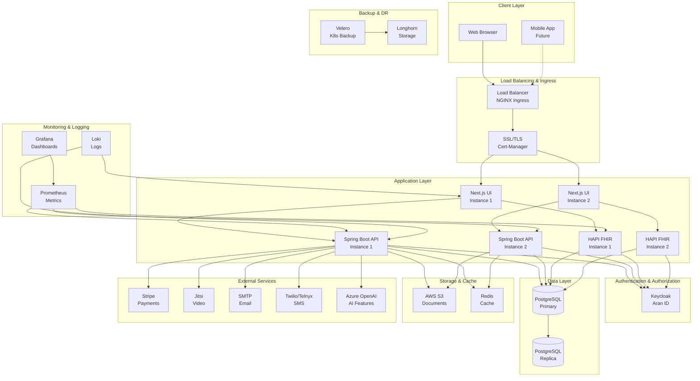
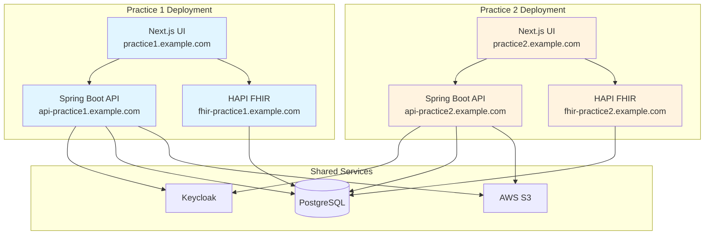
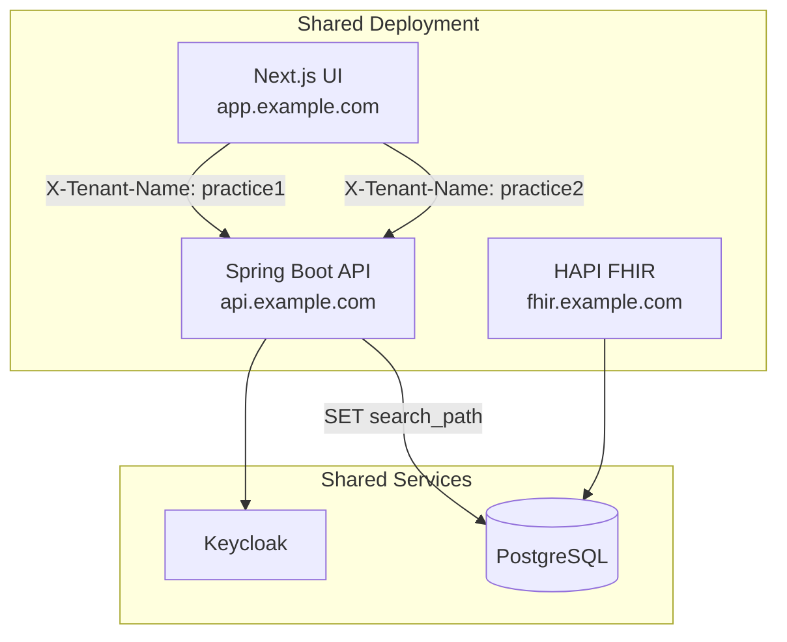
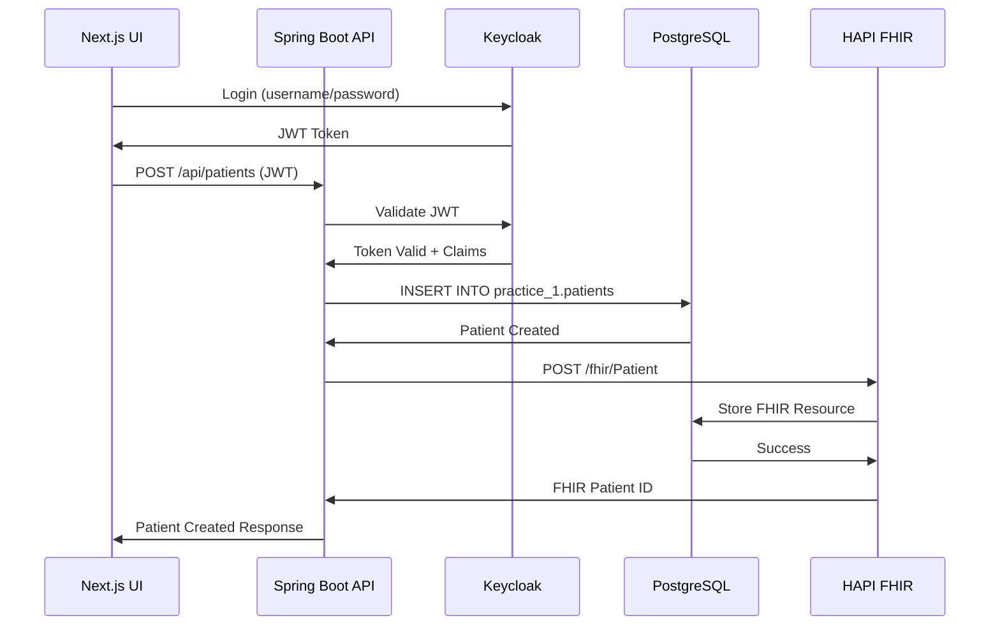
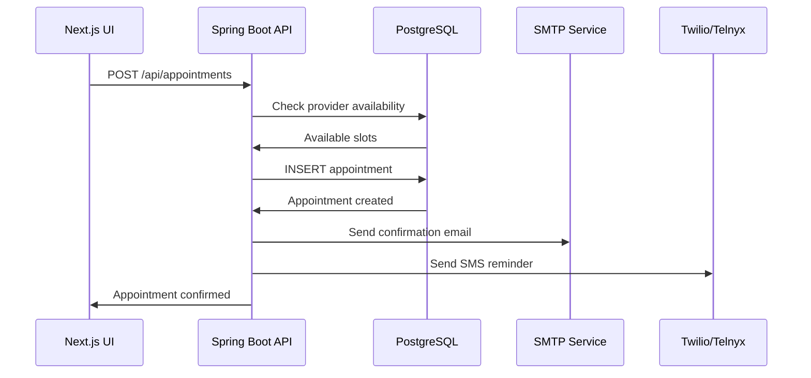
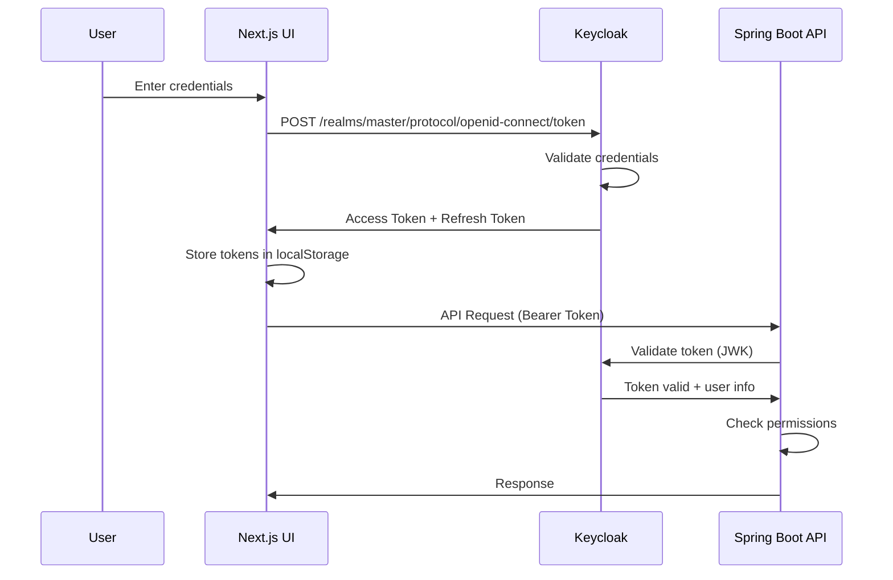
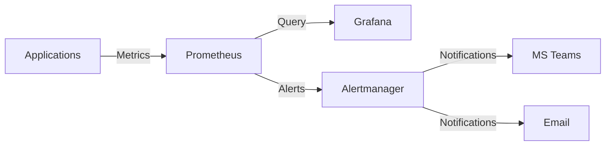
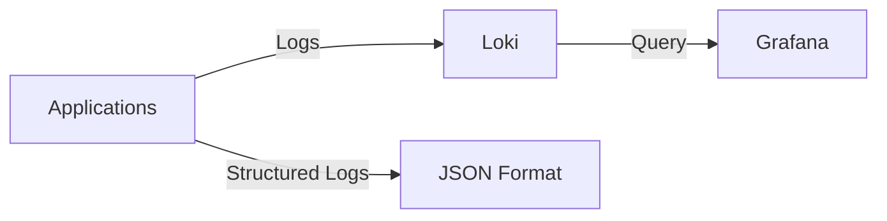

# System Architecture

This document provides a comprehensive overview of the Ciyex EHR system architecture, including all components, their interactions, and deployment patterns.

## High-Level Architecture

## Component Overview

### Frontend Layer

#### Next.js UI Application
- **Technology**: Next.js 16, React 18, Tailwind CSS 4.0
- **Features**:
  - Server-side rendering (SSR) for better SEO
  - Static site generation (SSG) for performance
  - API routes for backend proxy
  - Responsive design for all devices
- **Key Components**:
  - Patient management interface
  - Appointment scheduler
  - Clinical documentation forms
  - Telehealth video interface
  - Billing and payments UI

### Backend Layer

#### Spring Boot API
- **Technology**: Spring Boot 4.0, Java 21
- **Architecture Pattern**: Layered architecture
  - **Controllers**: REST endpoints
  - **Services**: Business logic
  - **Repositories**: Data access
  - **Entities**: Domain models
- **Key Features**:
  - RESTful API
  - OAuth2 resource server
  - Multi-schema support
  - Audit logging
  - File upload/download
  - Payment processing
  - Email/SMS notifications

#### HAPI FHIR Server
- **Technology**: HAPI FHIR 8.2.1 (R4)
- **Features**:
  - Full FHIR R4 compliance
  - Multi-tenant partitioning
  - Custom interceptors
  - SMART on FHIR support
- **Resources Supported**:
  - Patient, Practitioner, Organization
  - Encounter, Observation, Condition
  - MedicationRequest, AllergyIntolerance
  - Appointment, Schedule
  - And more...

### Authentication & Authorization

#### Keycloak (Aran ID)
- **Features**:
  - OAuth2/OIDC provider
  - Single Sign-On (SSO)
  - User federation
  - Group-based access control
  - Multi-factor authentication
- **Integration**:
  - JWT token validation
  - Role and group mapping
  - Custom claims support

### Data Layer

#### PostgreSQL Database
- **Version**: PostgreSQL 15+
- **Architecture**: Multi-schema
  - `public` schema: Shared configuration
  - `practice_1`, `practice_2`, etc.: Practice-specific data
- **Features**:
  - ACID compliance
  - Row-level security
  - Full-text search
  - JSON/JSONB support
- **Backup Strategy**:
  - Continuous WAL archiving
  - Daily full backups
  - Point-in-time recovery

#### Redis Cache
- **Purpose**: Session management, caching
- **Use Cases**:
  - API response caching
  - Rate limiting
  - Real-time features

### Storage

#### AWS S3
- **Purpose**: Document storage
- **Stored Items**:
  - Patient documents
  - Medical images
  - Lab reports
  - Message attachments
  - Backup archives

#### Longhorn
- **Purpose**: Persistent volumes for Kubernetes
- **Features**:
  - Distributed block storage
  - Snapshot and backup
  - Disaster recovery
  - Volume replication

## Deployment Architecture

### Single-Schema Per Instance (Recommended)

**Benefits**:
- Complete process isolation
- Independent scaling per practice
- Simpler troubleshooting
- Better security and compliance
- No tenant header required

### Multi-Tenant (Legacy)

**Drawbacks**:
- Shared resources and memory
- Complex tenant resolution
- Header-based routing risk
- Harder to troubleshoot

> See [Deployment Models](deployment-models.md) for detailed comparison.

## Data Flow

### Patient Creation Flow

### Appointment Scheduling Flow

## Security Architecture

### Authentication Flow

### Authorization Layers

1. **Network Layer**: Kubernetes NetworkPolicies
2. **Ingress Layer**: NGINX authentication
3. **Application Layer**: Spring Security
4. **Data Layer**: PostgreSQL row-level security

## Monitoring & Observability

### Metrics Collection

**Metrics Collected**:
- HTTP request rates and latencies
- Database connection pool stats
- JVM memory and GC metrics
- Custom business metrics

### Logging Architecture

**Log Levels**:
- ERROR: Application errors
- WARN: Warning conditions
- INFO: General information
- DEBUG: Detailed debugging (dev only)

## Scalability

### Horizontal Scaling

- **Frontend**: Scale UI pods based on CPU/memory
- **Backend**: Scale API pods based on request rate
- **FHIR**: Scale FHIR pods based on FHIR API usage
- **Database**: Read replicas for read-heavy workloads

### Vertical Scaling

- Increase pod resource limits
- Upgrade database instance size
- Optimize JVM heap settings

## Disaster Recovery

### Backup Strategy

1. **Database Backups**:
   - Continuous WAL archiving to S3
   - Daily full backups
   - 30-day retention

2. **Kubernetes Backups**:
   - Velero daily backups
   - Includes all resources and PVCs
   - 7-day retention

3. **Document Backups**:
   - S3 versioning enabled
   - Cross-region replication

### Recovery Procedures

- **RTO** (Recovery Time Objective): 4 hours
- **RPO** (Recovery Point Objective): 1 hour

See [Backup & Restore](../operations/backup.md) for detailed procedures.

## Performance Considerations

### Database Optimization
- Connection pooling (HikariCP)
- Query optimization and indexing
- Partitioning for large tables
- Read replicas for reporting

### Caching Strategy
- Redis for session data
- Application-level caching (Caffeine)
- HTTP caching headers
- CDN for static assets

### API Performance
- Async processing for long operations
- Pagination for large result sets
- Compression (gzip)
- Rate limiting

## Next Steps

- [Backend Architecture](backend-architecture.md) - Deep dive into Spring Boot
- [Frontend Architecture](frontend-architecture.md) - Deep dive into Next.js
- [FHIR Integration](fhir-integration.md) - HAPI FHIR details
- [Deployment Models](deployment-models.md) - Compare deployment options
