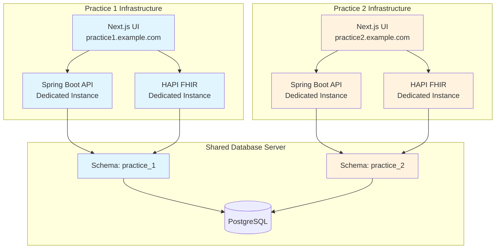
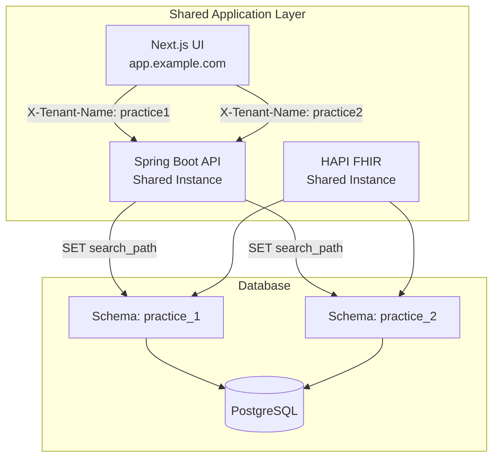
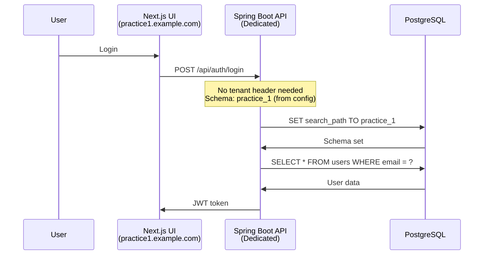
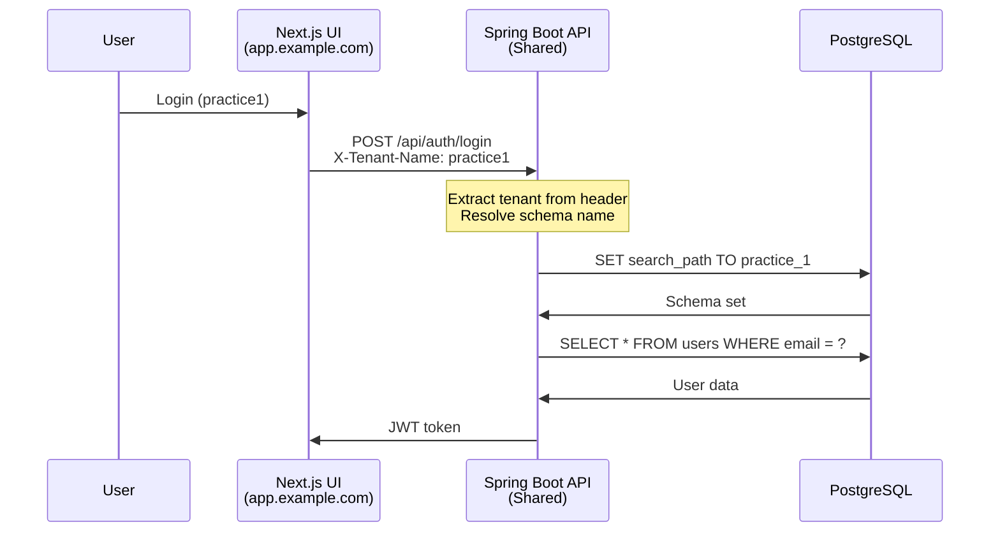

# Deployment Models Comparison

Understanding the architectural differences between multi-tenant and single-schema-per-instance deployments.

## Overview

Ciyex EHR supports two deployment architectures. This document provides a detailed comparison to help you choose the right model for your needs.

> **Recommendation**: Use **single-schema-per-instance** for production deployments.

## Architecture Comparison

### Single-Schema Per Instance (Recommended)



### Multi-Tenant (Legacy)



## Detailed Comparison

| Aspect | Single-Schema Per Instance | Multi-Tenant |
|--------|---------------------------|--------------|
| **Deployment** | One instance per practice | One instance for all practices |
| **Process Isolation** | ✅ Complete | ❌ Shared JVM |
| **Memory** | ✅ Dedicated per practice | ❌ Shared pool |
| **Scaling** | ✅ Independent per practice | ⚠️ All practices scale together |
| **Tenant Resolution** | ✅ No header needed | ❌ Requires X-Tenant-Name header |
| **Security** | ✅ Process-level isolation | ⚠️ Application-level isolation |
| **Troubleshooting** | ✅ Simple, isolated logs | ❌ Complex, mixed logs |
| **Deployment Complexity** | ⚠️ More instances to manage | ✅ Single deployment |
| **Resource Efficiency** | ⚠️ Higher overhead | ✅ Shared resources |
| **Customization** | ✅ Per-practice configs | ⚠️ Shared configuration |
| **Compliance** | ✅ Easier to audit | ⚠️ More complex auditing |
| **Failure Blast Radius** | ✅ Limited to one practice | ❌ Affects all practices |

## Request Flow

### Single-Schema Per Instance



### Multi-Tenant



## Configuration

### Single-Schema Per Instance

**Backend Configuration** (`application-practice1.yml`):
```yaml
spring:
  datasource:
    url: jdbc:postgresql://postgres:5432/ciyexdb
    username: ciyex
    password: ${DB_PASSWORD}

ciyex:
  schema:
    name: practice_1  # Fixed schema name
    
server:
  port: 8080
```

**Kubernetes Deployment**:
```yaml
apiVersion: apps/v1
kind: Deployment
metadata:
  name: ciyex-api-practice1
spec:
  replicas: 2
  template:
    spec:
      containers:
      - name: ciyex-api
        image: ciyex:latest
        env:
        - name: CIYEX_SCHEMA_NAME
          value: practice_1
        - name: SPRING_PROFILES_ACTIVE
          value: practice1
```

### Multi-Tenant

**Backend Configuration** (`application.yml`):
```yaml
spring:
  datasource:
    url: jdbc:postgresql://postgres:5432/ciyexdb
    username: ciyex
    password: ${DB_PASSWORD}

ciyex:
  multitenancy:
    enabled: true
    tenant-header: X-Tenant-Name
    
server:
  port: 8080
```

**Tenant Resolution**:
```java
@Component
public class TenantInterceptor implements HandlerInterceptor {
    @Override
    public boolean preHandle(HttpServletRequest request, 
                            HttpServletResponse response, 
                            Object handler) {
        String tenantName = request.getHeader("X-Tenant-Name");
        if (tenantName == null) {
            throw new BadRequestException("Missing tenant header");
        }
        RequestContext.setTenantName(tenantName);
        return true;
    }
}
```

## Security Implications

### Single-Schema Per Instance

**Advantages**:
- ✅ Process-level isolation prevents cross-tenant data leaks
- ✅ No risk of header manipulation
- ✅ Easier to implement row-level security
- ✅ Simpler audit logging
- ✅ Better compliance with HIPAA/GDPR

**Example**: If Practice 1's instance is compromised, Practice 2's data remains secure in a separate process.

### Multi-Tenant

**Risks**:
- ⚠️ Header manipulation could expose wrong tenant data
- ⚠️ Shared memory could leak data between tenants
- ⚠️ Application bugs could affect all tenants
- ⚠️ More complex security auditing

**Mitigation**:
```java
// Validate tenant access
@PreAuthorize("hasAuthority('TENANT_' + #tenantName)")
public void accessTenantData(String tenantName) {
    // Additional validation
    if (!userHasAccessToTenant(tenantName)) {
        throw new AccessDeniedException();
    }
}
```

## Performance

### Single-Schema Per Instance

**Advantages**:
- ✅ Dedicated JVM heap per practice
- ✅ No tenant context switching overhead
- ✅ Easier to optimize per practice
- ✅ Independent garbage collection

**Resource Usage**:
```
Practice 1: 2GB heap, 4 CPU cores
Practice 2: 2GB heap, 4 CPU cores
Total: 4GB heap, 8 CPU cores
```

### Multi-Tenant

**Advantages**:
- ✅ Shared connection pools
- ✅ Lower total memory footprint
- ✅ Better resource utilization for small practices

**Resource Usage**:
```
Shared Instance: 3GB heap, 6 CPU cores
(More efficient but less isolated)
```

## Operational Complexity

### Single-Schema Per Instance

**Deployment**:
```bash
# Deploy practice 1
helm install ciyex-practice1 ./ciyex-chart \
  --set schema.name=practice_1 \
  --set ingress.host=practice1.example.com

# Deploy practice 2
helm install ciyex-practice2 ./ciyex-chart \
  --set schema.name=practice_2 \
  --set ingress.host=practice2.example.com
```

**Monitoring**:
```bash
# Check practice 1 health
kubectl logs deployment/ciyex-api-practice1

# Check practice 2 health
kubectl logs deployment/ciyex-api-practice2
```

### Multi-Tenant

**Deployment**:
```bash
# Single deployment for all practices
helm install ciyex ./ciyex-chart \
  --set multitenancy.enabled=true
```

**Monitoring**:
```bash
# Logs mixed from all tenants
kubectl logs deployment/ciyex-api | grep "tenant=practice1"
```

## Troubleshooting

### Single-Schema Per Instance

**Advantages**:
- ✅ Clear log separation
- ✅ Easy to identify which practice has issues
- ✅ Can restart one practice without affecting others
- ✅ Simpler debugging

**Example**:
```bash
# Practice 1 has issues
kubectl logs deployment/ciyex-api-practice1 --tail=100

# Restart only practice 1
kubectl rollout restart deployment/ciyex-api-practice1
```

### Multi-Tenant

**Challenges**:
- ❌ Logs mixed from all tenants
- ❌ Hard to isolate tenant-specific issues
- ❌ Restart affects all practices
- ❌ More complex debugging

**Example**:
```bash
# Find practice 1 logs in mixed output
kubectl logs deployment/ciyex-api | grep "tenant=practice1" | tail -100

# Restart affects all practices
kubectl rollout restart deployment/ciyex-api
```

## Migration Path

### From Multi-Tenant to Single-Schema

1. **Prepare Infrastructure**
   ```bash
   # Create separate deployments
   for practice in practice1 practice2 practice3; do
     helm install ciyex-$practice ./ciyex-chart \
       --set schema.name=$practice \
       --set ingress.host=$practice.example.com
   done
   ```

2. **Update DNS**
   ```
   practice1.example.com → New deployment
   practice2.example.com → New deployment
   ```

3. **Migrate Users**
   - Inform users of new URLs
   - Update bookmarks
   - Redirect old URLs

4. **Decommission Multi-Tenant**
   ```bash
   helm uninstall ciyex-multitenant
   ```

## Cost Analysis

### Single-Schema Per Instance

**Infrastructure Costs**:
```
3 practices × 2 pods × 2GB RAM = 12GB RAM
3 practices × 2 pods × 1 CPU = 6 CPU cores

Estimated: $200-300/month (cloud)
```

**Operational Costs**:
- Higher deployment complexity
- More monitoring dashboards
- More CI/CD pipelines

### Multi-Tenant

**Infrastructure Costs**:
```
1 deployment × 4 pods × 2GB RAM = 8GB RAM
1 deployment × 4 pods × 1 CPU = 4 CPU cores

Estimated: $150-200/month (cloud)
```

**Operational Costs**:
- Lower deployment complexity
- Single monitoring dashboard
- One CI/CD pipeline

**Hidden Costs**:
- More complex troubleshooting
- Higher security audit costs
- Potential compliance issues

## Recommendations

### Use Single-Schema Per Instance When:

- ✅ Running production healthcare applications
- ✅ HIPAA/GDPR compliance required
- ✅ Practices have different SLAs
- ✅ Practices need custom configurations
- ✅ High security requirements
- ✅ Independent scaling needed

### Use Multi-Tenant When:

- ✅ Development/testing environments
- ✅ All practices have identical requirements
- ✅ Cost optimization is critical
- ✅ Managing many small practices
- ✅ Practices trust shared infrastructure

## Conclusion

For **production healthcare deployments**, we strongly recommend the **single-schema-per-instance** model due to:

1. **Better Security** - Process-level isolation
2. **Easier Compliance** - Simpler auditing
3. **Simpler Operations** - Clear log separation
4. **Better Reliability** - Isolated failures
5. **Flexible Scaling** - Per-practice optimization

The multi-tenant model is suitable for development environments or non-healthcare SaaS applications where the benefits of resource sharing outweigh the operational complexity.

## Next Steps

- [Kubernetes Deployment](kubernetes.md) - Deploy single-schema instances
- [Security Best Practices](../security/best-practices.md) - Secure your deployment
- [Monitoring](../operations/monitoring.md) - Monitor multiple instances
- [Scaling](scaling.md) - Scale individual practices
