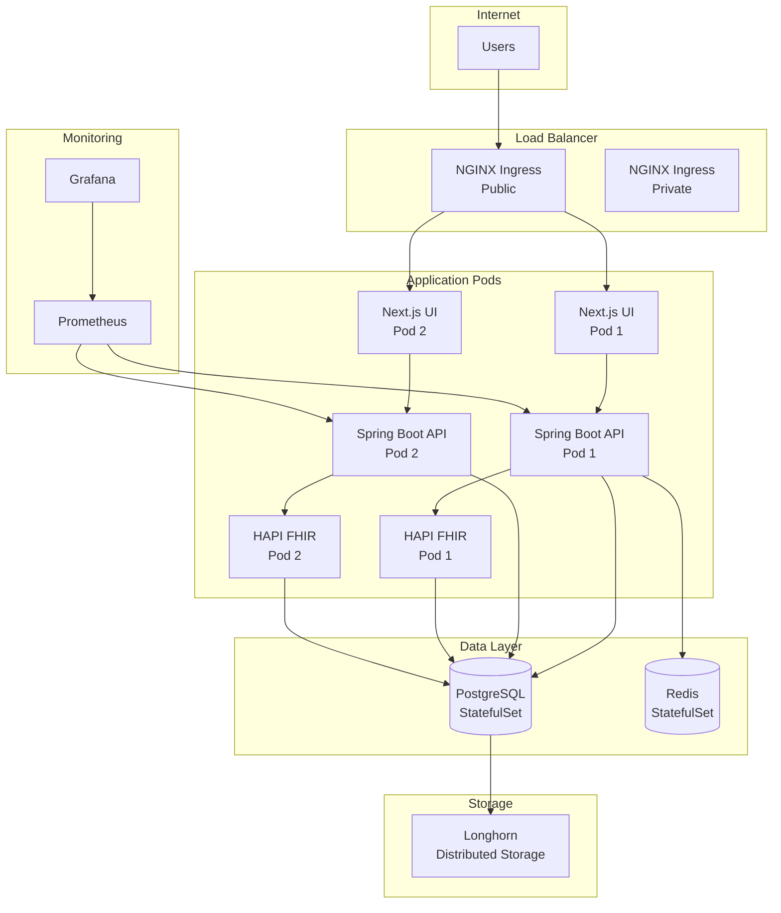

# Kubernetes Deployment

Complete guide for deploying Ciyex EHR to Kubernetes using Terraform.

## Overview

Ciyex EHR is designed for cloud-native deployment on Kubernetes. This guide covers deploying to K3s clusters on OVH bare metal servers using Terraform infrastructure-as-code.

## Architecture



## Prerequisites

### Infrastructure

- **Kubernetes Cluster**: K3s 1.28+ or K8s 1.28+
- **Nodes**: Minimum 3 nodes (1 control plane, 2 workers)
- **Resources per Node**:
  - CPU: 4 cores
  - RAM: 16GB
  - Disk: 100GB SSD

### Tools

- **Terraform**: 1.5.0+
- **kubectl**: 1.28+
- **Helm**: 3.12+
- **Git**: 2.30+

### Access

- SSH access to cluster nodes
- kubectl access to cluster
- Container registry credentials (ACR, Docker Hub, or GHCR)

## Deployment Options

### Option 1: Terraform (Recommended)

Use the `kube-terraform` repository for complete infrastructure provisioning.

### Option 2: Helm Charts

Use Helm charts for application deployment only (cluster already exists).

### Option 3: kubectl Manifests

Direct deployment using Kubernetes manifests.

## Terraform Deployment

### 1. Clone Repository

```bash
git clone https://github.com/qiaben/kube-terraform.git
cd kube-terraform
```

### 2. Configure Environment

```bash
cd environments/stage

# Copy example variables
cp terraform.tfvars.example terraform.tfvars

# Edit configuration
nano terraform.tfvars
```

### 3. Configure Variables

```hcl
# terraform.tfvars

# OVH API Credentials
ovh_application_key    = "your-key"
ovh_application_secret = "your-secret"
ovh_consumer_key       = "your-consumer-key"

# Server Configuration
server_service_names = [
  "ns1234567.ip-135-148-103.us",  # control plane 1
  "ns1234568.ip-40-160-54.us",    # control plane 2
  "ns1234569.ip-147-135-65.us",   # control plane 3
  "ns1234570.ip-147-135-70.us",   # worker 1
  "ns1234571.ip-135-148-55.us",   # worker 2
]

control_plane_count = 3
vrack_service_name  = "pn-123456"
private_ip_start    = 42

# DNS Configuration
domain = "example.com"
subdomain_prefix = "stage"

# SSL Configuration
letsencrypt_email = "admin@example.com"

# Database Configuration
postgres_password = "secure-password-here"
postgres_database = "ciyexdb"

# Application Configuration
ciyex_image = "ghcr.io/ciyex-org/ciyex:latest"
ciyex_ui_image = "ghcr.io/ciyex-org/ciyex-ehr-ui:latest"
ciyex_fhir_image = "ghcr.io/ciyex-org/ciyex-hapi-fhir:latest"

# Keycloak Configuration
keycloak_url = "https://aran-stg.zpoa.com"
keycloak_realm = "master"
keycloak_client_id = "ciyex-app"
keycloak_client_secret = "your-client-secret"

# S3 Configuration
s3_endpoint = "https://s3.us-east-va.perf.cloud.ovh.us"
s3_region = "us-east-va"
s3_bucket = "ciyex-stage"
s3_access_key = "your-access-key"
s3_secret_key = "your-secret-key"

# Monitoring
enable_prometheus = true
enable_grafana = true
grafana_admin_password = "admin-password"

# Backup
enable_velero = true
velero_s3_bucket = "ciyex-backups"
```

### 4. Initialize Terraform

```bash
terraform init
```

### 5. Plan Deployment

```bash
terraform plan
```

Review the plan carefully. It will show:
- Servers to be provisioned
- Network configuration
- K3s cluster setup
- Application deployments

### 6. Apply Configuration

```bash
terraform apply
```

This will take approximately 30-45 minutes:
1. Install Debian 13 on servers (~20 min)
2. Configure networking (~5 min)
3. Install K3s cluster (~5 min)
4. Deploy applications (~10 min)

### 7. Get Kubeconfig

```bash
# Kubeconfig is saved to outputs
terraform output kubeconfig > ~/.kube/config-ciyex-stage

# Set KUBECONFIG
export KUBECONFIG=~/.kube/config-ciyex-stage

# Verify access
kubectl get nodes
```

## Manual Kubernetes Deployment

If you have an existing Kubernetes cluster:

### 1. Create Namespace

```bash
kubectl create namespace ciyex-stage
```

### 2. Create Secrets

```bash
# Database credentials
kubectl create secret generic postgres-credentials \
  --from-literal=username=ciyex \
  --from-literal=password=secure-password \
  --namespace=ciyex-stage

# Keycloak credentials
kubectl create secret generic keycloak-credentials \
  --from-literal=client-secret=your-client-secret \
  --namespace=ciyex-stage

# S3 credentials
kubectl create secret generic s3-credentials \
  --from-literal=access-key=your-access-key \
  --from-literal=secret-key=your-secret-key \
  --namespace=ciyex-stage

# Container registry credentials
kubectl create secret docker-registry regcred \
  --docker-server=ghcr.io \
  --docker-username=your-username \
  --docker-password=your-token \
  --namespace=ciyex-stage
```

### 3. Deploy PostgreSQL

```yaml
# postgres-statefulset.yaml
apiVersion: apps/v1
kind: StatefulSet
metadata:
  name: postgres
  namespace: ciyex-stage
spec:
  serviceName: postgres
  replicas: 1
  selector:
    matchLabels:
      app: postgres
  template:
    metadata:
      labels:
        app: postgres
    spec:
      containers:
      - name: postgres
        image: postgres:16-alpine
        ports:
        - containerPort: 5432
        env:
        - name: POSTGRES_DB
          value: ciyexdb
        - name: POSTGRES_USER
          valueFrom:
            secretKeyRef:
              name: postgres-credentials
              key: username
        - name: POSTGRES_PASSWORD
          valueFrom:
            secretKeyRef:
              name: postgres-credentials
              key: password
        volumeMounts:
        - name: postgres-data
          mountPath: /var/lib/postgresql/data
  volumeClaimTemplates:
  - metadata:
      name: postgres-data
    spec:
      accessModes: [ "ReadWriteOnce" ]
      resources:
        requests:
          storage: 50Gi
---
apiVersion: v1
kind: Service
metadata:
  name: postgres
  namespace: ciyex-stage
spec:
  selector:
    app: postgres
  ports:
  - port: 5432
    targetPort: 5432
  clusterIP: None
```

```bash
kubectl apply -f postgres-statefulset.yaml
```

### 4. Deploy Backend API

```yaml
# ciyex-api-deployment.yaml
apiVersion: apps/v1
kind: Deployment
metadata:
  name: ciyex-api
  namespace: ciyex-stage
spec:
  replicas: 2
  selector:
    matchLabels:
      app: ciyex-api
  template:
    metadata:
      labels:
        app: ciyex-api
    spec:
      imagePullSecrets:
      - name: regcred
      containers:
      - name: ciyex-api
        image: ghcr.io/ciyex-org/ciyex:latest
        ports:
        - containerPort: 8080
        env:
        - name: SPRING_DATASOURCE_URL
          value: jdbc:postgresql://postgres:5432/ciyexdb
        - name: SPRING_DATASOURCE_USERNAME
          valueFrom:
            secretKeyRef:
              name: postgres-credentials
              key: username
        - name: SPRING_DATASOURCE_PASSWORD
          valueFrom:
            secretKeyRef:
              name: postgres-credentials
              key: password
        - name: CIYEX_SCHEMA_NAME
          value: practice_1
        - name: KEYCLOAK_CLIENT_SECRET
          valueFrom:
            secretKeyRef:
              name: keycloak-credentials
              key: client-secret
        - name: AWS_ACCESS_KEY_ID
          valueFrom:
            secretKeyRef:
              name: s3-credentials
              key: access-key
        - name: AWS_SECRET_ACCESS_KEY
          valueFrom:
            secretKeyRef:
              name: s3-credentials
              key: secret-key
        resources:
          requests:
            memory: "1Gi"
            cpu: "500m"
          limits:
            memory: "2Gi"
            cpu: "1000m"
        livenessProbe:
          httpGet:
            path: /actuator/health
            port: 8080
          initialDelaySeconds: 60
          periodSeconds: 10
        readinessProbe:
          httpGet:
            path: /actuator/health/readiness
            port: 8080
          initialDelaySeconds: 30
          periodSeconds: 5
---
apiVersion: v1
kind: Service
metadata:
  name: ciyex-api
  namespace: ciyex-stage
spec:
  selector:
    app: ciyex-api
  ports:
  - port: 8080
    targetPort: 8080
```

```bash
kubectl apply -f ciyex-api-deployment.yaml
```

### 5. Deploy Frontend UI

```yaml
# ciyex-ui-deployment.yaml
apiVersion: apps/v1
kind: Deployment
metadata:
  name: ciyex-ui
  namespace: ciyex-stage
spec:
  replicas: 2
  selector:
    matchLabels:
      app: ciyex-ui
  template:
    metadata:
      labels:
        app: ciyex-ui
    spec:
      imagePullSecrets:
      - name: regcred
      containers:
      - name: ciyex-ui
        image: ghcr.io/ciyex-org/ciyex-ehr-ui:latest
        ports:
        - containerPort: 3000
        env:
        - name: NEXT_PUBLIC_API_URL
          value: https://api-stage.example.com
        - name: NEXT_PUBLIC_KEYCLOAK_URL
          value: https://aran-stg.zpoa.com
        - name: NEXT_PUBLIC_KEYCLOAK_REALM
          value: master
        - name: NEXT_PUBLIC_KEYCLOAK_CLIENT_ID
          value: ciyex-app
        resources:
          requests:
            memory: "512Mi"
            cpu: "250m"
          limits:
            memory: "1Gi"
            cpu: "500m"
---
apiVersion: v1
kind: Service
metadata:
  name: ciyex-ui
  namespace: ciyex-stage
spec:
  selector:
    app: ciyex-ui
  ports:
  - port: 3000
    targetPort: 3000
```

```bash
kubectl apply -f ciyex-ui-deployment.yaml
```

### 6. Configure Ingress

```yaml
# ingress.yaml
apiVersion: networking.k8s.io/v1
kind: Ingress
metadata:
  name: ciyex-ingress
  namespace: ciyex-stage
  annotations:
    cert-manager.io/cluster-issuer: letsencrypt-prod
    nginx.ingress.kubernetes.io/ssl-redirect: "true"
spec:
  ingressClassName: nginx
  tls:
  - hosts:
    - stage.example.com
    - api-stage.example.com
    secretName: ciyex-tls
  rules:
  - host: stage.example.com
    http:
      paths:
      - path: /
        pathType: Prefix
        backend:
          service:
            name: ciyex-ui
            port:
              number: 3000
  - host: api-stage.example.com
    http:
      paths:
      - path: /
        pathType: Prefix
        backend:
          service:
            name: ciyex-api
            port:
              number: 8080
```

```bash
kubectl apply -f ingress.yaml
```

## Verification

### Check Pods

```bash
kubectl get pods -n ciyex-stage
```

Expected output:
```
NAME                         READY   STATUS    RESTARTS   AGE
postgres-0                   1/1     Running   0          5m
ciyex-api-xxxxx-xxxxx        1/1     Running   0          3m
ciyex-api-xxxxx-xxxxx        1/1     Running   0          3m
ciyex-ui-xxxxx-xxxxx         1/1     Running   0          2m
ciyex-ui-xxxxx-xxxxx         1/1     Running   0          2m
```

### Check Services

```bash
kubectl get svc -n ciyex-stage
```

### Check Ingress

```bash
kubectl get ingress -n ciyex-stage
```

### Test Application

```bash
curl https://stage.example.com
curl https://api-stage.example.com/actuator/health
```

## Scaling

### Manual Scaling

```bash
# Scale API pods
kubectl scale deployment ciyex-api --replicas=3 -n ciyex-stage

# Scale UI pods
kubectl scale deployment ciyex-ui --replicas=3 -n ciyex-stage
```

### Horizontal Pod Autoscaler

```yaml
# hpa.yaml
apiVersion: autoscaling/v2
kind: HorizontalPodAutoscaler
metadata:
  name: ciyex-api-hpa
  namespace: ciyex-stage
spec:
  scaleTargetRef:
    apiVersion: apps/v1
    kind: Deployment
    name: ciyex-api
  minReplicas: 2
  maxReplicas: 10
  metrics:
  - type: Resource
    resource:
      name: cpu
      target:
        type: Utilization
        averageUtilization: 70
  - type: Resource
    resource:
      name: memory
      target:
        type: Utilization
        averageUtilization: 80
```

```bash
kubectl apply -f hpa.yaml
```

## Monitoring

### Access Grafana

```bash
# Get Grafana password
kubectl get secret grafana-admin -n monitoring -o jsonpath="{.data.password}" | base64 -d

# Port forward
kubectl port-forward -n monitoring svc/grafana 3000:80

# Open browser
open http://localhost:3000
```

### View Logs

```bash
# API logs
kubectl logs -f deployment/ciyex-api -n ciyex-stage

# UI logs
kubectl logs -f deployment/ciyex-ui -n ciyex-stage

# All pods
kubectl logs -f -l app=ciyex-api -n ciyex-stage
```

## Troubleshooting

### Pods Not Starting

```bash
# Describe pod
kubectl describe pod <pod-name> -n ciyex-stage

# Check events
kubectl get events -n ciyex-stage --sort-by='.lastTimestamp'
```

### Database Connection Issues

```bash
# Test database connectivity
kubectl run -it --rm debug --image=postgres:16-alpine --restart=Never -n ciyex-stage -- \
  psql -h postgres -U ciyex -d ciyexdb
```

### Ingress Not Working

```bash
# Check ingress controller
kubectl get pods -n ingress-nginx

# Check ingress logs
kubectl logs -n ingress-nginx deployment/ingress-nginx-controller
```

## Next Steps

- [Terraform Modules](terraform.md) - Detailed Terraform configuration
- [CI/CD Pipeline](cicd.md) - Automated deployments
- [Backup & Restore](backup-restore.md) - Disaster recovery
- [Monitoring](../operations/monitoring.md) - Prometheus & Grafana setup
