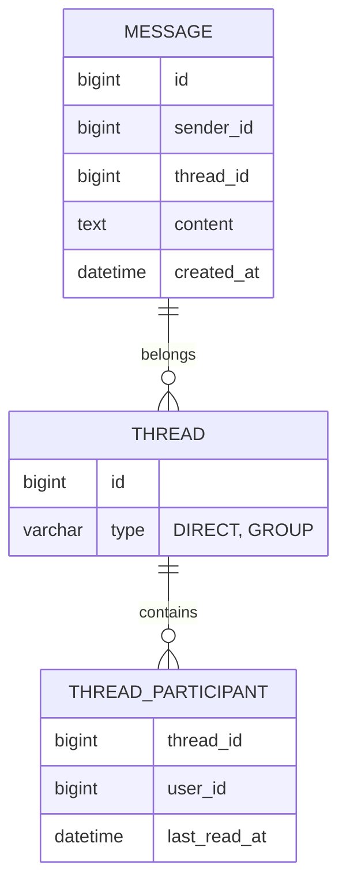

# Secure Messaging

HIPAA-compliant internal messaging system.

## Overview

A secure, WhatsApp-like messaging interface for communication between:
- Provider &lt;-&gt; Provider (Consultations)
- Provider &lt;-&gt; Staff (Coordination)
- Provider &lt;-&gt; Patient (Secure Portal Messages)

## Features
- **End-to-End Encryption**: Messages stored encrypted.
- **Attachments**: Share labs, images, and documents securely.
- **Read Receipts**: Know when messages are viewed.
- **Urgent Flags**: Mark high-priority messages.

## Architecture

### Data Model



### Real-Time Updates
We use **WebSockets (STOMP)** for real-time delivery.

```javascript
// Frontend subscription
client.subscribe('/user/topic/messages', (msg) => {
    const message = JSON.parse(msg.body);
    displayNotification(message);
});
```

## Security
- **Retention**: Messages are retained for 6 years (configurable).
- **Access**: Only participants in a thread can decrypt messages.
- **Audit**: Reading a message creates an audit log entry.
