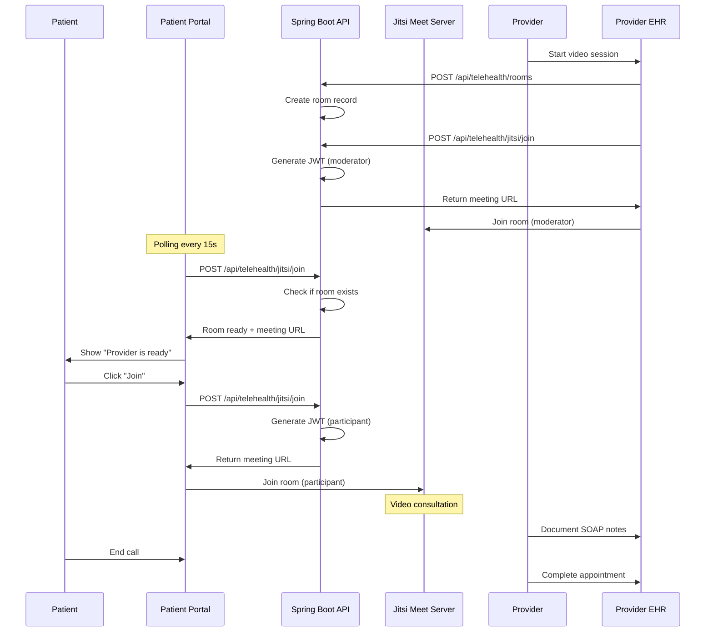

# Telehealth

Complete guide to Ciyex EHR's integrated telehealth capabilities powered by Jitsi Meet.

## Overview

Ciyex EHR includes a fully integrated telehealth solution that enables secure video consultations between healthcare providers and patients. The system uses Jitsi Meet for video conferencing with JWT-based authentication and seamless integration with the appointment system.

## Features

- 🎥 **HD Video Calls** - High-quality video and audio streaming
- 🔒 **Secure Authentication** - JWT-based room access control
- 📅 **Appointment Integration** - Automatic room creation from appointments
- 🔔 **Real-time Notifications** - Patients notified when provider is ready
- 📝 **Clinical Documentation** - SOAP notes during video calls
- 📱 **Cross-Platform** - Works on desktop, tablet, and mobile
- 🌐 **Browser-Based** - No app installation required
- ♿ **Accessible** - WCAG 2.1 compliant interface

## Architecture



## User Flows

### Provider Flow

1. **View Scheduled Appointments**
   - Provider logs into EHR
   - Navigates to appointments page
   - Sees scheduled telehealth appointments

2. **Start Video Session**
   - Clicks "Start Video Call" on appointment
   - System creates Jitsi room
   - Provider joins as moderator
   - SOAP notes panel appears on right side

3. **Wait for Patient**
   - Provider waits in video room
   - Patient receives notification
   - Patient joins when ready

4. **Conduct Consultation**
   - Video and audio communication
   - Provider takes notes in SOAP panel
   - Provider can share screen if needed

5. **End Session**
   - Provider clicks "End Session"
   - SOAP notes automatically saved
   - Appointment status updated to "COMPLETED"

### Patient Flow

1. **View Appointments**
   - Patient logs into portal
   - Navigates to appointments page
   - Sees scheduled telehealth appointments

2. **Wait for Provider**
   - System polls for room readiness (every 15 seconds)
   - Banner appears when provider starts session
   - "Join Video Call" button becomes active

3. **Join Video Call**
   - Patient clicks "Join" button
   - Redirected to telehealth page
   - Automatically joins Jitsi room

4. **Video Consultation**
   - Patient sees and hears provider
   - Can enable/disable camera and microphone
   - Can use chat if needed

5. **End Call**
   - Patient clicks "End Call"
   - Returns to appointments page
   - Can view appointment summary

## API Endpoints

### Create Room

```http
POST /api/telehealth/rooms
Authorization: Bearer {token}
Content-Type: application/json

{
  "providerId": 45,
  "patientId": 89,
  "roomName": "apt123"
}
```

**Response:**
```json
{
  "roomSid": "apt123"
}
```

### Join Room

```http
POST /api/telehealth/jitsi/join
Authorization: Bearer {token}
Content-Type: application/json

{
  "roomName": "apt123",
  "identity": "patient-89",
  "ttlSeconds": 3600
}
```

**Success Response:**
```json
{
  "token": "eyJhbGciOiJIUzI1NiIsInR5cCI6IkpXVCJ9...",
  "roomName": "apt123",
  "identity": "patient-89",
  "meetingUrl": "https://meet.ciyex.com/apt123?jwt=eyJhbGc...",
  "expiresIn": 3600
}
```

**Error Response (Room Not Ready):**
```json
{
  "error": "Room not found or not started yet"
}
```

## Configuration

### Backend Configuration

In `application.yml`:

```yaml
ciyex:
  jitsi:
    enabled: true
    server-url: https://meet.ciyex.com
    app-id: ciyex-telehealth
    app-secret: ${JITSI_APP_SECRET}
    default-ttl: 3600
```

### Environment Variables

```bash
# Jitsi Configuration
JITSI_APP_SECRET=your-jitsi-secret-here
JITSI_SERVER_URL=https://meet.ciyex.com
```

### Organization Configuration

Each organization can configure Jitsi settings in the database:

```sql
-- In org_config table
INSERT INTO org_config (org_id, config_key, config_value)
VALUES 
  (1, 'jitsi.enabled', 'true'),
  (1, 'jitsi.server_url', 'https://meet.ciyex.com'),
  (1, 'jitsi.app_id', 'practice-1'),
  (1, 'jitsi.app_secret', 'encrypted-secret');
```

## Frontend Integration

### Telehealth Page Component

```typescript
// src/app/telehealth/[appointmentId]/page.tsx
'use client';

import { useEffect, useState } from 'react';
import { useParams, useRouter } from 'next/navigation';

export default function TelehealthPage() {
  const params = useParams();
  const router = useRouter();
  const [meetingUrl, setMeetingUrl] = useState('');
  const [loading, setLoading] = useState(true);

  useEffect(() => {
    initVideoCall();
  }, []);

  const initVideoCall = async () => {
    try {
      const response = await fetch('/api/telehealth/jitsi/join', {
        method: 'POST',
        headers: {
          'Authorization': `Bearer ${localStorage.getItem('token')}`,
          'Content-Type': 'application/json'
        },
        body: JSON.stringify({
          roomName: `apt${params.appointmentId}`,
          identity: getTelehealthIdentity(),
          ttlSeconds: 3600
        })
      });

      const data = await response.json();
      
      if (data.meetingUrl) {
        setMeetingUrl(data.meetingUrl);
      } else {
        alert('Unable to join video call. Please try again.');
      }
    } catch (error) {
      console.error('Error joining video call:', error);
    } finally {
      setLoading(false);
    }
  };

  const endCall = () => {
    router.push('/appointments');
  };

  if (loading) {
    return <div>Loading video call...</div>;
  }

  return (
    <div className="h-screen flex flex-col">
      <div className="flex-1">
        <iframe
          src={meetingUrl}
          allow="camera; microphone; fullscreen; display-capture"
          className="w-full h-full border-0"
        />
      </div>
      <div className="p-4 bg-gray-100">
        <button
          onClick={endCall}
          className="px-6 py-2 bg-red-600 text-white rounded"
        >
          End Call
        </button>
      </div>
    </div>
  );
}
```

### Room Readiness Polling

```typescript
// In appointments page
useEffect(() => {
  const checkRooms = async () => {
    const telehealthAppts = appointments.filter(
      apt => apt.visitType === 'Telehealth' && apt.status === 'SCHEDULED'
    );

    for (const apt of telehealthAppts) {
      try {
        const response = await fetch('/api/telehealth/jitsi/join', {
          method: 'POST',
          headers: {
            'Authorization': `Bearer ${localStorage.getItem('token')}`,
            'Content-Type': 'application/json'
          },
          body: JSON.stringify({
            roomName: `apt${apt.id}`,
            identity: getTelehealthIdentity(),
            ttlSeconds: 3600
          })
        });

        const data = await response.json();
        
        if (data.meetingUrl) {
          setTelehealthReady(prev => ({
            ...prev,
            [apt.id]: { meetingUrl: data.meetingUrl }
          }));
        } else {
          setTelehealthReady(prev => {
            const updated = { ...prev };
            delete updated[apt.id];
            return updated;
          });
        }
      } catch (error) {
        console.error('Error checking room:', error);
      }
    }
  };

  // Poll every 15 seconds
  const interval = setInterval(checkRooms, 15000);
  checkRooms(); // Initial check

  return () => clearInterval(interval);
}, [appointments]);
```

## JWT Token Structure

### Provider Token (Moderator)

```json
{
  "context": {
    "user": {
      "id": "provider-45",
      "name": "Dr. John Smith",
      "email": "john.smith@example.com",
      "moderator": true
    }
  },
  "aud": "ciyex-telehealth",
  "iss": "ciyex-app",
  "sub": "meet.ciyex.com",
  "room": "apt123",
  "exp": 1730000000
}
```

### Patient Token (Participant)

```json
{
  "context": {
    "user": {
      "id": "patient-89",
      "name": "Jane Doe",
      "email": "jane.doe@example.com",
      "moderator": false
    }
  },
  "aud": "ciyex-telehealth",
  "iss": "ciyex-app",
  "sub": "meet.ciyex.com",
  "room": "apt123",
  "exp": 1730000000
}
```

## Security

### Authentication

- **JWT Tokens** - All room access requires valid JWT
- **Room Names** - Unique per appointment (e.g., `apt123`)
- **Token Expiration** - Default 1 hour, configurable
- **Moderator Control** - Only providers can start rooms

### Authorization

- **Provider Verification** - Provider ID verified against appointment
- **Patient Verification** - Patient ID verified against appointment
- **Organization Isolation** - Rooms scoped to organization

### Privacy

- **End-to-End Encryption** - Jitsi supports E2EE
- **No Recording by Default** - Recording disabled unless explicitly enabled
- **HIPAA Compliance** - Configured for healthcare use
- **Audit Logging** - All session starts/ends logged

## Troubleshooting

### Issue: "Room not found or not started yet"

**Cause**: Provider hasn't started the video session yet

**Solution**:
- Wait for provider to start session
- Patient portal will show notification when ready
- Polling runs every 15 seconds automatically

### Issue: "Unable to join video call"

**Possible Causes**:
- JWT token expired
- Jitsi configuration missing
- Network/CORS issues
- Browser permissions denied

**Solutions**:
1. Check JWT token is valid
2. Verify Jitsi configuration in org_config
3. Check browser console for errors
4. Allow camera/microphone permissions

### Issue: Video/audio not working

**Solutions**:
1. Check browser permissions for camera/microphone
2. Verify camera/microphone are not in use by other apps
3. Try different browser (Chrome recommended)
4. Check network firewall settings

### Issue: Poor video quality

**Solutions**:
1. Check internet connection speed
2. Close other bandwidth-intensive applications
3. Reduce video quality in Jitsi settings
4. Use wired connection instead of WiFi

## Best Practices

### For Providers

1. **Test Equipment** - Test camera/microphone before appointments
2. **Good Lighting** - Ensure face is well-lit
3. **Quiet Environment** - Minimize background noise
4. **Professional Background** - Use neutral background
5. **Start Early** - Join 5 minutes before appointment time

### For Patients

1. **Test Connection** - Test video call feature beforehand
2. **Stable Internet** - Use reliable internet connection
3. **Private Space** - Find quiet, private location
4. **Device Charged** - Ensure device has sufficient battery
5. **Backup Plan** - Have phone number ready as backup

### For Administrators

1. **Monitor Usage** - Track telehealth session metrics
2. **Regular Testing** - Test Jitsi integration regularly
3. **Update Configuration** - Keep Jitsi server updated
4. **Backup Server** - Have fallback Jitsi server configured
5. **User Training** - Provide training materials

## Metrics & Analytics

Track telehealth usage:

```sql
-- Telehealth sessions by month
SELECT 
  DATE_TRUNC('month', appointment_start_date) as month,
  COUNT(*) as total_sessions,
  AVG(EXTRACT(EPOCH FROM (appointment_end_time - appointment_start_time))/60) as avg_duration_minutes
FROM appointments
WHERE visit_type = 'Telehealth'
  AND status = 'COMPLETED'
GROUP BY month
ORDER BY month DESC;
```

## Next Steps

- [Appointments](appointments.md) - Appointment scheduling
- [Clinical Documentation](clinical-docs.md) - SOAP notes
- [Jitsi Integration](../integrations/jitsi.md) - Detailed Jitsi setup
- [Security](../security/compliance.md) - HIPAA compliance
