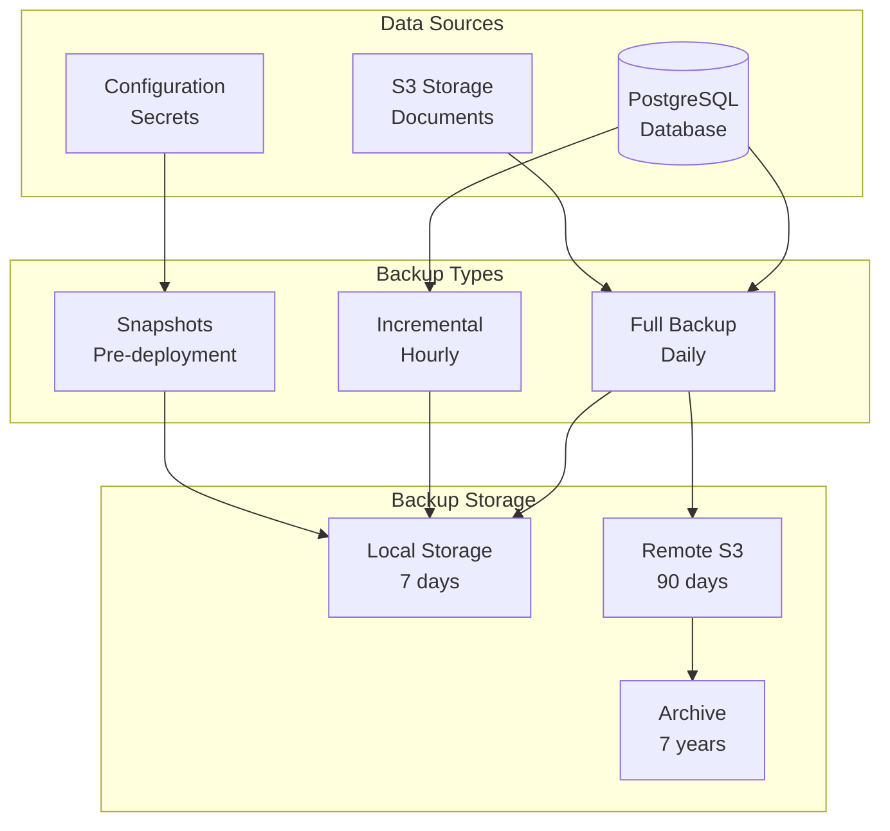

# Backup & Restore

Complete guide to backing up and restoring Ciyex EHR data.

## Overview

Regular backups are critical for disaster recovery, data protection, and compliance. This guide covers database backups, file storage backups, and complete system restoration.

## Backup Strategy



## Database Backups

### Automated Daily Backups

**Kubernetes CronJob**:
```yaml
# postgres-backup-cronjob.yaml
apiVersion: batch/v1
kind: CronJob
metadata:
  name: postgres-backup
  namespace: ciyex-prod
spec:
  schedule: "0 2 * * *"  # 2 AM daily
  jobTemplate:
    spec:
      template:
        spec:
          containers:
          - name: backup
            image: postgres:16-alpine
            env:
            - name: PGHOST
              value: postgres
            - name: PGDATABASE
              value: ciyexdb
            - name: PGUSER
              valueFrom:
                secretKeyRef:
                  name: postgres-credentials
                  key: username
            - name: PGPASSWORD
              valueFrom:
                secretKeyRef:
                  name: postgres-credentials
                  key: password
            - name: AWS_ACCESS_KEY_ID
              valueFrom:
                secretKeyRef:
                  name: s3-credentials
                  key: access-key
            - name: AWS_SECRET_ACCESS_KEY
              valueFrom:
                secretKeyRef:
                  name: s3-credentials
                  key: secret-key
            command:
            - /bin/sh
            - -c
            - |
              BACKUP_FILE="backup-$(date +%Y%m%d-%H%M%S).sql.gz"
              
              # Create backup
              pg_dump -Fc -f /tmp/backup.dump
              
              # Compress
              gzip -c /tmp/backup.dump > /tmp/$BACKUP_FILE
              
              # Upload to S3
              apk add --no-cache aws-cli
              aws s3 cp /tmp/$BACKUP_FILE s3://ciyex-backups/database/$BACKUP_FILE
              
              # Cleanup
              rm /tmp/backup.dump /tmp/$BACKUP_FILE
              
              echo "Backup completed: $BACKUP_FILE"
          restartPolicy: OnFailure
```

### Manual Backup

```bash
# Full database backup
kubectl exec -it postgres-0 -n ciyex-prod -- \
  pg_dump -U ciyex -Fc ciyexdb > backup-$(date +%Y%m%d).dump

# Backup specific schema
kubectl exec -it postgres-0 -n ciyex-prod -- \
  pg_dump -U ciyex -n practice_1 -Fc ciyexdb > practice1-backup.dump

# Backup with compression
kubectl exec -it postgres-0 -n ciyex-prod -- \
  pg_dump -U ciyex -Fc -Z9 ciyexdb | gzip > backup.dump.gz
```

### Incremental Backups

**WAL Archiving**:
```sql
-- Enable WAL archiving
ALTER SYSTEM SET wal_level = replica;
ALTER SYSTEM SET archive_mode = on;
ALTER SYSTEM SET archive_command = 'aws s3 cp %p s3://ciyex-backups/wal/%f';

-- Restart PostgreSQL
SELECT pg_reload_conf();
```

**Base Backup**:
```bash
# Create base backup
kubectl exec -it postgres-0 -n ciyex-prod -- \
  pg_basebackup -U ciyex -D /tmp/basebackup -Ft -z -P

# Upload to S3
kubectl exec -it postgres-0 -n ciyex-prod -- \
  aws s3 sync /tmp/basebackup s3://ciyex-backups/basebackup/
```

## S3 Storage Backups

### Document Backups

```bash
# Sync S3 bucket to backup location
aws s3 sync s3://ciyex-documents s3://ciyex-backups/documents/ \
  --storage-class GLACIER

# With versioning enabled
aws s3api put-bucket-versioning \
  --bucket ciyex-documents \
  --versioning-configuration Status=Enabled
```

### Automated S3 Backup

```yaml
# s3-backup-cronjob.yaml
apiVersion: batch/v1
kind: CronJob
metadata:
  name: s3-backup
  namespace: ciyex-prod
spec:
  schedule: "0 3 * * *"  # 3 AM daily
  jobTemplate:
    spec:
      template:
        spec:
          containers:
          - name: backup
            image: amazon/aws-cli:latest
            env:
            - name: AWS_ACCESS_KEY_ID
              valueFrom:
                secretKeyRef:
                  name: s3-credentials
                  key: access-key
            - name: AWS_SECRET_ACCESS_KEY
              valueFrom:
                secretKeyRef:
                  name: s3-credentials
                  key: secret-key
            command:
            - /bin/sh
            - -c
            - |
              # Sync documents to backup bucket
              aws s3 sync s3://ciyex-documents s3://ciyex-backups/documents-$(date +%Y%m%d)/
              
              echo "S3 backup completed"
          restartPolicy: OnFailure
```

## Configuration Backups

### Kubernetes Resources

```bash
# Backup all Kubernetes resources
kubectl get all -n ciyex-prod -o yaml > k8s-backup-$(date +%Y%m%d).yaml

# Backup secrets (encrypted)
kubectl get secrets -n ciyex-prod -o yaml | \
  gpg --encrypt --recipient admin@ciyex.org > secrets-backup.yaml.gpg

# Backup configmaps
kubectl get configmaps -n ciyex-prod -o yaml > configmaps-backup.yaml
```

### Automated K8s Backup with Velero

**Install Velero**:
```bash
# Install Velero CLI
wget https://github.com/vmware-tanzu/velero/releases/download/v1.12.0/velero-v1.12.0-linux-amd64.tar.gz
tar -xvf velero-v1.12.0-linux-amd64.tar.gz
sudo mv velero-v1.12.0-linux-amd64/velero /usr/local/bin/

# Install Velero in cluster
velero install \
  --provider aws \
  --plugins velero/velero-plugin-for-aws:v1.8.0 \
  --bucket ciyex-velero-backups \
  --secret-file ./credentials-velero \
  --backup-location-config region=us-east-1 \
  --snapshot-location-config region=us-east-1
```

**Create Backup Schedule**:
```bash
# Daily backup of entire namespace
velero schedule create ciyex-daily \
  --schedule="0 2 * * *" \
  --include-namespaces ciyex-prod \
  --ttl 720h

# Hourly backup of critical resources
velero schedule create ciyex-hourly \
  --schedule="0 * * * *" \
  --include-namespaces ciyex-prod \
  --include-resources deployments,statefulsets,services \
  --ttl 168h
```

## Restore Procedures

### Database Restore

**Full Restore**:
```bash
# Download backup from S3
aws s3 cp s3://ciyex-backups/database/backup-20241015.dump.gz .

# Decompress
gunzip backup-20241015.dump.gz

# Stop application
kubectl scale deployment ciyex-api --replicas=0 -n ciyex-prod

# Drop and recreate database
kubectl exec -it postgres-0 -n ciyex-prod -- psql -U ciyex -c "DROP DATABASE ciyexdb;"
kubectl exec -it postgres-0 -n ciyex-prod -- psql -U ciyex -c "CREATE DATABASE ciyexdb;"

# Restore
kubectl exec -i postgres-0 -n ciyex-prod -- \
  pg_restore -U ciyex -d ciyexdb -Fc < backup-20241015.dump

# Restart application
kubectl scale deployment ciyex-api --replicas=2 -n ciyex-prod
```

**Point-in-Time Recovery (PITR)**:
```bash
# Restore base backup
kubectl exec -it postgres-0 -n ciyex-prod -- \
  tar -xzf /backups/basebackup.tar.gz -C /var/lib/postgresql/data

# Create recovery.conf
kubectl exec -it postgres-0 -n ciyex-prod -- bash -c "cat > /var/lib/postgresql/data/recovery.conf <<EOF
restore_command = 'aws s3 cp s3://ciyex-backups/wal/%f %p'
recovery_target_time = '2024-10-15 14:30:00'
EOF"

# Restart PostgreSQL
kubectl rollout restart statefulset/postgres -n ciyex-prod

# Wait for recovery
kubectl logs -f postgres-0 -n ciyex-prod
```

### S3 Storage Restore

```bash
# Restore all documents
aws s3 sync s3://ciyex-backups/documents-20241015/ s3://ciyex-documents/

# Restore specific file
aws s3 cp s3://ciyex-backups/documents/patient-123/report.pdf s3://ciyex-documents/patient-123/
```

### Kubernetes Resources Restore

```bash
# Restore from YAML backup
kubectl apply -f k8s-backup-20241015.yaml

# Restore secrets
gpg --decrypt secrets-backup.yaml.gpg | kubectl apply -f -

# Restore with Velero
velero restore create --from-backup ciyex-daily-20241015
```

## Disaster Recovery

### Complete System Restore

**Step 1: Provision Infrastructure**
```bash
# Provision Kubernetes cluster
cd kube-terraform/environments/prod
terraform init
terraform apply
```

**Step 2: Restore Kubernetes Resources**
```bash
# Restore with Velero
velero restore create disaster-recovery \
  --from-backup ciyex-daily-20241015 \
  --wait

# Verify pods are running
kubectl get pods -n ciyex-prod
```

**Step 3: Restore Database**
```bash
# Download latest backup
aws s3 cp s3://ciyex-backups/database/backup-latest.dump.gz .

# Restore database
gunzip backup-latest.dump.gz
kubectl exec -i postgres-0 -n ciyex-prod -- \
  pg_restore -U ciyex -d ciyexdb -Fc < backup-latest.dump
```

**Step 4: Restore S3 Data**
```bash
# Restore documents
aws s3 sync s3://ciyex-backups/documents-latest/ s3://ciyex-documents/
```

**Step 5: Verify System**
```bash
# Check application health
curl https://api.example.com/actuator/health

# Test login
curl -X POST https://api.example.com/api/auth/login \
  -H "Content-Type: application/json" \
  -d '{"username":"test@example.com","password":"password"}'

# Verify data
kubectl exec -it postgres-0 -n ciyex-prod -- \
  psql -U ciyex -d ciyexdb -c "SELECT COUNT(*) FROM patients;"
```

## Backup Verification

### Automated Backup Testing

```yaml
# backup-test-cronjob.yaml
apiVersion: batch/v1
kind: CronJob
metadata:
  name: backup-test
  namespace: ciyex-prod
spec:
  schedule: "0 4 * * 0"  # Weekly on Sunday at 4 AM
  jobTemplate:
    spec:
      template:
        spec:
          containers:
          - name: test
            image: postgres:16-alpine
            command:
            - /bin/sh
            - -c
            - |
              # Download latest backup
              aws s3 cp s3://ciyex-backups/database/backup-latest.dump.gz /tmp/

              # Test restore to temporary database
              gunzip /tmp/backup-latest.dump.gz
              createdb testdb
              pg_restore -d testdb /tmp/backup-latest.dump

              # Verify data
              COUNT=$(psql -d testdb -t -c "SELECT COUNT(*) FROM patients;")
              
              if [ "$COUNT" -gt 0 ]; then
                echo "Backup verification successful: $COUNT patients found"
              else
                echo "Backup verification failed: No data found"
                exit 1
              fi

              # Cleanup
              dropdb testdb
          restartPolicy: OnFailure
```

## Retention Policies

### Database Backups

```bash
# Keep daily backups for 30 days
aws s3 ls s3://ciyex-backups/database/ | \
  awk '{print $4}' | \
  while read file; do
    DATE=$(echo $file | grep -oP '\d{8}')
    if [ $(date -d "$DATE" +%s) -lt $(date -d '30 days ago' +%s) ]; then
      aws s3 rm s3://ciyex-backups/database/$file
    fi
  done

# Keep monthly backups for 1 year
# Keep yearly backups for 7 years (HIPAA requirement)
```

### S3 Lifecycle Policy

```json
{
  "Rules": [
    {
      "Id": "MoveToGlacier",
      "Status": "Enabled",
      "Transitions": [
        {
          "Days": 30,
          "StorageClass": "GLACIER"
        },
        {
          "Days": 365,
          "StorageClass": "DEEP_ARCHIVE"
        }
      ],
      "Expiration": {
        "Days": 2555
      }
    }
  ]
}
```

## Monitoring Backups

### Backup Alerts

```yaml
# prometheus-backup-alerts.yaml
groups:
  - name: backups
    rules:
      - alert: BackupFailed
        expr: kube_job_status_failed{job_name=~"postgres-backup.*"} > 0
        for: 5m
        labels:
          severity: critical
        annotations:
          summary: "Database backup failed"
          description: "Backup job {{ $labels.job_name }} failed"
      
      - alert: BackupOld
        expr: time() - backup_last_success_timestamp > 86400
        for: 1h
        labels:
          severity: warning
        annotations:
          summary: "Backup is old"
          description: "Last successful backup was {{ $value }}s ago"
      
      - alert: BackupSizeTooSmall
        expr: backup_size_bytes < 1000000
        for: 5m
        labels:
          severity: warning
        annotations:
          summary: "Backup size suspiciously small"
          description: "Backup size is only {{ $value }} bytes"
```

## Best Practices

1. **3-2-1 Rule** - 3 copies, 2 different media, 1 offsite
2. **Test Restores** - Regularly test backup restoration
3. **Encrypt Backups** - Encrypt sensitive data at rest
4. **Automate Everything** - Use CronJobs for consistency
5. **Monitor Backups** - Alert on failures
6. **Document Procedures** - Keep runbooks updated
7. **Compliance** - Meet HIPAA 7-year retention requirement

## Compliance

### HIPAA Requirements

- **Retention**: 7 years minimum
- **Encryption**: At rest and in transit
- **Access Control**: Audit who accesses backups
- **Testing**: Regular restore testing
- **Documentation**: Maintain backup logs

### Backup Audit Log

```sql
-- Create audit table
CREATE TABLE backup_audit (
  id SERIAL PRIMARY KEY,
  backup_type VARCHAR(50),
  backup_file VARCHAR(255),
  backup_size BIGINT,
  backup_date TIMESTAMP,
  status VARCHAR(20),
  error_message TEXT
);

-- Log backup
INSERT INTO backup_audit (backup_type, backup_file, backup_size, backup_date, status)
VALUES ('FULL', 'backup-20241015.dump.gz', 1234567890, NOW(), 'SUCCESS');
```

## Troubleshooting

### Backup Fails

**Issue**: Backup job fails

**Solutions**:
```bash
# Check job logs
kubectl logs job/postgres-backup-xxx -n ciyex-prod

# Check disk space
kubectl exec -it postgres-0 -n ciyex-prod -- df -h

# Check S3 credentials
kubectl get secret s3-credentials -n ciyex-prod -o yaml
```

### Restore Fails

**Issue**: Cannot restore backup

**Solutions**:
```bash
# Verify backup file integrity
gunzip -t backup.dump.gz

# Check PostgreSQL version compatibility
kubectl exec -it postgres-0 -n ciyex-prod -- psql --version

# Try verbose restore
kubectl exec -i postgres-0 -n ciyex-prod -- \
  pg_restore -U ciyex -d ciyexdb -v -Fc < backup.dump
```

## Next Steps

- [Monitoring](monitoring.md) - Monitor backup jobs
- disaster discovery steps. - DR planning
- [Security](../security/best-practices.md) - Backup security
- [Compliance](../security/compliance.md) - HIPAA compliance
