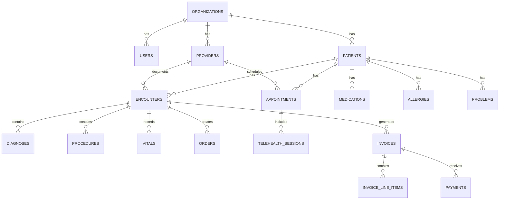

# Database Schema

Complete reference for the Ciyex EHR database schema.

## Overview

Ciyex EHR uses PostgreSQL 16 with a relational schema designed for healthcare data management. The schema supports multi-tenancy, FHIR resources, and comprehensive audit logging.

## Schema Architecture



## Core Tables

### Organizations

```sql
CREATE TABLE organizations (
    id BIGSERIAL PRIMARY KEY,
    name VARCHAR(255) NOT NULL,
    type VARCHAR(50) NOT NULL, -- HOSPITAL, CLINIC, PRACTICE
    address TEXT,
    phone VARCHAR(20),
    email VARCHAR(255),
    website VARCHAR(255),
    npi VARCHAR(10), -- National Provider Identifier
    tax_id VARCHAR(20),
    active BOOLEAN DEFAULT true,
    created_at TIMESTAMP DEFAULT CURRENT_TIMESTAMP,
    updated_at TIMESTAMP DEFAULT CURRENT_TIMESTAMP
);

CREATE INDEX idx_organizations_active ON organizations(active);
CREATE INDEX idx_organizations_npi ON organizations(npi);
```

### Users

```sql
CREATE TABLE users (
    id BIGSERIAL PRIMARY KEY,
    organization_id BIGINT REFERENCES organizations(id),
    keycloak_id UUID UNIQUE NOT NULL,
    email VARCHAR(255) UNIQUE NOT NULL,
    first_name VARCHAR(100),
    last_name VARCHAR(100),
    role VARCHAR(50) NOT NULL, -- ADMIN, PROVIDER, NURSE, STAFF, PATIENT
    active BOOLEAN DEFAULT true,
    last_login TIMESTAMP,
    created_at TIMESTAMP DEFAULT CURRENT_TIMESTAMP,
    updated_at TIMESTAMP DEFAULT CURRENT_TIMESTAMP
);

CREATE INDEX idx_users_email ON users(email);
CREATE INDEX idx_users_keycloak_id ON users(keycloak_id);
CREATE INDEX idx_users_organization ON users(organization_id);
CREATE INDEX idx_users_role ON users(role);
```

### Patients

```sql
CREATE TABLE patients (
    id BIGSERIAL PRIMARY KEY,
    organization_id BIGINT REFERENCES organizations(id),
    user_id BIGINT REFERENCES users(id),
    mrn VARCHAR(50) UNIQUE NOT NULL, -- Medical Record Number
    first_name VARCHAR(100) NOT NULL,
    middle_name VARCHAR(100),
    last_name VARCHAR(100) NOT NULL,
    date_of_birth DATE NOT NULL,
    gender VARCHAR(20),
    ssn VARCHAR(11), -- Encrypted
    email VARCHAR(255),
    phone VARCHAR(20),
    address TEXT,
    city VARCHAR(100),
    state VARCHAR(50),
    zip_code VARCHAR(10),
    country VARCHAR(50) DEFAULT 'USA',
    emergency_contact_name VARCHAR(200),
    emergency_contact_phone VARCHAR(20),
    emergency_contact_relationship VARCHAR(50),
    primary_language VARCHAR(50) DEFAULT 'English',
    marital_status VARCHAR(20),
    occupation VARCHAR(100),
    active BOOLEAN DEFAULT true,
    created_at TIMESTAMP DEFAULT CURRENT_TIMESTAMP,
    updated_at TIMESTAMP DEFAULT CURRENT_TIMESTAMP
);

CREATE INDEX idx_patients_mrn ON patients(mrn);
CREATE INDEX idx_patients_organization ON patients(organization_id);
CREATE INDEX idx_patients_name ON patients(last_name, first_name);
CREATE INDEX idx_patients_dob ON patients(date_of_birth);
CREATE INDEX idx_patients_user ON patients(user_id);
```

### Providers

```sql
CREATE TABLE providers (
    id BIGSERIAL PRIMARY KEY,
    organization_id BIGINT REFERENCES organizations(id),
    user_id BIGINT REFERENCES users(id),
    npi VARCHAR(10) UNIQUE NOT NULL,
    first_name VARCHAR(100) NOT NULL,
    last_name VARCHAR(100) NOT NULL,
    specialty VARCHAR(100),
    license_number VARCHAR(50),
    license_state VARCHAR(50),
    dea_number VARCHAR(20), -- Drug Enforcement Administration
    phone VARCHAR(20),
    email VARCHAR(255),
    active BOOLEAN DEFAULT true,
    created_at TIMESTAMP DEFAULT CURRENT_TIMESTAMP,
    updated_at TIMESTAMP DEFAULT CURRENT_TIMESTAMP
);

CREATE INDEX idx_providers_npi ON providers(npi);
CREATE INDEX idx_providers_organization ON providers(organization_id);
CREATE INDEX idx_providers_user ON providers(user_id);
```

## Clinical Tables

### Appointments

```sql
CREATE TABLE appointments (
    id BIGSERIAL PRIMARY KEY,
    organization_id BIGINT REFERENCES organizations(id),
    patient_id BIGINT REFERENCES patients(id),
    provider_id BIGINT REFERENCES providers(id),
    appointment_type VARCHAR(50) NOT NULL, -- OFFICE_VISIT, TELEHEALTH, FOLLOW_UP
    appointment_date TIMESTAMP NOT NULL,
    duration_minutes INTEGER DEFAULT 30,
    status VARCHAR(50) DEFAULT 'SCHEDULED', -- SCHEDULED, CONFIRMED, CHECKED_IN, IN_PROGRESS, COMPLETED, CANCELLED, NO_SHOW
    reason TEXT,
    notes TEXT,
    reminder_sent BOOLEAN DEFAULT false,
    created_at TIMESTAMP DEFAULT CURRENT_TIMESTAMP,
    updated_at TIMESTAMP DEFAULT CURRENT_TIMESTAMP
);

CREATE INDEX idx_appointments_patient ON appointments(patient_id);
CREATE INDEX idx_appointments_provider ON appointments(provider_id);
CREATE INDEX idx_appointments_date ON appointments(appointment_date);
CREATE INDEX idx_appointments_status ON appointments(status);
CREATE INDEX idx_appointments_organization ON appointments(organization_id);
```

### Encounters

```sql
CREATE TABLE encounters (
    id BIGSERIAL PRIMARY KEY,
    organization_id BIGINT REFERENCES organizations(id),
    patient_id BIGINT REFERENCES patients(id),
    provider_id BIGINT REFERENCES providers(id),
    appointment_id BIGINT REFERENCES appointments(id),
    encounter_date TIMESTAMP NOT NULL,
    encounter_type VARCHAR(50) NOT NULL,
    chief_complaint TEXT,
    history_present_illness TEXT,
    review_of_systems JSONB,
    physical_exam JSONB,
    assessment TEXT,
    plan TEXT,
    status VARCHAR(50) DEFAULT 'DRAFT', -- DRAFT, SIGNED, AMENDED
    signed_by BIGINT REFERENCES users(id),
    signed_at TIMESTAMP,
    created_at TIMESTAMP DEFAULT CURRENT_TIMESTAMP,
    updated_at TIMESTAMP DEFAULT CURRENT_TIMESTAMP
);

CREATE INDEX idx_encounters_patient ON encounters(patient_id);
CREATE INDEX idx_encounters_provider ON encounters(provider_id);
CREATE INDEX idx_encounters_date ON encounters(encounter_date);
CREATE INDEX idx_encounters_status ON encounters(status);
CREATE INDEX idx_encounters_organization ON encounters(organization_id);
```

### Vitals

```sql
CREATE TABLE vitals (
    id BIGSERIAL PRIMARY KEY,
    encounter_id BIGINT REFERENCES encounters(id),
    patient_id BIGINT REFERENCES patients(id),
    recorded_at TIMESTAMP DEFAULT CURRENT_TIMESTAMP,
    blood_pressure_systolic INTEGER,
    blood_pressure_diastolic INTEGER,
    heart_rate INTEGER,
    temperature DECIMAL(4,1),
    temperature_unit VARCHAR(1) DEFAULT 'F', -- F or C
    respiratory_rate INTEGER,
    oxygen_saturation INTEGER,
    weight DECIMAL(5,1),
    weight_unit VARCHAR(2) DEFAULT 'lb', -- lb or kg
    height DECIMAL(5,1),
    height_unit VARCHAR(2) DEFAULT 'in', -- in or cm
    bmi DECIMAL(4,1),
    created_at TIMESTAMP DEFAULT CURRENT_TIMESTAMP
);

CREATE INDEX idx_vitals_encounter ON vitals(encounter_id);
CREATE INDEX idx_vitals_patient ON vitals(patient_id);
CREATE INDEX idx_vitals_recorded_at ON vitals(recorded_at);
```

### Medications

```sql
CREATE TABLE medications (
    id BIGSERIAL PRIMARY KEY,
    patient_id BIGINT REFERENCES patients(id),
    encounter_id BIGINT REFERENCES encounters(id),
    prescribed_by BIGINT REFERENCES providers(id),
    medication_name VARCHAR(255) NOT NULL,
    dosage VARCHAR(100),
    route VARCHAR(50), -- oral, IV, topical, etc.
    frequency VARCHAR(100),
    duration VARCHAR(50),
    quantity INTEGER,
    refills INTEGER DEFAULT 0,
    instructions TEXT,
    status VARCHAR(50) DEFAULT 'ACTIVE', -- ACTIVE, DISCONTINUED, COMPLETED
    prescribed_date TIMESTAMP DEFAULT CURRENT_TIMESTAMP,
    start_date DATE,
    end_date DATE,
    created_at TIMESTAMP DEFAULT CURRENT_TIMESTAMP,
    updated_at TIMESTAMP DEFAULT CURRENT_TIMESTAMP
);

CREATE INDEX idx_medications_patient ON medications(patient_id);
CREATE INDEX idx_medications_status ON medications(status);
CREATE INDEX idx_medications_prescribed_by ON medications(prescribed_by);
```

### Allergies

```sql
CREATE TABLE allergies (
    id BIGSERIAL PRIMARY KEY,
    patient_id BIGINT REFERENCES patients(id),
    allergen VARCHAR(255) NOT NULL,
    allergen_type VARCHAR(50), -- MEDICATION, FOOD, ENVIRONMENTAL
    reaction TEXT,
    severity VARCHAR(50), -- MILD, MODERATE, SEVERE
    onset_date DATE,
    status VARCHAR(50) DEFAULT 'ACTIVE', -- ACTIVE, INACTIVE, RESOLVED
    notes TEXT,
    created_at TIMESTAMP DEFAULT CURRENT_TIMESTAMP,
    updated_at TIMESTAMP DEFAULT CURRENT_TIMESTAMP
);

CREATE INDEX idx_allergies_patient ON allergies(patient_id);
CREATE INDEX idx_allergies_status ON allergies(status);
```

### Problems

```sql
CREATE TABLE problems (
    id BIGSERIAL PRIMARY KEY,
    patient_id BIGINT REFERENCES patients(id),
    icd10_code VARCHAR(10) NOT NULL,
    description TEXT NOT NULL,
    status VARCHAR(50) DEFAULT 'ACTIVE', -- ACTIVE, RESOLVED, INACTIVE
    onset_date DATE,
    resolved_date DATE,
    notes TEXT,
    created_at TIMESTAMP DEFAULT CURRENT_TIMESTAMP,
    updated_at TIMESTAMP DEFAULT CURRENT_TIMESTAMP
);

CREATE INDEX idx_problems_patient ON problems(patient_id);
CREATE INDEX idx_problems_status ON problems(status);
CREATE INDEX idx_problems_icd10 ON problems(icd10_code);
```

## Billing Tables

### Invoices

```sql
CREATE TABLE invoices (
    id BIGSERIAL PRIMARY KEY,
    organization_id BIGINT REFERENCES organizations(id),
    patient_id BIGINT REFERENCES patients(id),
    encounter_id BIGINT REFERENCES encounters(id),
    invoice_number VARCHAR(50) UNIQUE NOT NULL,
    invoice_date DATE NOT NULL,
    due_date DATE NOT NULL,
    subtotal DECIMAL(10,2) NOT NULL,
    tax DECIMAL(10,2) DEFAULT 0,
    total DECIMAL(10,2) NOT NULL,
    amount_paid DECIMAL(10,2) DEFAULT 0,
    balance DECIMAL(10,2) NOT NULL,
    status VARCHAR(50) DEFAULT 'PENDING', -- PENDING, PAID, PARTIALLY_PAID, OVERDUE, CANCELLED
    notes TEXT,
    created_at TIMESTAMP DEFAULT CURRENT_TIMESTAMP,
    updated_at TIMESTAMP DEFAULT CURRENT_TIMESTAMP
);

CREATE INDEX idx_invoices_patient ON invoices(patient_id);
CREATE INDEX idx_invoices_number ON invoices(invoice_number);
CREATE INDEX idx_invoices_status ON invoices(status);
CREATE INDEX idx_invoices_date ON invoices(invoice_date);
```

### Payments

```sql
CREATE TABLE payments (
    id BIGSERIAL PRIMARY KEY,
    invoice_id BIGINT REFERENCES invoices(id),
    amount DECIMAL(10,2) NOT NULL,
    payment_method VARCHAR(50) NOT NULL, -- CARD, CASH, CHECK, INSURANCE
    payment_date TIMESTAMP DEFAULT CURRENT_TIMESTAMP,
    stripe_payment_intent_id VARCHAR(255),
    status VARCHAR(50) DEFAULT 'COMPLETED', -- PENDING, COMPLETED, FAILED, REFUNDED
    notes TEXT,
    created_at TIMESTAMP DEFAULT CURRENT_TIMESTAMP
);

CREATE INDEX idx_payments_invoice ON payments(invoice_id);
CREATE INDEX idx_payments_stripe_id ON payments(stripe_payment_intent_id);
CREATE INDEX idx_payments_date ON payments(payment_date);
```

## Audit Tables

### Audit Logs

```sql
CREATE TABLE audit_logs (
    id BIGSERIAL PRIMARY KEY,
    user_id BIGINT REFERENCES users(id),
    organization_id BIGINT REFERENCES organizations(id),
    event_type VARCHAR(100) NOT NULL,
    resource_type VARCHAR(50),
    resource_id BIGINT,
    action VARCHAR(50) NOT NULL, -- CREATE, READ, UPDATE, DELETE
    ip_address INET,
    user_agent TEXT,
    details JSONB,
    created_at TIMESTAMP DEFAULT CURRENT_TIMESTAMP
);

CREATE INDEX idx_audit_logs_user ON audit_logs(user_id);
CREATE INDEX idx_audit_logs_event_type ON audit_logs(event_type);
CREATE INDEX idx_audit_logs_created_at ON audit_logs(created_at);
CREATE INDEX idx_audit_logs_resource ON audit_logs(resource_type, resource_id);
```

## Flyway Migrations

### Example Migration

```sql
-- V1.0.0__initial_schema.sql
CREATE TABLE organizations (
    id BIGSERIAL PRIMARY KEY,
    name VARCHAR(255) NOT NULL,
    created_at TIMESTAMP DEFAULT CURRENT_TIMESTAMP
);

-- V1.0.1__add_patients.sql
CREATE TABLE patients (
    id BIGSERIAL PRIMARY KEY,
    organization_id BIGINT REFERENCES organizations(id),
    first_name VARCHAR(100) NOT NULL,
    last_name VARCHAR(100) NOT NULL,
    created_at TIMESTAMP DEFAULT CURRENT_TIMESTAMP
);

-- V1.0.2__add_patient_email.sql
ALTER TABLE patients ADD COLUMN email VARCHAR(255);
CREATE INDEX idx_patients_email ON patients(email);
```

## Database Functions

### Calculate Age

```sql
CREATE OR REPLACE FUNCTION calculate_age(birth_date DATE)
RETURNS INTEGER AS $$
BEGIN
    RETURN EXTRACT(YEAR FROM AGE(birth_date));
END;
$$ LANGUAGE plpgsql IMMUTABLE;

-- Usage
SELECT first_name, last_name, calculate_age(date_of_birth) as age
FROM patients;
```

### Update Timestamp Trigger

```sql
CREATE OR REPLACE FUNCTION update_updated_at_column()
RETURNS TRIGGER AS $$
BEGIN
    NEW.updated_at = CURRENT_TIMESTAMP;
    RETURN NEW;
END;
$$ LANGUAGE plpgsql;

CREATE TRIGGER update_patients_updated_at
    BEFORE UPDATE ON patients
    FOR EACH ROW
    EXECUTE FUNCTION update_updated_at_column();
```

## Best Practices

1. **Use Indexes** - Index foreign keys and frequently queried columns
2. **Normalize Data** - Follow 3NF normalization
3. **Use Constraints** - Enforce data integrity with constraints
4. **Audit Everything** - Log all data access and modifications
5. **Encrypt Sensitive Data** - Encrypt SSN, medical records
6. **Regular Backups** - Daily automated backups
7. **Monitor Performance** - Track slow queries

## Next Steps

- [Local Setup](../installation/local-setup.md) - Database setup
- [Backup & Restore](../operations/backup.md) - Backup procedures
- [Performance Tuning](../operations/performance.md) - Query optimization
- [Security](../security/best-practices.md) - Data security
