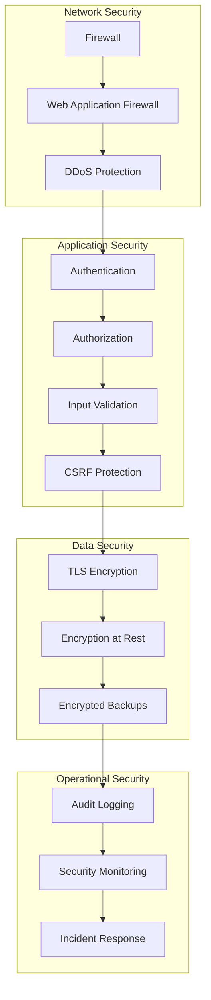

# Security Best Practices

Comprehensive security guidelines for deploying and operating Ciyex EHR in production.

## Overview

Healthcare applications require the highest level of security to protect patient data and comply with regulations like HIPAA and GDPR. This guide covers security best practices for Ciyex EHR.

## Security Layers



## Authentication Security

### Password Requirements

Enforce strong password policies:

```yaml
# application.yml
ciyex:
  security:
    password:
      min-length: 12
      require-uppercase: true
      require-lowercase: true
      require-digit: true
      require-special-char: true
      max-age-days: 90
      history-count: 5
```

### Multi-Factor Authentication (MFA)

Enable MFA for all users:

1. **Configure Keycloak MFA**
   - Navigate to Authentication → Required Actions
   - Enable "Configure OTP"
   - Set as default for new users

2. **Enforce MFA for Providers**
   ```javascript
   // Require MFA for provider role
   if (user.role === 'PROVIDER' && !user.mfaEnabled) {
     throw new Error('MFA required for providers');
   }
   ```

### Session Management

```yaml
# application.yml
server:
  servlet:
    session:
      timeout: 30m
      cookie:
        http-only: true
        secure: true
        same-site: strict
```

### Token Security

```yaml
jwt:
  secret: ${JWT_SECRET}  # Store in secrets manager
  expiration: 3600  # 1 hour
  refresh-expiration: 86400  # 24 hours
  issuer: ciyex-ehr
  audience: ciyex-app
```

**Best Practices**:
- ✅ Use strong secret (256-bit minimum)
- ✅ Rotate secrets regularly (every 90 days)
- ✅ Store secrets in environment variables or secrets manager
- ✅ Use short expiration times
- ✅ Implement token refresh mechanism
- ✅ Invalidate tokens on logout

## Authorization

### Role-Based Access Control (RBAC)

```java
@PreAuthorize("hasRole('PROVIDER')")
public ResponseEntity<?> getPatientRecords() {
    // Only providers can access
}

@PreAuthorize("hasRole('ADMIN')")
public ResponseEntity<?> deleteUser() {
    // Only admins can delete users
}

@PreAuthorize("hasAnyRole('PROVIDER', 'NURSE')")
public ResponseEntity<?> updateVitals() {
    // Providers and nurses can update vitals
}
```

### Attribute-Based Access Control (ABAC)

```java
@PreAuthorize("@securityService.canAccessPatient(#patientId)")
public ResponseEntity<?> getPatient(@PathVariable Long patientId) {
    // Check if user has access to specific patient
}
```

### Data Access Restrictions

```sql
-- Row-level security in PostgreSQL
CREATE POLICY patient_access_policy ON patients
  USING (
    organization_id = current_setting('app.current_org_id')::integer
  );
```

## Data Encryption

### Encryption at Rest

**Database Encryption**:
```sql
-- Enable PostgreSQL encryption
ALTER SYSTEM SET ssl = on;
ALTER SYSTEM SET ssl_cert_file = '/path/to/server.crt';
ALTER SYSTEM SET ssl_key_file = '/path/to/server.key';
```

**Field-Level Encryption**:
```java
@Entity
public class Patient {
    @Convert(converter = EncryptedStringConverter.class)
    private String ssn;  // Encrypted SSN
    
    @Convert(converter = EncryptedStringConverter.class)
    private String medicalRecordNumber;
}
```

**S3 Encryption**:
```yaml
aws:
  s3:
    encryption: AES256
    bucket-key-enabled: true
```

### Encryption in Transit

**TLS Configuration**:
```yaml
server:
  ssl:
    enabled: true
    key-store: classpath:keystore.p12
    key-store-password: ${KEYSTORE_PASSWORD}
    key-store-type: PKCS12
    key-alias: ciyex
    protocol: TLS
    enabled-protocols: TLSv1.3,TLSv1.2
```

**Force HTTPS**:
```java
@Configuration
public class SecurityConfig {
    @Bean
    public SecurityFilterChain filterChain(HttpSecurity http) {
        http.requiresChannel()
            .anyRequest()
            .requiresSecure();
        return http.build();
    }
}
```

## Input Validation

### Backend Validation

```java
@PostMapping("/api/patients")
public ResponseEntity<?> createPatient(
    @Valid @RequestBody PatientDTO patient) {
    // @Valid triggers validation
}

public class PatientDTO {
    @NotBlank(message = "First name is required")
    @Size(max = 50)
    private String firstName;
    
    @Email(message = "Invalid email format")
    private String email;
    
    @Pattern(regexp = "^\\d{3}-\\d{2}-\\d{4}$", 
             message = "Invalid SSN format")
    private String ssn;
}
```

### SQL Injection Prevention

**Use Prepared Statements**:
```java
// ✅ GOOD - Parameterized query
String sql = "SELECT * FROM patients WHERE id = ?";
jdbcTemplate.queryForObject(sql, new Object[]{patientId}, ...);

// ❌ BAD - String concatenation
String sql = "SELECT * FROM patients WHERE id = " + patientId;
```

**Use JPA/Hibernate**:
```java
// ✅ GOOD - JPA query
@Query("SELECT p FROM Patient p WHERE p.id = :id")
Patient findById(@Param("id") Long id);
```

### XSS Prevention

**Frontend Sanitization**:
```typescript
import DOMPurify from 'dompurify';

// Sanitize user input
const clean = DOMPurify.sanitize(userInput);
```

**Backend Headers**:
```yaml
# application.yml
spring:
  security:
    headers:
      content-security-policy: "default-src 'self'"
      x-content-type-options: nosniff
      x-frame-options: DENY
      x-xss-protection: "1; mode=block"
```

## CSRF Protection

```java
@Configuration
public class SecurityConfig {
    @Bean
    public SecurityFilterChain filterChain(HttpSecurity http) {
        http.csrf()
            .csrfTokenRepository(CookieCsrfTokenRepository.withHttpOnlyFalse());
        return http.build();
    }
}
```

## Audit Logging

### What to Log

✅ **Authentication Events**:
- Login attempts (success/failure)
- Logout events
- Password changes
- MFA events

✅ **Authorization Events**:
- Access denied events
- Permission changes
- Role assignments

✅ **Data Access**:
- Patient record access
- PHI viewing
- Document downloads
- Report generation

✅ **Data Modifications**:
- Create, update, delete operations
- Bulk data exports
- Configuration changes

❌ **Never Log**:
- Passwords
- Tokens
- SSNs
- Credit card numbers

### Audit Log Format

```json
{
  "timestamp": "2024-10-15T10:30:00Z",
  "eventType": "PATIENT_RECORD_ACCESS",
  "userId": "user-123",
  "userName": "john.provider@example.com",
  "patientId": "patient-456",
  "action": "VIEW",
  "resource": "Patient/456",
  "ipAddress": "192.168.1.100",
  "userAgent": "Mozilla/5.0...",
  "organizationId": "org-1",
  "success": true,
  "details": {
    "accessReason": "Annual checkup",
    "dataAccessed": ["demographics", "vitals", "medications"]
  }
}
```

### Audit Log Storage

```yaml
# application.yml
logging:
  level:
    com.qiaben.ciyex.audit: INFO
  file:
    name: /var/log/ciyex/audit.log
    max-size: 100MB
    max-history: 365
    total-size-cap: 10GB
```

## Network Security

### Firewall Rules

**Inbound**:
```bash
# Allow HTTPS only
iptables -A INPUT -p tcp --dport 443 -j ACCEPT

# Allow Kubernetes API (from specific IPs)
iptables -A INPUT -p tcp --dport 6443 -s 10.0.0.0/8 -j ACCEPT

# Allow SSH (from specific IPs)
iptables -A INPUT -p tcp --dport 22 -s 203.0.113.0/24 -j ACCEPT

# Drop all other inbound
iptables -A INPUT -j DROP
```

**Outbound**:
```bash
# Allow HTTPS
iptables -A OUTPUT -p tcp --dport 443 -j ACCEPT

# Allow DNS
iptables -A OUTPUT -p udp --dport 53 -j ACCEPT

# Allow SMTP
iptables -A OUTPUT -p tcp --dport 587 -j ACCEPT
```

### Network Policies (Kubernetes)

```yaml
apiVersion: networking.k8s.io/v1
kind: NetworkPolicy
metadata:
  name: ciyex-api-policy
spec:
  podSelector:
    matchLabels:
      app: ciyex-api
  policyTypes:
  - Ingress
  - Egress
  ingress:
  - from:
    - podSelector:
        matchLabels:
          app: ciyex-ui
    ports:
    - protocol: TCP
      port: 8080
  egress:
  - to:
    - podSelector:
        matchLabels:
          app: postgres
    ports:
    - protocol: TCP
      port: 5432
```

## Secrets Management

### Kubernetes Secrets

```bash
# Create secret
kubectl create secret generic db-credentials \
  --from-literal=username=ciyex \
  --from-literal=password=secure-password \
  --namespace=ciyex-prod

# Use in deployment
apiVersion: apps/v1
kind: Deployment
spec:
  template:
    spec:
      containers:
      - name: ciyex-api
        env:
        - name: DB_PASSWORD
          valueFrom:
            secretKeyRef:
              name: db-credentials
              key: password
```

### External Secrets Operator

```yaml
apiVersion: external-secrets.io/v1beta1
kind: SecretStore
metadata:
  name: aws-secrets-manager
spec:
  provider:
    aws:
      service: SecretsManager
      region: us-east-1
---
apiVersion: external-secrets.io/v1beta1
kind: ExternalSecret
metadata:
  name: ciyex-secrets
spec:
  refreshInterval: 1h
  secretStoreRef:
    name: aws-secrets-manager
  target:
    name: ciyex-app-secrets
  data:
  - secretKey: db-password
    remoteRef:
      key: ciyex/db-password
```

## Vulnerability Management

### Dependency Scanning

```bash
# Scan Java dependencies
./gradlew dependencyCheckAnalyze

# Scan Node.js dependencies
pnpm audit

# Scan Docker images
trivy image ciyex:latest
```

### Regular Updates

```bash
# Update dependencies monthly
./gradlew dependencyUpdates
pnpm update

# Update base images
docker pull openjdk:21-jdk-slim
docker pull node:22-alpine
```

## Incident Response

### Detection

Monitor for:
- Failed login attempts (>5 in 5 minutes)
- Unusual data access patterns
- Large data exports
- Configuration changes
- Privilege escalations

### Response Plan

1. **Detect** - Automated alerts
2. **Contain** - Isolate affected systems
3. **Investigate** - Review audit logs
4. **Remediate** - Fix vulnerabilities
5. **Recover** - Restore from backups
6. **Report** - Notify stakeholders

### Breach Notification

If PHI breach occurs:
1. **Assess** - Determine scope within 24 hours
2. **Notify** - Inform affected patients within 60 days
3. **Report** - File HHS breach report if >500 patients
4. **Document** - Maintain incident records

## Compliance Checklist

### HIPAA Compliance

- [ ] Business Associate Agreements (BAAs) in place
- [ ] Encryption at rest and in transit
- [ ] Access controls and authentication
- [ ] Audit logging enabled
- [ ] Regular security assessments
- [ ] Incident response plan
- [ ] Backup and disaster recovery
- [ ] Employee training
- [ ] Physical security measures
- [ ] Breach notification procedures

### GDPR Compliance

- [ ] Data Processing Agreements (DPAs)
- [ ] Consent management
- [ ] Right to access (data export)
- [ ] Right to erasure (data deletion)
- [ ] Data portability
- [ ] Privacy by design
- [ ] Data protection impact assessments
- [ ] Breach notification (72 hours)

## Security Testing

### Penetration Testing

```bash
# OWASP ZAP scan
docker run -t owasp/zap2docker-stable zap-baseline.py \
  -t https://app.example.com

# Nikto web scanner
nikto -h https://app.example.com
```

### Security Headers

```bash
# Check security headers
curl -I https://app.example.com

# Should include:
# Strict-Transport-Security: max-age=31536000
# X-Content-Type-Options: nosniff
# X-Frame-Options: DENY
# Content-Security-Policy: default-src 'self'
```

## Best Practices Summary

1. **Authentication**
   - ✅ Enforce strong passwords
   - ✅ Enable MFA for all users
   - ✅ Use short session timeouts
   - ✅ Implement account lockout

2. **Authorization**
   - ✅ Use RBAC and ABAC
   - ✅ Principle of least privilege
   - ✅ Regular access reviews

3. **Data Protection**
   - ✅ Encrypt data at rest
   - ✅ Use TLS 1.3 for transit
   - ✅ Field-level encryption for PHI
   - ✅ Secure backups

4. **Application Security**
   - ✅ Input validation
   - ✅ Output encoding
   - ✅ CSRF protection
   - ✅ Security headers

5. **Monitoring**
   - ✅ Comprehensive audit logging
   - ✅ Real-time alerting
   - ✅ Regular log reviews
   - ✅ Incident response plan

6. **Compliance**
   - ✅ HIPAA compliance
   - ✅ Regular security assessments
   - ✅ Employee training
   - ✅ Documentation

## Next Steps

- [Authentication Security](authentication-security.md) - Detailed auth security
- [Audit Logging](audit-logging.md) - Audit implementation
- [Compliance](compliance.md) - HIPAA/GDPR compliance
- [Monitoring](../operations/monitoring.md) - Security monitoring
